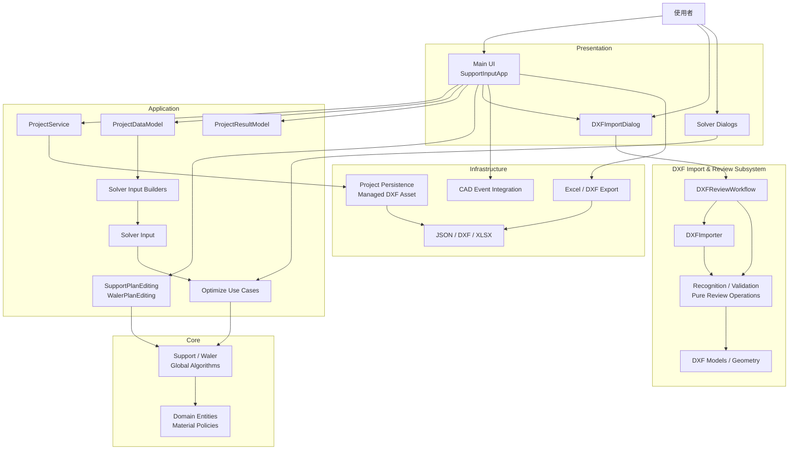
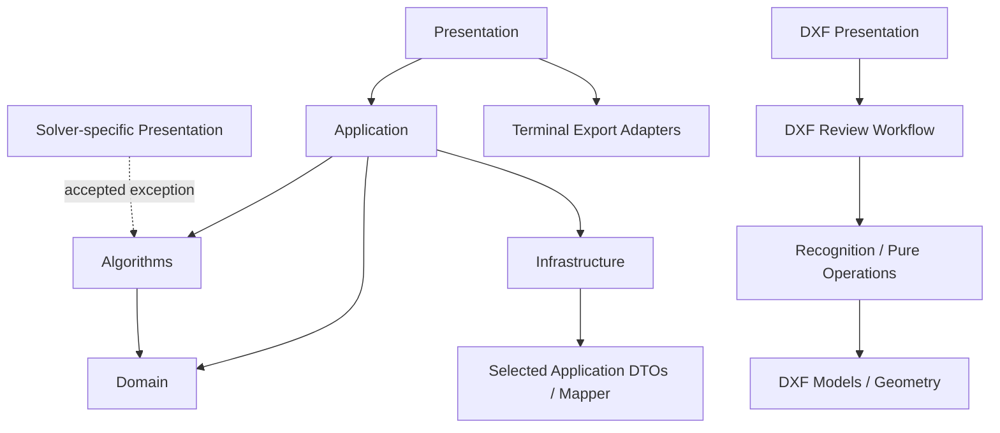
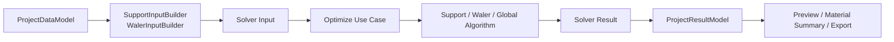
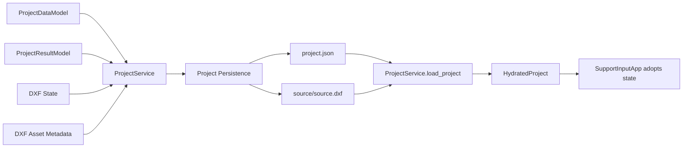

# 系統架構

## 1. Purpose and Architecture Goals

本系統是開挖工程圍令與支撐配置工具，負責建立工程資料、從 DXF 辨識及檢核幾何、執行 Support／Waler 最佳化、保存 Project 與 DXF 關聯狀態，以及匯出材料明細與配置成果。

架構的主要目標是：

- 保護工程規則與 Solver 行為的正確性。
- 讓 Presentation、Application、Domain、Algorithms、Infrastructure 與 DXF subsystem 有清楚責任。
- 讓 Project input、Solver result 與 DXF Review state 各自有唯一 owner。
- 讓主要 workflow 可以脫離 Tkinter 獨立測試。
- 防止 DXF provenance、UI state 或 persistence detail 滲入 Solver Domain。
- 在不改變既有工程行為的前提下維持可演進性。

本專案以 Clean Architecture 的依賴方向作為設計指引，但不追求形式上的完全純化。工程行為正確、責任清楚、可測試及可安全演進，優先於增加抽象層或套用 Design Pattern。

### Non-goals

- 不要求每個大型 UI 檔案都拆小。
- 不要求每個 Infrastructure component 都先定義 interface。
- 不要求所有跨層資料都轉換成獨立 DTO。
- 不為了分層而建立沒有實際責任的 wrapper。
- 不強制 DXF 子系統採用與主 Application 完全相同的目錄結構。
- 不在本文件展開工程名詞、Solver 演算法或完整 runtime 操作流程。

工程名詞與規則屬於 `DOMAIN.md`；Solver 搜尋、評分與限制細節屬於 `SOLVER.md`；完整 runtime workflow 屬於 `WORKFLOW.md`。

## 2. System Overview



Main UI 是桌面程式的 Presentation shell。DXF Import & Review 是垂直子系統，包含自己的 Presentation、Application workflow、recognition operations 與資料模型。Application 負責 Project lifecycle、Solver input、結果生命週期及人工方案修改；Infrastructure 負責外部檔案、CAD bridge、persistence 與成果匯出。

System Overview 中的 Solver 路徑表示資料及 use-case 流程：`ProjectDataModel → Solver Input Builder → Solver Input → Optimize Use Case → Algorithms`。Builder 只負責準備輸入，不主持或主動呼叫最佳化流程。

## 3. Layers and Responsibilities

### 3.1 Presentation

Presentation 包含 `main.py`、`bracing_optimizer/presentation/`，以及 DXF 子系統中的 `dialog.py`、`preview.py` 與 `controllers.py`。

負責：

- Tkinter widgets、user interaction 與畫面更新。
- Selection、viewport、hover 與 temporary edit state。
- 顯示驗證、診斷與 Solver 結果。
- 啟動 Application use case，並採用其回傳的 staged state。
- 決定何時刷新 Treeview、Preview 與狀態訊息。

Presentation 可以保存尚未確認的 UI draft，但不應成為正式工程規則或 Solver 合法性判斷的 owner。

### 3.2 Application

Application 位於 `bracing_optimizer/application/`，負責：

- Use-case orchestration 與 Project state transition。
- 將可編輯 Project rows 轉成 Domain model。
- 建立 Solver input 並協調 Solver 搜尋流程。
- 管理 Solver result lifecycle。
- 執行人工 Support／Waler 方案修改。
- 建立與 hydrate Project payload。
- 協調 persistence、DXF apply 與 DXF relink。

Application 可以依賴 Domain 與 Algorithms。目前 `ProjectService` 也直接使用部分 Infrastructure persistence implementation；這是現有接受的例外。

### 3.3 Domain

Domain 位於 `bracing_optimizer/domain/`，負責穩定的工程 entity、aggregate，以及跨 Solver 共用的材料分類與比例政策。

Domain 不依賴 Presentation、Application、Infrastructure、DXF importer 或 Tkinter。

`ProjectDataModel` 不是 Domain entity；它是 Application layer 中可編輯資料列的正式 owner。資料透過 `ProjectRowMapper` 轉成 `ProjectDomainModel` 後，才進入 typed Domain boundary。

### 3.4 Algorithms

Algorithms 位於 `bracing_optimizer/algorithms/`，負責：

- Support 候選生成與全域配置。
- Waler 候選生成、修補、評分與搜尋。
- Global Waler exact selection。
- Search policy、diagnostics 與搜尋穩定性判斷。
- 工程限制下的合法性與最佳化計算。

Algorithms 可以依賴 Domain policy，但不依賴 Application、Presentation 或 Infrastructure。輸入準備與 workflow coordination 由 Application use case 負責。

### 3.5 Infrastructure

Infrastructure 位於 `bracing_optimizer/infrastructure/`，負責：

- Project JSON validation 與 persistence。
- DXF managed-copy lifecycle 與 compatibility inspection。
- CAD TEMP event 讀取、映射與 acknowledge。
- Excel／DXF 成果匯出。
- Inventory 外部資料來源。
- 檔案系統與外部 library 整合。

Infrastructure 不定義 Support 或 Waler 的核心工程規則。

### 3.6 DXF Subsystem

`dxf_import/` 是獨立的垂直子系統，內部依賴方向為：

```text
DXF Presentation
        ↓
DXFReviewWorkflow
        ↓
Recognition / Review Pure Operations
        ↓
DXF Models / Geometry
```

- `dialog.py`：Tkinter Presentation。
- `preview.py`、`controllers.py`：顯示、selection 與 preview interaction。
- `review_workflow.py`：一個 live DXF Review session 的 Application workflow。
- `importer.py`：DXF reader 與 recognition pipeline adapter。
- `recognition.py`、`validation.py`：辨識與驗證。
- `candidate_points.py`、`support_pairing.py`：工程 review operations。
- `source_exclusion.py`、`review_confirmation.py`：Review decision persistence。
- `models.py`、`geometry.py`：DXF models 與幾何操作。

Recognition core 不依賴 Dialog、Preview 或 Review Workflow。

## 4. Major Components and Ownership

| Component | Responsibility | Owns | Does not own |
| --- | --- | --- | --- |
| `SupportInputApp` | Main UI shell、畫面協調與採用 staged state | Tkinter widgets、selection、viewport、UI-only state | Solver 規則、Project schema validation、live DXF Review state |
| `DXFImportDialog` | DXF Review 畫面、preview、選取與使用者確認 | Selection、viewport、Tk variables、temporary UI draft | WCS result、ReviewItem、confirmation、exclusion |
| `DXFReviewWorkflow` | 一次 live DXF Review session 的正式 workflow | WCS result、projected result、manual replay、confirmation、exclusion | Tkinter widgets、ProjectDataModel、Solver result |
| `ProjectDataModel` | 正式可變 Project input model | Walers、Struts、Braces、Inventory、Material Specs | Solver result、DXF provenance、UI widgets |
| `ProjectResultModel` | 正式 Solver result state 與 persistence projection | Result items、visibility、calculated time、material usage | Solver 搜尋、Project input、UI selection |
| `ProjectService` | Project use cases 與 persistence coordination | DXF apply transition、payload、hydration、save/load/relink workflow | Tkinter interaction、Preview refresh |
| `SupportPlanEditing` | 人工支撐方案修改與重新評估 | Edit context、piece validation、staged solution | Editor widgets、結果 Treeview |
| `WalerPlanEditing` | 人工圍令方案修改、合法性與重算 | Waler edit validation 與 staged plan | Editor widgets、結果顯示 |
| `SupportInputBuilder` | Project geometry → Support Solver input | Input transformation 與 builder validation | Support optimization |
| `WalerInputBuilder` | Project geometry → Waler Solver input | Forbidden-point projection、inventory input preparation | Waler optimization |
| `OptimizeSupportZone` | 支撐分區最佳化 use case | Candidate-cache policy、搜尋階段、diagnostics orchestration | Tkinter、Project persistence |
| `OptimizeWaler` | 單根圍令最佳化 use case | Config、staged search、result merge、diagnostics | Tkinter、Project state |
| `OptimizeWalerGlobal` | 全場圍令候選生成與 exact selection | Local solve coordination、global candidate selection | UI apply、Project result commit |

## 5. Dependency Rules



主要規則：

- Domain 不得反向依賴 Application、Presentation 或 Infrastructure。
- Algorithms 不得依賴 Application 或 Presentation。
- Presentation 應透過 Application API 執行完整 use case。
- Main 不直接 import `bracing_optimizer.algorithms.*`。
- DXF Recognition 不得依賴 Review Workflow 或 Presentation。
- DXF Review Workflow 不得依賴 Dialog、Preview 或 Tkinter。
- Package internal helper 應由 owner module 匯入，不透過 package root 暴露。

### DXF Public API

`dxf_import` package root 只提供 Dialog／Outcome、Import Result／Error、Coordinate System／Geometry Tolerances、headless import／layer reading，以及 source fingerprint／review-state matching。Recognition、candidate point、controller、preview 與 Review operations 屬於 package internal API。

### Accepted Dependency Exceptions

- Solver-specific Dialog 與 formatter 仍讀取少數 Algorithms constants、diagnostics 與顯示用 helper。
- `ProjectService` 直接依賴目前唯一的 persistence implementation。
- 部分 Infrastructure adapter 使用 Application DTO 或 mapper。
- Main 可以直接呼叫 terminal Excel／DXF export adapter。
- DXF Dialog 在子系統內直接建立 `DXFImporter` 與 `DXFReviewWorkflow`。

這些例外不代表可以任意新增跨層依賴。

## 6. State Ownership

同一份正式 state 應只有一個 authoritative owner。Presentation 可以保存 draft、projection 或 selection，但不應維護第二份正式 truth。

| State | Authoritative owner | Presentation 可持有的內容 |
| --- | --- | --- |
| Project input | `ProjectDataModel` | Treeview projection、cell editor draft |
| Solver result | `ProjectResultModel` | Tree selection、顯示文字、可見狀態操作 |
| Live DXF Review session | `DXFReviewWorkflow` | Read-only snapshot、selection 與 UI draft |
| DXF WCS canonical result | `DXFReviewWorkflow.world_result` | Read-only snapshot |
| DXF active projected result | `DXFReviewWorkflow.result` | Read-only snapshot |
| DXF problems／ReviewItems | `DXFReviewWorkflow` | Treeview projection、目前選取項目 |
| DXF confirmation／exclusion／manual replay | `DXFReviewWorkflow` | 操作狀態與 staged impact 顯示 |
| DXF coordinate origin | `DXFReviewWorkflow` | 座標設定視窗的 temporary draft |
| Preview viewport／hover／selection | Presentation | 完整 UI state |
| Paused serialized DXF resume state | Main／Application session（live session 已關閉） | 狀態與繼續 Review 操作的 UI projection |
| Durable DXF Review state | Project payload／persistence boundary | 載入後交給 Application session；恢復 live session 時交給 Workflow |
| Solver runtime cache | Main application session | Solver Dialog 可詢問是否載入相同條件結果 |

DXF Dialog 透過 immutable `DXFReviewSnapshot` 取得 Workflow projection。Workflow command 成功後，Dialog 重新取得 snapshot 並刷新畫面，不直接修改正式 Review fields。

Live Review session 存在時，authoritative state 始終屬於 `DXFReviewWorkflow`。Review 暫停且 Dialog 關閉後，Main／Application session 接手 serialized resume state；專案儲存後，durable state 位於 Project payload 與 persistence boundary。再次繼續 Review 時，新的 `DXFReviewWorkflow` 驗證並恢復該狀態，重新成為 live state owner。

Project load 時，`ProjectService` 先建立完整 `HydratedProject`，Main 再一次採用 Project input、result、DXF state 與 workflow status。

## 7. Major Data Flows

### 7.1 DXF Import and Review

```mermaid
flowchart LR
    File[DXF File] --> Read[Read entities<br/>OCS to WCS]
    Read --> Recognition[Recognition / Association / Validation]
    Recognition --> World[WCS DXFImportResult]
    World --> Review[DXFReviewWorkflow]
    Review --> Manual[Manual modification<br/>Confirmation / Exclusion]
    Manual --> Projection[World or Local projection]
    Projection --> Outcome[DXFImportDialogOutcome]
    Outcome --> Rows[Project rows]
    Rows --> Project[ProjectDataModel]
```



`world_result` 是 WCS canonical result。Local coordinate 不覆寫 WCS，而是由 `CoordinateSystem` 產生 derived `result`。

完成 Review 後，`DXFImportResult.to_project_rows()` 將 active coordinates 轉成 Project rows。只有正式 Waler、Strut 與 Brace rows 進入 `ProjectDataModel`；DXF source handle、layer、recognition metadata、Column、Beam 與 CornerBrace 詳細資料保留在 DXF state。

### 7.2 Solver



Support Solver 以 Zoning 為 use-case boundary。Single Waler Solver 針對一根 Waler 建立前幾名候選。Global Waler Solver 先取得各 Waler 的 local candidates，再以 exact global selection 選出全場組合。Solver Dialog 負責背景執行與顯示，不應自行實作搜尋流程。

### 7.3 Persistence



Save 時，`ProjectService` 建立正式 payload；Persistence 驗證 schema 與 Domain rows，並以 staged files 保存 JSON 與 managed DXF。驗證成功後才替換正式檔案，失敗時保留或回復原有檔案。

Load 時，Persistence 驗證 JSON 並檢查 managed DXF；`ProjectService` 建立 `ProjectDataModel`、`ProjectResultModel` 與 DXF lifecycle state，最後由 Main 採用並刷新 UI。

## 8. Accepted Architecture Debt

| Accepted debt | 接受原因 | 重新評估時機 |
| --- | --- | --- |
| Solver Presentation 仍有少數 Algorithms dependency | 目前主要用於預設值、diagnostics、cache metadata 與顯示，不取代 Solver use case | Solver UI 開始自行判斷合法性、重算工程分數，或 Solver 規則頻繁造成 UI 漂移 |
| CAD event transaction 仍在 Main | Mapper 已封裝幾何映射，現有 transaction 有整合測試；再拆會影響 ACK、binding 與 UI rollback | 增加更多 CAD update 類型，或 Main 對 CAD application rules 的理解持續增加 |
| Application／Infrastructure 未完全 Dependency Inversion | 目前只有一套 project persistence 與 export implementation，額外 port 的收益有限 | 需要替換 persistence backend、headless service 或第二種 adapter |
| `DXFImporter.convert()` 同時主持 reader 與 recognition pipeline | 兩者共享 DXF document、tolerance 與 source provenance，現有責任仍具 cohesive 性 | 需要多種 reader、串流辨識或獨立 recognition service |
| `DXFImportResult.to_project_rows()` 知道 Project row contract | 它是明確的 DXF → Project boundary，且 metadata isolation 有測試 | Project schema 大幅變更、出現第二種 consumer，或 conversion 開始依賴 Main |
| Main 直接呼叫 terminal export adapter | Export 是使用者觸發的終端 I/O，Main 負責檔案對話框與結果提示 | 需要批次、CLI、server-side export 或多個 Presentation client |
| Main／Dialog 檔案仍較大 | 大部分剩餘內容是 cohesive UI layout、rendering 與 interaction | 出現難以獨立測試的完整 workflow、頻繁修改衝突，或同一 state 出現多個 owner |

Accepted debt 不是自動待辦清單。只有在觸發條件出現、責任開始混淆或變更風險提高時，才重新評估。

## 9. Architecture Guardrails

Architecture tests 用來防止未來開發，尤其 AI-assisted development，不小心破壞 dependency boundary。

目前測試保護：

- `main.py` 不直接 import `bracing_optimizer.algorithms.*`。
- Domain 不依賴 Application、Algorithms implementation、Presentation 或 Infrastructure。
- Algorithms 不依賴 Application 或 Presentation。
- Solver core 與 use cases 不依賴外部 adapter。
- Infrastructure 不依賴 GUI layer。
- Presentation modules 不反向 import Main。
- DXF package root 只公開核准的 public API，repository internal code 從 owner module 匯入。
- DXF private helper 不從 package root export。
- DXF 非 UI modules 不依賴 Tkinter。
- DXF Recognition core 不依賴 Review 或 Presentation。
- `DXFReviewWorkflow` 不直接或間接依賴 Dialog、Controller 或 Preview。
- Dialog 不保存第二份 Workflow-owned Review fields。
- DXF provenance metadata 不進入 Project／Solver rows。
- Project UI 將 DXF apply、payload、hydration、persistence 與 result staging 委派給 Application components。
- Manual Support plan editing 不在 Main 複製 Solver 工程規則。

Architecture tests 保護責任與依賴方向，不保證所有檔案都小，也不要求所有實作符合形式上的完全 Dependency Inversion。

新增跨層依賴前，應先確認：

1. 新依賴是否讓外層取得不應擁有的工程規則。
2. 是否建立第二份正式 state。
3. 是否繞過既有 Application use case。
4. 是否讓 Domain 或 Algorithms 知道 GUI／檔案格式。
5. 是否需要新增 architecture test 防止 boundary 回退。
