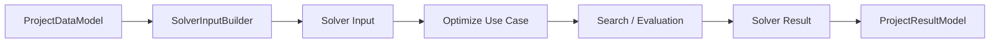
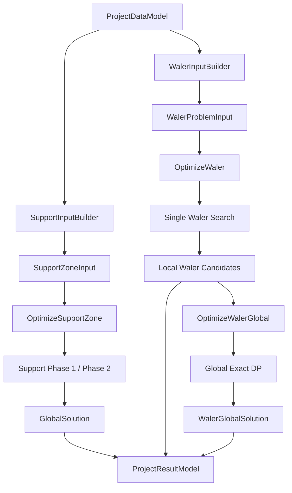

# Solver 與最佳化

## 1. Purpose

本文件說明系統在既定工程規則下，如何：

- 建立 Solver input。
- 產生候選方案。
- 執行搜尋與搜尋升級。
- 計算方案分數。
- 保留具代表性的候選。
- 選擇單支或全域結果。
- 重新評估人工修改方案。
- 產生 Solver diagnostics。

本文件描述目前實際實作，不把搜尋策略或暫時參數描述成永久工程政策。

相關文件的責任如下：

- 工程實體、材料分類與合法性規則由 [DOMAIN.md](DOMAIN.md) 定義。
- Application、Algorithms、Presentation 與結果 ownership 由 [ARCHITECTURE.md](ARCHITECTURE.md) 定義。
- 本文件只說明 Solver 的搜尋、評分、候選保留及結果選擇。

本文件不是：

- 完整 Domain rule 文件。
- 架構責任文件。
- UI 操作說明。
- Python API reference。
- 未來 Solver roadmap。

---

## 2. Solver Overview

Solver 的共同資料流如下：



此圖表示資料流，不表示 `SolverInputBuilder` 主動執行最佳化。

主要 Solver 分為三條流程：



三條流程的責任分別為：

- Support Solver：替同一 `Zoning` 的 Struts 協調 Support material layout 與 Jack placement。
- Single Waler Solver：替一根 Waler 產生、評分並保留數個 local candidates。
- Global Waler Solver：從每根 Waler 已保留的 local candidates 中，各選一個形成全場組合。

Optimize use case 回傳 Solver result 與 diagnostics。Presentation／Application 再決定是否將結果採用至 `ProjectResultModel`。

---

## 3. Support Solver Overview

Support Solver 分為兩個階段。

### Phase 1：單支 Strut 候選生成

每一根 Strut 分別產生合法且具有一定多樣性的 `SupportPlan` 候選。

主要工作包括：

- 建立 Steel length multiset。
- 配置一支 Jack 與可選 Shim。
- 搜尋 Steel 排列順序。
- 依 Steel／RC Waler 類型產生 Jack／Shim 位置。
- 驗證 gap、joint、forbidden zone 及材料長度。
- 依 `TargetJackRegion` 篩選自動候選。
- 保留 Jack 位置及材料型態具多樣性的候選。
- 最多保留 100 個候選進入 Phase 2。

### Phase 2：同 Zoning 全域組合搜尋

Phase 2 從每個 geometry-based optimization unit 的候選中選一個 unit candidate；一般 unit 含一支 Strut，`SharedLayoutGroup` unit 含兩支 physical Struts。Phase 2 檢查：

- `SharedLayoutGroup` 是否共用相同 ordered layout。
- 相鄰、非雙路支撐的 Jack center 是否至少相距 500 mm。
- Jack region 是否協調。
- 全區材料比例是否接近目標。
- 候選組合是否具有足夠搜尋穩定性。

### Application models

`SupportInputBuilder` 將 `ProjectDataModel` 轉成 `SupportConfig`，內容包括：

- Strut 總長。
- Column stations。
- Beam stations。
- `TargetJackRegion`。
- `MaterialSpec`。
- 兩端 Waler 類型。
- 可購買 Steel lengths。
- `SharedLayoutGroup`。

`SupportZoneInput` 代表一個 `Zoning` 的完整求解問題。

它同時持有 Application 建立的 transient `SupportAdjacencyContract`：ordered units、代表位置、投影與 consecutive adjacency pairs。此 contract 由目前 Project geometry 即時計算，不寫回 Project，也不進入 persistence schema。

`OptimizeSupportZone` 負責：

- Phase 1 cache。
- 每根 Strut 的候選生成。
- 雙路支撐候選交集。
- Phase 2 搜尋階段。
- 搜尋升級與 diagnostics。

最終輸出為 `GlobalSolution`。

---

## 4. Support Phase 1

### 4.1 Steel multiset generation

Phase 1 先以 Dynamic Programming 建立 Steel multiset。

Multiset 只描述：

- 使用哪些 Steel lengths。
- 每個 length 使用幾支。

它不包含材料排列順序。

一個材料組合還包含：

- 一支固定長度 600 mm 的 Jack。
- Shim：`0、100、150、200、300 mm`。
- Support gap：`0～150 mm`。

DP 的目前搜尋限制為：

- 同一材料總長最多保留 60 個 DP states。
- 最多使用 20 支 Steel pieces。
- 最多選入 100 組材料組合進一步配置。

材料組合的預排序會考慮：

- under-4000 Steel 數量。
- joint 數量。
- gap 與 80 mm 的差距。

材料組合選擇不是單純取分數前 100 名，目前策略為：

1. 先保留分數較佳的 40 組。
2. 再替不同 material style 保留代表組合。
3. 剩餘名額依分數補滿。

這是候選多樣性 Search Heuristic，不是工程合法性。

### 4.2 Steel order Beam Search

同一 Steel multiset 可能因排列不同，形成不同 cumulative joint positions。

因此 Phase 1 使用 Beam Search（束搜尋）搜尋 Steel order，而不暴力列出所有 permutation。

目前設定為：

- Beam width（束寬）：50。
- 最多輸出 50 個 Steel orders。

每一層會擴展目前 partial sequences，依搜尋優先分數排序後，只保留前 50 個 partial states。

此處的 pruning／truncation 是：

- 搜尋狀態剪枝。
- 候選截斷。
- 停止繼續探索排名較後的 partial states。

它不是鋼材裁切。Support 與 Waler 都不因束搜尋而改變標準材料長度。

Steel order 搜尋使用以下 heuristic：

| Partial sequence condition | Search penalty |
| --- | ---: |
| 第一支 Steel `< 4000 mm` | 40 |
| 目前最後一支 Steel `< 4000 mm` | 20 |
| 目前最後兩支 Steel 都 `< 4000 mm` | 10 |
| sequence 中每一支 `< 4000 mm` | 2 |

這些數值只影響 Steel order 的搜尋順序：

- 不屬於 Engineering Hard Constraint。
- 不決定方案是否合法。
- 不進入正式 `SupportPlan.score`。
- 不等同正式 Short／Mid／Long 分類。

正式 `SupportPlan.score` 對 under-4000 Steel 另有獨立的 final scoring。

### 4.3 Jack / Shim placement

每個 Steel order 產生 Jack／Shim layouts。

自動候選生成直接依 Waler 類型限制 layout：

- Steel／Steel：非零 Shim 必須與 Jack 相鄰。
- From 端為 RC：Shim 必須位於 From RC 接觸面。
- To 端為 RC：Shim 必須位於 To RC 接觸面。
- RC／RC：Shim 可以位於任一 RC 接觸面。
- Shim 為 0 時不建立實體 Shim piece。

這些 placement 是 Engineering Hard Constraint，但目前由自動候選生成空間直接保證，不作為 score。

### 4.4 Single-support validation

每個完整 layout 會建立 `SupportPlan` 並驗證：

- Jack 數量必須剛好為一支。
- Steel length 必須存在於該 Material Spec 的可購買集合。
- Support gap 必須位於 `0～150 mm`。
- Joint 不得落入端部 exclusion。
- Joint 不得落入 Column exclusion。
- Joint 不得落入 Beam exclusion。

合法方案再計算正式單支分數。

### 4.5 TargetJackRegion

`TargetJackRegion` 是 User／Solver Preference，不是人工方案的 hard constraint。

目前自動 Phase 1 的行為是：

- 先建立並驗證完整 layout。
- 只保留 `jack_region_id == target_jack_region` 的自動候選。
- 不符合 target region 的方案不進入 Phase 2。
- Target region 本身不加入 `SupportPlan.score`。

因此它在自動搜尋中是候選 filter，而不是工程合法性判斷。

### 4.6 Per-combination candidate retention

每一組 Steel multiset／Shim／gap 最多保留 20 個 layouts。

保留策略會嘗試涵蓋：

- 不同 100 mm Jack center buckets。
- 各 bucket 中不含 under-4000 Steel 的代表方案。
- 不同 Steel orders。
- 不同 Jack／Shim order。
- 其餘依分數與多樣性補入。

這些限制只控制搜尋規模與候選覆蓋，不是工程規則。

### 4.7 Final Phase 1 retention

所有材料組合處理完成後，每根 Strut 最多保留 100 個候選。

目前保留順序為：

1. 每個 100 mm Jack center bucket 優先保留 2 個代表方案。
2. 每種 material style 優先保留 2 個代表方案。
3. 在容量允許時，至少保留 20 個沒有 under-4000 Steel 的候選。
4. 剩餘名額依正式單支分數補入。

最後仍會按正式 candidate sort key 排序。

`Top 100`、bucket 大小與 diversity quota 都是 Search Heuristic。

---

## 5. Support Phase 2

### 5.1 Input

Phase 2 的邏輯輸入是：

```text
Ordered unit 1 → assembled unit candidates
Ordered unit 2 → assembled unit candidates
...
Ordered unit N → assembled unit candidates
```

每個 Phase 1 candidate 已包含：

- ordered pieces。
- joints。
- gap。
- Jack center。
- Jack region。
- single-support score。
- material spec。
- shared layout group。

`SupportInputBuilder` 先對同一 Zoning 的 physical axes 執行 `5°`／`5 mm` pairwise validation，以全組幾何建立共同方向，將 normal Strut midpoint 或 shared unit 的兩 lane midpoint center 投影到 row direction，並拒絕 `<= 1 mm` 的 projection tie。成功後才建立 ordered adjacency contract；Project row、UI、ID 或 input order 不作 fallback。

### 5.2 SharedLayoutGroup

`SharedLayoutGroup` 代表雙路支撐。

進入全域搜尋前，`OptimizeSupportZone` 會：

1. 找出同一 group 的所有 Struts。
2. 計算各 Strut 候選的 ordered layout signature。
3. 以共同 signature 組成 unit candidates；Phase 1 完整 pieces 去重已保證每支 physical Strut 的同一 signature 至多對應一個 retained plan，此步驟不額外刪除合法 signature。

Phase 2 選擇時，同一 group 的 Struts 必須使用相同 ordered piece layout。

材料仍以兩支 Strut 分別計算，因此：

- Steel 數量計算兩次。
- Jack 數量計算兩次。
- 材料比例統計也計算兩份。

同一雙路支撐群組的兩支 Strut 彼此不套用 500 mm Jack spacing 檢查。

兩 lane candidate 的 `jack_center` 必須相同；不一致時回傳 `SHARED_JACK_INVARIANT_VIOLATION`，不任選其中一支。Group-level Jack region 使用共同 station 與兩 lane 合併後的 `pile_centers` 呼叫既有 `get_jack_region_id()`；Strut length 不參與此計算。

### 5.3 Global Beam Search

Phase 2 依 `SupportAdjacencyContract` 的 geometry-based ordered units，逐 unit 加入候選。

每加入一個 unit 時：

1. 將目前所有 partial states 與該 unit candidates 組合。
2. 拒絕違反 shared Jack invariant 或 external adjacency Jack spacing 的組合。
3. 重新計算 partial global score。
4. 依 score 與 tie-break 排序。
5. 只保留束寬內的 partial states。

搜尋狀態剪枝只是停止探索排名較後的 partial states，不是裁切或修改任何 Steel piece。

### 5.4 Adjacent Jack spacing

Phase 2 只比較 geometry contract 中的 consecutive unit pairs。一般 Strut 使用 axis midpoint；SharedLayoutGroup 是一個 unit，使用兩 lane midpoint 的中心作代表位置。

若兩者不是同一 `SharedLayoutGroup`：

- Jack center 距離 `< 500 mm`：組合不合法。
- Jack center 距離 `= 500 mm`：可接受。
- Jack region 不同：加入 region consistency penalty。

500 mm 比較的是兩 unit `jack_center` station 的絕對差，不是二維空間距離。Spacing 與 Jack region consistency 使用完全相同的 pair set；SharedLayoutGroup 內部兩 lane 不形成一般 adjacency pair，每個對外 boundary 只計算一次。

### 5.5 Global score and tie-break

Phase 2 的主要 total score 為：

```text
所有 SupportPlan.score
+ 相鄰 Jack region consistency penalty
+ material ratio penalty
+ material concentration penalty
```

目前 material concentration weight 為 0，因此只計算 metric，不影響排序。

主要 total score 相同時，再依下列順序 tie-break：

1. 最大單一 Steel pattern 使用次數較少者。
2. Pattern concentration 較低者。
3. Candidate index path。

Pattern diversity 目前是 tie-break，不是正式加權 score component。

### 5.6 Search stages

Phase 2 使用三個搜尋階段：

| Stage | Beam width |
| --- | ---: |
| STANDARD | 100 |
| ENHANCED | 250 |
| DEEP | 500 |

搜尋會在以下情況進入下一階段：

- 尚未找到合法全域方案。
- 合法且唯一方案少於 3 個。
- 搜尋狀態曾被剪枝，且不同束寬間的最佳分數尚未穩定。

穩定度判斷目前使用：

- 相對改善 tolerance：`0.001`。
- 分數比較 precision：6 位。
- 未發生剪枝時，對已保留的 Phase 1 candidates 而言視為已完整探索。

DEEP 是目前最大階段。達到 DEEP 不代表已證明工程問題無解。

### 5.7 GlobalSolution

`GlobalSolution` 保存：

- 選中的 `SupportPlan` 列表。
- total score。
- single-support score total。
- Jack region penalty。
- material ratio analysis／penalty。
- material concentration analysis／penalty。
- 最小相鄰 Jack distance。
- validity 與 reason。
- search diagnostics。

若 Phase 2 搜尋途中沒有任何合法 beam state，現行程式會建立 fallback：

- 各 ordered unit 選分數較低且符合 shared layout 的候選，再展開為全部 physical plans。
- 結果標記為 invalid。
- total score 加上 `5,000,000`。
- reason 說明未找到符合相鄰 Jack spacing 的完整解。

Fallback 是失敗結果的呈現方式，不是合法方案。

---

## 6. Support Scoring

目前所有 score weights 都是 Current Tuning Parameters。

它們是依工程直覺調整、目前可得到合理排序的預設值，不是永久固定的 Domain rule。

| Component | Classification | Purpose | Current Rule |
| --- | --- | --- | --- |
| Jack 數量 | Engineering Hard Constraint | 確保完整 Support layout | 必須剛好 1 支 |
| Support gap range | Engineering Hard Constraint | 限制合法餘量 | `0～150 mm` |
| Forbidden joint | Engineering Hard Constraint | 避開端部、Column、Beam | 任一違規即 invalid |
| Steel purchasable length | Engineering Hard Constraint | 禁止不存在的料長 | Steel 必須在允許集合 |
| RC／Steel Shim placement | Engineering Hard Constraint | 符合端部接觸規則 | 自動生成階段保證 |
| Gap preference | Solver Preference；權重為 Current Tuning Parameter | 偏好接近 80 mm | `abs(gap - 80) × 20` |
| Under-4000 penalty | Solver Preference；權重為 Current Tuning Parameter | 減少小於 4000 mm 的 Steel | 每支 `8,000` |
| Joint count | Solver Preference；權重為 Current Tuning Parameter | 減少材料接頭 | 每個 joint `1,200` |
| Jack edge preference | Solver Preference；權重為 Current Tuning Parameter | 避免 Jack 過度靠近端部 | 距任一端 `< 2500 mm` 加 `5,000` |
| TargetJackRegion | User／Solver Preference | 引導自動配置區域 | Phase 1 filter，不進 score |
| Adjacent Jack spacing | Engineering Hard Constraint | 維持非雙路相鄰 Jack 間距 | `< 500 mm` 拒絕 |
| Jack region consistency | Solver Preference；權重為 Current Tuning Parameter | 讓相鄰 Struts 的 Jack region 接近 | region 差值每級 `3,000` |
| Material ratio | Temporary Solver Heuristic；權重為 Current Tuning Parameter | 暫時平衡 Short／Mid／Long | L1 ratio deviation × `10,000` |
| Support ratio target | Temporary Solver Heuristic | 提供目前材料分布目標 | 預設 `38% / 40% / 22%`，可調整 |
| Material concentration | Disabled Metric | 量測單一料長集中程度 | threshold `25%`，weight `0` |
| Pattern diversity | Search tie-break | 同分時避免 pattern 過度集中 | 不加入 weighted score |
| Inventory Qty／purchase | Not implemented / Known Gap | 應偏好庫存並減少採購 | 目前不進 Support score |
| Invalid penalties | Implementation Detail | 讓 invalid plan 可診斷及排序 | 正常自動流程仍會排除 invalid plan |

Under-4000 與正式 `Short` 分類不同：

- under-4000：`L < 4000 mm` 的 Solver preference。
- Short：`4000 ≤ L < 6000 mm` 的正式材料分類。

---

## 7. Support Cache and Diagnostics

### 7.1 Phase 1 cache

Support cache 只保存 Phase 1 單支候選。

Cache key 的目的，是確認兩次候選生成是否具有相同的：

- Strut 長度與 station geometry。
- Target Jack region。
- 兩端 Waler 類型。
- 可購買 Steel／Jack／Shim 條件。
- gap 與 forbidden-zone rules。
- single-support score settings。
- DP、束搜尋及候選保留政策。
- search policy id／version。

Phase 2 專用資訊刻意不放入 Phase 1 cache key，例如：

- Global beam width。
- Material ratio weight。
- 其他只影響全域組合的條件。

Cache hit 時：

- 不重新執行該 Strut 的 Phase 1。
- 將 cached candidate 複製成目前 StrutID、MaterialSpec 與 SharedLayoutGroup。
- Phase 2 仍會重新執行。

### 7.2 Deterministic behavior

Support 搜尋目前是 deterministic：

- DP 依固定順序產生 multiset。
- Steel order 束搜尋依固定 sort key。
- Layout generation 與 candidate retention 依固定排序。
- Phase 2 束搜尋不使用隨機抽樣。

目前 policy 仍保留 Phase 1 random seed `42`，但現行主要候選路徑沒有依賴隨機順序。

### 7.3 Diagnostics

`SolverDiagnostics` 會記錄：

- 使用的搜尋階段。
- 是否找到合法方案。
- 搜尋是否升級。
- 是否達到搜尋上限。
- 結果是否穩定。
- 候選數與唯一方案數。
- 最佳分數歷史。
- 升級原因與停止原因。
- 受影響構件。
- 各階段紀錄。

主要 issue categories 包括：

- `ENGINEERING_CONSTRAINT_LIMITED`
- `CANDIDATE_INSUFFICIENT`
- `SEARCH_INSUFFICIENT`
- `SCORING_PREFERENCE`
- `NONE`

目前 diagnostics 的 `infeasibility_proven` 為 false。搜尋未找到合法方案，不等於數學上已證明無解。

---

## 8. Single Waler Solver

### 8.1 Input and configuration

`WalerInputBuilder` 將 Project Waler 轉成 `WalerProblemInput`，包含：

- WalerID。
- 起終點與總長。
- Strut／Brace connection 投影得到的 forbidden points。
- Material Spec。
- stock items。
- purchasable lengths。

Builder 仍忠實建立包含 RC 的正式 Waler input。進入 Single Waler optimization 前，Application 以正規化後的 `material_spec == RC` 排除 RC；選擇清單只提供 eligible non-RC Waler。`not RC` 不代表已證明為 Steel，既有 Project validation、材料與 purchasable-length 檢查仍照常執行。`OptimizeWaler` 也會在建立 `wales.Config` 前防禦性拒絕 RC input，因此 RC 不會進入 Waler 搜尋演算法。

對 eligible non-RC input，`OptimizeWaler` 再建立 `wales.Config`，搜尋與評分行為不變。

正式限制包括：

- segment length `1000～10000 mm`。
- segment 必須存在於 purchasable length 集合。
- joint 與 forbidden point 距離至少 300 mm。
- 最多一塊 adjustment block。
- tail remainder `0～199 mm`。

Waler 標準鋼材料長目前以 500 mm 為級距。每個 segment 必須使用合法的 purchasable standard length，因此從 Waler 起點依序累積標準 segment 後，可能的 joint positions 自然形成 500 mm grid。

Solver 使用此材料規格所形成的離散位置建立搜尋空間。這是「由標準材料級距衍生的搜尋離散化」，不是獨立的 joint-position hard constraint，也不是任意搜尋 tuning。

### 8.2 Tail resolution

搜尋 Waler segmentation 前，Solver 先解析：

```text
required length
= standard Steel target
+ one adjustment block
+ tail remainder
```

Adjustment block 可為：

```text
0 / 100 / 150 / 200 / 300 mm
```

解析順序目前偏好：

1. 較小的 tail remainder。
2. remainder 相同時使用較小 adjustment block。
3. 仍相同時使用較大的 Steel target。

這是 tail resolution 的確定性選擇，不是 GA score。

### 8.3 Material-derived search discretization and feasible path

Waler 標準鋼材料長目前以 500 mm 為級距。

由 Waler 起點依序累積合法的標準 segment 後，可能的 joint positions 自然形成 500 mm grid。Solver 以此建立離散的 candidate joint positions，再搜尋可行分段路徑。

此 500 mm grid 的分類是：

**由標準材料級距衍生的搜尋離散化（Material-derived search discretization）**

它不是：

- 任意設定的 GA tuning。
- Beam Search 的束寬或剪枝參數。
- 一條獨立的「joint 必須位於 500 mm 倍數」Engineering Hard Constraint。

真正的工程合法性仍由以下條件決定：

- 每個 segment 位於 `1000～10000 mm`。
- 每個 segment 存在於對應 Material Spec 的 purchasable standard length 集合。
- Joint 與 forbidden point 的距離至少為 300 mm。

Solver 在上述離散搜尋空間中建立 feasible path，並使用 DFS 尋找可作為初始候選的合法分段路徑。

目前設定有最多 1,000,000 次 DFS visits 的實作上限；這是 Search Heuristic，不是工程規則。

### 8.4 Search representation and evaluation pipeline

Single Waler GA 使用「接頭位置型」染色體，不直接把 segment lengths 當成 genes。
每一個 gene 對應一個 candidate joint position：

```text
0：不選擇該接頭
1：選擇該接頭
```

固定起點 `0` 與已解析的 `steel_target_length` 不放入染色體。解碼時先取出
值為 `1` 的 candidate positions，排序並去重，再用相鄰節點差值建立
segments。解碼本身只轉換表示法，不判斷合法性。

每個 individual 的評估順序為：

```text
0/1 individual
→ decode joints and segments
→ validate joint clearance、segment range 與 purchasable lengths
→ exact-length inventory／purchase allocation
→ Short／Mid／Long ratio analysis
→ local score 與 diagnostics payload
```

無效 individual 會取得供搜尋排序與診斷使用的 invalid penalty，但不會因此
成為合法工程方案。正式候選仍必須通過全部 hard constraints。

### 8.5 No material cutting

Waler 不允許把較長庫存料裁成較短 segment。

目前 allocation 採 exact-length matching：

- 庫存 `stock_length` 必須等於 segment length。
- 有相同長度的庫存時優先使用庫存。
- 庫存不足但該 length 可購買時，建立 `BUY-{length}` assignment。
- 不會用 9000 mm 庫存供應 8000 mm segment。

因此 `total_waste` 仍被計算及保存，但在現行 exact-length allocation 下通常為 0。

### 8.6 Feasible paths and initial population

初始個體不是任意產生 bits 後等待 repair。Solver 先建立由合法 candidate
positions 組成的有向圖；只有符合 segment range 且存在於 purchasable lengths
的兩個節點之間才建立 edge。

初始族群的建立流程為：

1. 先檢查 `0 → steel_target_length` 是否至少存在一條可行路徑。
2. 以 randomized DFS 取得不同的合法 joint sequences。
3. 將 joint sequence 轉回 0/1 individual。
4. 對初始個體再執行 repair，作為合法性與簡化保險。
5. Randomized attempts 未取得路徑時，使用 deterministic DFS fallback。

Randomization 只影響嘗試路徑與候選多樣性；所有成功路徑仍須符合相同 hard
constraints。DFS visit cap 與 randomized attempt count 都是 Search Heuristic。

### 8.7 Repair

GA individual 是 candidate joint positions 的 bit sequence。

`repair_individual()` 會嘗試：

- 移除 forbidden joints。
- 修復小於最短限制的 segments。
- 修復大於最長限制的 segments。
- 改善小於 preferred 4000 mm 的 segments。
- 在不破壞合法性的情況下減少 joints。

Repair 是搜尋工具。它不改變正式合法性規則，也不代表人工方案必須經過相同修補程序。

Repair 每次只接受重新驗證後仍合法的局部變更。若迭代上限內仍無法取得合法
individual，會放棄局部結果並重新建立一條合法路徑；這是搜尋 fallback，不是
放寬 `purchasable_lengths`、joint clearance 或 segment range。

### 8.8 Per-stage evolution

每個 GA stage 先評估初始族群，之後每一代依序執行：

```text
依 score 排序
→ 保留 elite
→ tournament selection
→ single-point crossover
→ bit-flip mutation
→ repair children
→ 評估新的 population
```

Tournament selection 必須使用與 population index 對齊的 evaluation；elite
則從依 score 排序後的 evaluation 取得。每一代的新 population 只評估一次，
並記錄最佳合法分數、合法候選數與唯一合法方案數供搜尋穩定度判斷。

### 8.9 Staged GA

Single Waler 使用 staged Genetic Algorithm。

| Stage | Generations | Population | Seed |
| --- | ---: | ---: | ---: |
| STANDARD | 10 | 120 | 42 |
| ENHANCED | 30 | 180 | 137 |
| DEEP | 60 | 240 | 271 |

共同 GA 參數為：

- Crossover rate：`0.85`
- Mutation rate：`0.08`
- Elite size：`8`
- Tournament size：`4`

每一階段使用自己的固定 seed，重新建立族群並執行搜尋，不是從上一階段族群接續演化。

固定 seed 使相同輸入及相同版本下的搜尋較可重現，但 GA 本身仍屬啟發式搜尋。

### 8.10 Search escalation

每個階段會檢查：

- 是否有合法方案。
- 合法方案是否至少 3 個。
- 合法且唯一方案是否至少 3 個。
- 最後 5 代最佳分數是否穩定。
- 相對改善是否低於 `0.001`。

條件不足時進入下一階段。

DEEP 完成後即停止；即使結果仍未穩定，也不再擴大搜尋。

### 8.11 Candidate merge

每個 GA stage 最多輸出 5 個 local candidates。

所有已執行階段的結果會：

1. 以完整 Waler solution signature 去重；signature 包含 ordered segments、
   joints、tail adjustment 與 tail remainder。
2. 相同 signature 保留較低 score。
3. 依 score 與 deterministic signature 排序。
4. 最終最多保留 5 個候選。

---

## 9. Waler Scoring

Single Waler 使用 additive weighted score，分數越低越好。

所有數值權重都是 Current Tuning Parameters。

| Component | Classification | Purpose | Current Rule |
| --- | --- | --- | --- |
| Segment legality | Engineering Hard Constraint | 確保標準材料可施工 | `1000～10000 mm` 且在 purchasable set |
| Forbidden-point clearance | Engineering Hard Constraint | 避開 Strut／Brace connection | 距離 `< 300 mm` invalid |
| Tail completion | Engineering Hard Constraint | 確保可完成 Waler 總長 | 一塊 adjustment，加 `0～199 mm` remainder |
| Purchase quantity | Solver Preference；權重為 Current Tuning Parameter | 優先使用現有庫存 | 每支購買料 `100,000` |
| Material ratio | Temporary Solver Heuristic；權重為 Current Tuning Parameter | 平衡 Short／Mid／Long | L1 deviation × `100,000` |
| Waler ratio target | Temporary Solver Heuristic | 暫時避免偏向單一料長區間 | 預設 `20% / 50% / 30%`，可調整 |
| Under-4000 pieces | Solver Preference；權重為 Current Tuning Parameter | 減少小於 4000 mm 的 segments | 每段 `100,000` |
| Stock groups | Solver Preference；權重為 Current Tuning Parameter | 減少庫存／購買群組切換 | 每群組 `5,000` |
| Length spread | Solver Preference；權重為 Current Tuning Parameter | 減少最大與最小使用料長差距 | `max(length) - min(length)` |
| Joint count | Solver Preference；權重為 Current Tuning Parameter | 減少接頭 | 每個 joint `1,000` |
| Waste | Disabled Metric | 保留配置資訊 | 有計算但目前不進 score |

公式為：

```text
score
= purchase quantity × 100000
+ material ratio penalty
+ under-4000 count × 100000
+ distinct stock groups × 5000
+ length spread
+ joint count × 1000
```

### Stock group

`distinct_groups` 表示使用的庫存／購買群組數，不等於 distinct material lengths。

例如：

- Inventory ItemCode `W-6000` 有 2 支時，展開成 `W-6000#1`、`W-6000#2`。
- 兩支仍屬於同一 `stock_group = W-6000`。
- 購買的同長度材料使用 `stock_group = A{length}`。
- 不同 ItemCode 即使長度相同，仍可能是不同 stock groups。

因此文件與 UI 不應把 `distinct_groups` 簡化成「料長種類數」。

---

## 10. Global Waler Solver

### 10.1 Local candidate generation

`OptimizeWalerGlobal` 先排除 RC inputs，再對每根 eligible non-RC Waler 執行 `OptimizeWaler`。全 RC input 會在 Application boundary 回傳無可計算對象，不建立 local optimizer，也不進入 Exact DP。

每根 eligible non-RC Waler 必須具有合法的第一名 local candidate，否則全域流程失敗。

每根 eligible non-RC Waler 最多提供 5 個 local candidates。

### 10.2 Material signature

每個 local candidate 會分析：

- Short count。
- Mid count。
- Long count。
- Out count。
- Out material 距正式分類範圍的總距離。

Material signature 為：

```text
(short_count, mid_count, long_count, out_count, out_distance_mm)
```

同一根 Waler 中，具有相同 material signature 的 candidates 會合併。

代表候選依序偏好：

1. 較低 local regret。
2. Candidate rank 1。
3. 較低 candidate rank。

### 10.3 Local regret

Local regret 表示：

```text
candidate local score - 該 Waler 的 rank 1 local score
```

它量化為了全場材料協調，某根 Waler 放棄自己 local 最佳方案所付出的代價。

Local regret 不等於原始 local score 總和。

### 10.4 Exact DP scope

Global Waler Solver 使用 deterministic Exact DP。

此處的 Exact 表示：

> 在每根 Waler 已保留且完成 material-signature merge 的 local candidate 集合中，精確選出全域 objective 最佳的組合。

它不表示：

- 列出所有可能 Waler segmentations。
- 對所有 joint combinations 做 exhaustive search。
- 取代前段 GA 的啟發式候選生成。
- 證明未保留候選中不存在更佳 segmentation。

因此完整流程是：

```text
GA 產生有限 local candidates
→ material-signature merge
→ 在保留候選集合內 Exact DP
```

### 10.5 DP state merge

DP state 記錄累積的：

```text
(short_count, mid_count, long_count, out_count)
```

若多條 partial paths 到達相同 state，只保留依下列順序較佳者：

1. Out distance 較小。
2. Local regret 較小。
3. 改用非 rank 1 的 Waler 數較少。
4. Candidate rank path 較小。

這是 `exact_duplicate_state_merge`，不是束寬截斷。

### 10.6 Global objective

最終 objective 使用 lexicographic ordering：

1. `total_out`
2. `total_out_distance_mm`
3. Short／Mid／Long ratio deviation
4. `total_local_regret`
5. `changed_waler_count`
6. Candidate rank path

Lexicographic 表示前一項優先級高於後面所有項目，不是將它們乘上權重後相加。

Out materials 不納入 Short／Mid／Long 比例的 denominator。

### 10.7 Inventory limitation

Global Waler Solver 目前沒有 shared inventory depletion。

每根 Waler 的 local solve 都看到相同的 Project inventory snapshot，因此：

- Local candidate 會計算自身庫存與採購。
- Global selection 不會在選完 W1 後，扣除庫存再計算 W2。
- 全場組合可能重複使用同一份庫存可用量假設。

Diagnostics 會記錄：

```text
shared_inventory_optimized = false
```

---

## 11. Manual Editing

### 11.1 SupportPlanEditing

人工修改 Support pieces 時，`SupportPlanEditing` 會先驗證：

- Piece type 是否為 Steel／Shim／Jack。
- Piece length 是否為正數。
- Jack 是否剛好一支。
- Jack length 是否為 600 mm。
- Steel length 是否在允許集合。
- Shim length 是否為允許尺寸。

接著 `evaluate_single_support()` 重新計算：

- joints。
- gap。
- Jack center。
- Jack region。
- forbidden-zone violations。
- single-support score。
- validity 與 reason。

完成後再重新計算全域：

- SharedLayoutGroup 是否共用排列。
- 依 current Project geometry 重建相同 adjacency contract。
- geometry-adjacent unit 的 Jack spacing。
- Jack region consistency penalty。
- Material ratio penalty。
- Global total score。

`TargetJackRegion` 不使人工方案 invalid。人工方案可以位於其他 Jack region，只會顯示實際 region 與全域協調結果。

下列自動搜尋條件不應成為人工方案合法性：

- DP state cap。
- Beam width。
- Candidate Top 100。
- Jack bucket quota。
- Steel order 40／20／10／2 heuristic。
- Candidate rank。

目前人工 Support editing 尚未驗證 RC／Steel Shim placement，列為 Known Solver Gap。

### 11.2 WalerPlanEditing

人工修改 Waler segments 後會重新建立 joints，並驗證：

- Required Waler length 是否可由 Steel、最多一塊 adjustment block 與 `0～199 mm` remainder 完成。
- Segment 是否位於 `1000～10000 mm`。
- Segment 是否存在於 purchasable length 集合。
- Joint 是否避開 forbidden point 300 mm。
- Segment total 是否符合已解析的 Steel target。
- 庫存是否足夠。

庫存不足不使方案 invalid；若 length 可購買，會顯示採購警告並將購買數量納入 score。

人工 Waler 方案會重新計算與自動 Solver 相同的 local score components。

下列搜尋資訊不影響人工合法性：

- GA 是否曾產生此方案。
- GA seed。
- Population／generation。
- Repair 是否曾走到此方案。
- Candidate rank。
- Global Waler local regret。

---

## 12. Solver Models

| Model | Meaning | Produced By | Consumed By |
| --- | --- | --- | --- |
| `SupportConfig` | 單支 Strut 的 Support 求解設定 | `SupportInputBuilder` | Support Phase 1 |
| `SupportPlan` | 一個 ordered Support piece layout 及其合法性與分數 | `evaluate_single_support()`／Phase 1 | Phase 2、人工編輯、結果顯示 |
| `SupportOptimizationUnit` | 一支 Strut 或一個 SharedLayoutGroup 的 Application grouping | `SupportZoneInput.units` | `OptimizeSupportZone` |
| `SupportAdjacencyContract` | 由 Project geometry 衍生的 ordered units 與 consecutive pairs | `SupportInputBuilder` | `OptimizeSupportZone`、`SupportPlanEditing` |
| `SupportUnitCandidate` | 一個 Phase 2 unit 的共同 Jack facts與一或兩個 physical plans | `OptimizeSupportZone`／unit assembly | Support Phase 2 |
| `SupportZoneInput` | 一個 Zoning 的完整 Support problem | `SupportInputBuilder` | `OptimizeSupportZone` |
| `GlobalSolution` | 一個 Zoning 的全域 Support 結果 | Support Phase 2 | `ProjectResultModel`、人工編輯、顯示／匯出 |
| `WalerProblemInput` | 單根 Waler 的幾何、禁止點、材料與庫存輸入 | `WalerInputBuilder` | `OptimizeWaler`／`OptimizeWalerGlobal` |
| Local Waler candidate | 一個 Waler segmentation、allocation、score 與 diagnostics payload | `wales.evolve()`／`OptimizeWaler` | 單根結果、Global Waler Solver |
| `WalerGlobalCandidate` | 加入材料分類、rank 與 local regret 的 local candidate | `build_global_candidate()` | Global Exact DP |
| `WalerGlobalSolution` | 每根 Waler 各選一個候選的全場結果 | `solve_global_waler_candidates()` | `ProjectResultModel`、顯示／匯出 |
| `SolverDiagnostics` | Support 或 Single Waler 搜尋狀態、升級原因與品質診斷 | Optimize use cases | Presentation、結果紀錄 |
| `WalerGlobalDiagnostics` | Global DP state、merge、objective 與限制資訊 | Global Waler Solver | Presentation、結果紀錄 |

---

## 13. Search Heuristic vs Solver Preference

### Engineering Hard Constraint

不符合即不得視為合法工程方案。

專案例子：

- Support gap `0～150 mm`。
- Support joint 避開端部、Column、Beam。
- 非雙路相鄰 Jack center 間距至少 500 mm。
- 同一 Zoning physical Struts 方向差 `<= 5°`、長度差 `<= 5 mm`，且 unit projection 不得有 `<= 1 mm` tie。
- SharedLayoutGroup 使用相同 ordered layout。
- Waler joint clearance 至少 300 mm。
- Waler segment 屬於 `1000～10000 mm` 且可購買。
- Waler tail adjustment 與 remainder 規則。

### Solver Preference

在多個合法方案中影響排序或自動候選選擇，但不是人工合法性。

專案例子：

- Support gap 接近 80 mm。
- 減少 under-4000 pieces。
- 減少 joints。
- 避免 Jack 過度靠近端部。
- TargetJackRegion。
- 相鄰 Jack region consistency。
- 優先使用 Waler 現有庫存。

### Current Tuning Parameter

目前用來讓合法方案得到合理排序的數值，可依結果品質重新調整。

專案例子：

- Support under-4000 weight `8,000`。
- Support joint weight `1,200`。
- Support gap deviation weight `20`。
- Jack edge penalty `5,000`。
- Jack region difference weight `3,000`。
- Support material ratio weight `10,000`。
- Waler purchase weight `100,000`。
- Waler stock-group weight `5,000`。

這些數值不是固定 Engineering Policy。

### Temporary Solver Heuristic

目前在模型尚未成熟時使用，未來可以被重新設計或取代。

專案例子：

- Support Short／Mid／Long target `38 / 40 / 22`。
- Waler Short／Mid／Long target `20 / 50 / 30`。

兩者都可由使用者調整，不是永久材料政策。

### Search Heuristic

只控制搜尋範圍、速度、多樣性或升級條件。

專案例子：

- Support DP 每個總長最多 60 states。
- Support Steel order 束寬 50。
- Steel order 40／20／10／2 penalties。
- 每根 Strut Top 100 candidates。
- Phase 2 束寬 100／250／500。
- Jack bucket／material style diversity quota。
- Waler GA population、generation、mutation、crossover 與 seeds。
- Waler 每根 Top 5 local candidates。

Search Heuristic 不應用來判定人工方案 invalid。

### Material-derived search discretization

由正式材料規格自然形成的有限搜尋空間，不是任意搜尋 tuning，也不是額外的工程限制。

專案例子：

- Waler 標準鋼材料長目前以 500 mm 為級距。
- 合法 standard segments 從 Waler 起點累積後，joint candidates 自然形成 500 mm grid。
- Solver 使用此 grid 建立 candidate joint positions。

工程合法性仍由 segment range、purchasable standard length 與 forbidden-point clearance 決定。

### Implementation Detail

負責讓程式結果可重現、可快取或可傳遞，但沒有直接工程語意。

專案例子：

- Cache schema／selection version。
- Candidate payload 使用 dictionary。
- Score comparison precision。
- Signature rounding。
- Diagnostics field naming。
- Fixed deterministic tie-break path。

---

## 14. Known Solver Gaps

Known Gap 表示已知 Domain 與目前實作之間仍有差異，不代表必須立即修改。

### Gap 1 — Support inventory scoring

- Domain：庫存不足仍可採購，但 Solver 應偏好現有庫存並減少採購。
- Current：Support Solver 使用 purchasable lengths 判斷合法性，但 Inventory Qty／purchase quantity 尚未進入 score。
- Waler Solver 已具有 local inventory／purchase scoring。

### Gap 2 — Empty Material Spec fallback

- Domain：Material Spec 應決定可購買料長與庫存來源。
- Current：Material Spec 空白時，以 Usage 下料長及每種 99 根近似無限庫存。
- Classification：Implementation Fallback，不是工程規則。

### Gap 3 — Temporary Support material ratio

- Current：Support 預設使用 `38 / 40 / 22`。
- Classification：Temporary Solver Heuristic。
- 它不是正式材料政策，未來可由成熟的庫存／採購模型取代。

Waler 的 `20 / 50 / 30` 也屬 current Temporary Solver Heuristic，但不是程式 bug。

### Gap 4 — Manual Support Shim placement validation

- Domain：RC／Steel Waler 對 Shim placement 有正式 hard constraint。
- Automatic Solver：候選生成時已依 Waler 類型限制 placement。
- Manual Editing：目前 `validate_pieces()` 與 `evaluate_single_support()` 未重新驗證此 placement。
- Impact：人工排列可能通過其他檢查，但不符合已確認的 Shim placement rule。

---

## 15. Out of Scope

本文件不展開：

- Tkinter layout、Dialog 與按鈕操作。
- Project save／load 與 persistence schema。
- DXF recognition、ReviewItem 或 coordinate workflow。
- Application／Infrastructure dependency details。
- 完整 Domain rule 的由來與工程論證。
- 未經確認的 Solver roadmap。
- 每個 Python function 的逐行行為。

需要調整 Engineering Hard Constraint 時，應先更新 Domain 規格。

需要調整 score weight、beam width、candidate count、GA stage 或 random seed 時，應視為 Solver policy change，先確認需求、測試與結果影響。
