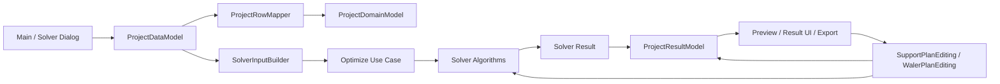
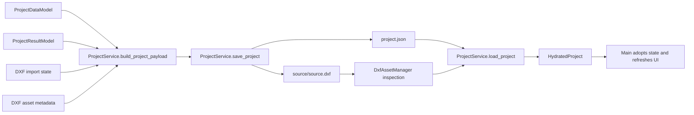

# 系統流程

## DXF Data Flow

```mermaid
flowchart LR
    File[DXF File] --> Read[Read entities / OCS to WCS]
    Read --> Recognize[Recognition]
    Recognize --> Associate[Connections / Associations / Materials]
    Associate --> World[world_result]
    World --> Review[DXFReviewWorkflow]
    Review --> Decisions[Manual override / Exclusion / Confirmation]
    Decisions --> Coordinate[Coordinate projection]
    Coordinate --> Projection[result + ProblemRecord + ReviewItem]
    Projection --> Dialog[DXFImportDialog]
    Dialog --> Outcome[DXFImportDialogOutcome]
    Outcome --> Service[ProjectService]
    Service --> Rows[Project rows]
    Rows --> Project[ProjectDataModel]
```

## Solver Data Flow

```mermaid
flowchart LR
    UI[Main / Solver Dialog] --> Project[ProjectDataModel]
    Project --> Mapper[ProjectRowMapper]
    Mapper --> Domain[ProjectDomainModel]
    Project --> Builder[SolverInputBuilder]
    Builder --> UseCase[Optimize Use Case]
    UseCase --> Solver[Solver Algorithms]
    Solver --> Result[Solver Result]
    Result --> ResultModel[ProjectResultModel]
    ResultModel --> Output[Preview / Result UI / Export]
    Output --> Editing[SupportPlanEditing / WalerPlanEditing]
    Editing --> Solver
    Editing --> ResultModel
```

## Project Persistence Flow

```mermaid
flowchart LR
    Data[ProjectDataModel] --> Build[ProjectService.build_project_payload]
    Results[ProjectResultModel] --> Build
    DxfState[DXF import state] --> Build
    Asset[DXF asset metadata] --> Build
    Build --> Save[ProjectService.save_project]
    Save --> Json[project.json]
    Save --> Managed[source/source.dxf]
    Json --> Load[ProjectService.load_project]
    Managed --> Inspect[DxfAssetManager inspection]
    Inspect --> Load
    Load --> Hydrate[HydratedProject]
    Hydrate --> Adopt[Main adopts state and refreshes UI]
```
