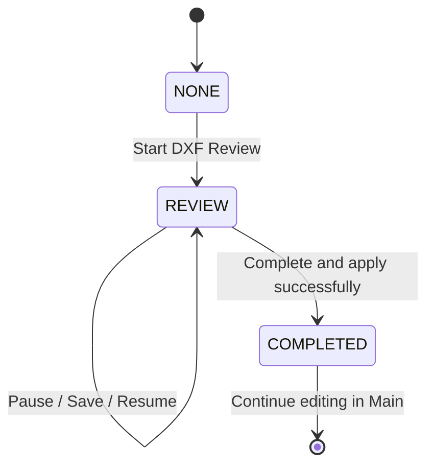
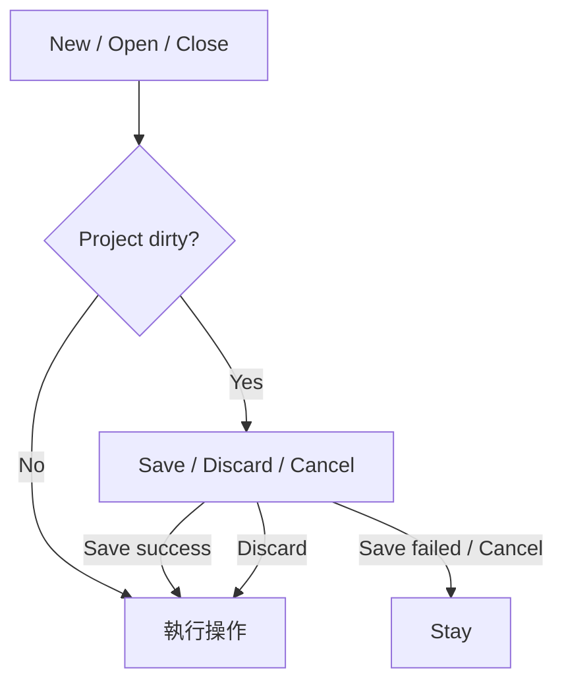
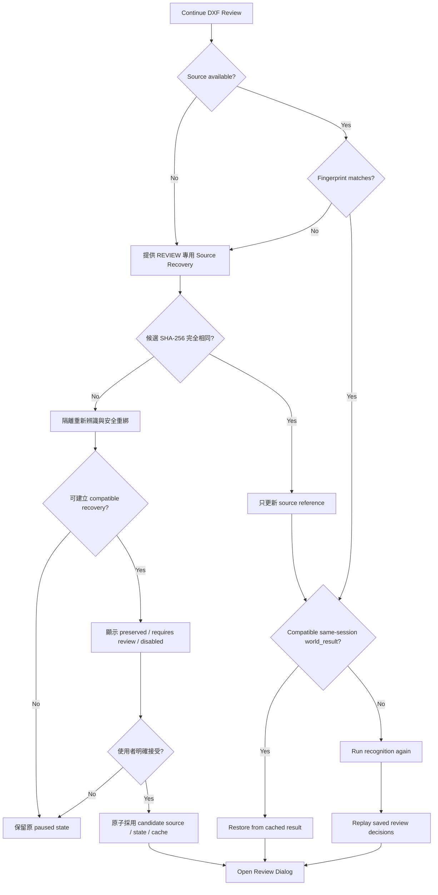
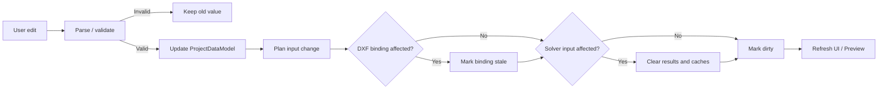
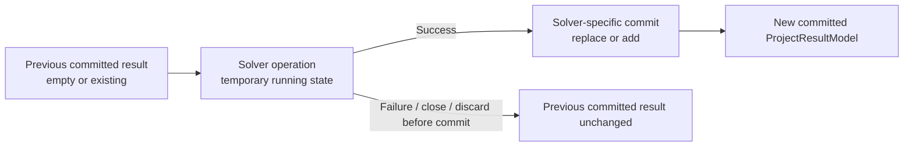
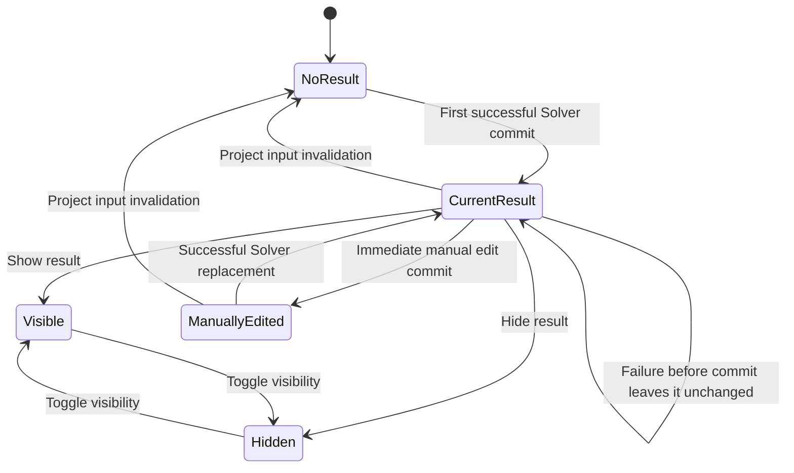
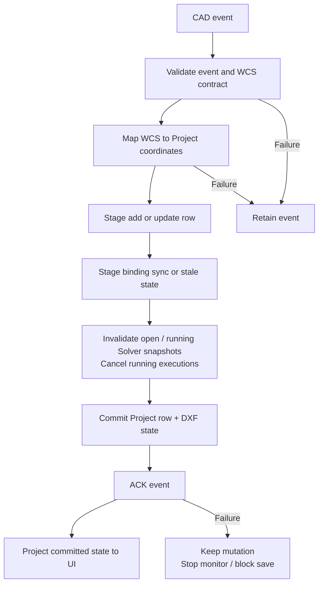
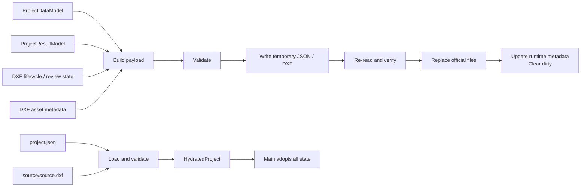

# 系統流程

## 1. Purpose

本文件說明 SupportOptimizer 在使用者發起操作後，runtime state 如何流動，以及：

- Trigger 是什麼？
- Temporary／staged state 在哪裡？
- 什麼時候 commit 成為正式狀態？
- Failure、Cancel 或 rollback 時怎麼處理？

相關文件的責任如下：

- [ARCHITECTURE.md](ARCHITECTURE.md)：Component 責任、state ownership 與 dependency direction。
- [DOMAIN.md](DOMAIN.md)：工程實體、工程限制與共同語言。
- [SOLVER.md](SOLVER.md)：候選生成、搜尋、評分與 Solver policy。
- `WORKFLOW.md`：操作發生後，runtime state 依序如何改變。

本文件以目前實作為主。尚未實作、但已由產品確認的行為會標示為 `Confirmed Desired Behavior`，不得解讀為目前 runtime 已有的功能。

### OpenSpec change 文件閱讀方式

OpenSpec change 的文件有不同責任，不應把 `proposal.md`、`design.md` 與
`spec.md` 當成同一份文件的不同版本：

| 文件 | 主要用途 | 何時閱讀 |
| --- | --- | --- |
| `proposal.md` | 用白話說明問題、目標流程、範圍與不變事項 | 判斷是否採用這個方向時先讀 |
| `design.md` | 說明技術方案、架構對齊、取捨與被拒絕的替代方案 | 準備實作，或流程仍可能調整時閱讀 |
| 相關 `spec.md` | 定義可觀察行為、工程規則、邊界與失敗語意 | 實作或修改測試前閱讀直接相關的區段 |
| `tasks.md` | 定義實作依賴順序與驗證條件 | 開始執行 change 時閱讀 |

建議順序為：

```text
proposal.md
    ↓ 確認方向
design.md
    ↓ 確認方案與取捨
相關 spec.md
    ↓ 確認精確行為與邊界
tasks.md
    ↓ 依序實作與驗證
```

不需要為了理解一個 change 而閱讀所有既有 spec。Proposal 應包含
「閱讀指引」，列出本次 change 直接相關的 capability、Requirement 或
scenario；若缺少閱讀指引，應先從 `proposal.md` 的 Modified Capabilities
與 scope 推導最小閱讀範圍。

Proposal 的開頭應先提供 30 秒摘要，至少包含：

- 現在遇到的問題。
- 改完後使用者或工程流程會看到的主要變化。
- 一段現況到目標的白話流程。
- 哪些行為維持不變。

必要的 domain term 應在第一次出現時用白話解釋。候選排序、資料欄位、
state machine、fallback 等實作細節，應留在 `design.md` 或 `spec.md`，
不要讓 proposal 成為 spec 的縮寫。

### OpenSpec artifact 的固定輸出結構

上述閱讀方式必須實際輸出在文件內，而不是只由 Agent 在對話中提醒。
未來產出的 OpenSpec 文件應遵守以下結構：

#### `proposal.md`

文件開頭依序提供：

1. `## 閱讀導航`：用表格列出 P0「現在必讀」、P1「實作前閱讀」、P2「需要時再讀」。每一列都要包含要回答的問題、文件／段落與閱讀目的。
2. `## 快速摘要`：用 3～5 點說明問題、決定、主要流程變化與不變事項。
3. `## 現況與目標`：用 Before／After 或現況／目標對照。
4. `## 主要流程`：用短流程圖或編號步驟描述使用者可理解的流程。
5. `## 不變事項`：列出本次 change 明確不會改變的行為。

之後再放 OpenSpec 標準的 `Why`、`What Changes`、`Capabilities` 與
`Impact`。若存在多份相關 spec，必須另外列出「本次先不用看」的
文件或區段；不要要求使用者閱讀整個 `openspec/specs/`。

#### `design.md`

文件開頭依序提供：

1. `## 閱讀導航`：指出哪些 Decision 是實作者現在必須理解的，哪些是只有遇到特定模組或風險時才需要閱讀。
2. `## 方案摘要`：用一段文字或流程圖把技術方案對應回 proposal 的主要流程。
3. `## 決策對照`：列出 Decision、選擇原因、被拒絕的替代方案，以及會影響哪些 spec／task。

詳細的 Architecture Alignment、state ownership、相容性、風險與
Migration Plan 放在後面，不讓讀者一開始就被實作細節淹沒。

#### `spec.md`

在 `Purpose`（新 capability）或 `## ADDED / MODIFIED Requirements`
之前提供 `## 閱讀導航`，把 Requirements 分成：

- 這次行為一定要理解的 Requirements。
- 只有修改特定模組或測試時才需要閱讀的 Requirements。
- 本次 change 不涉及、可以先跳過的 Requirements。

每個 Requirement 仍須保留完整的 SHALL／MUST 規則與 WHEN／THEN
Scenario；閱讀導航只是降低閱讀成本，不得刪除規範內容。

#### `tasks.md`

開頭提供 `## 實作前閱讀`，列出開始每個 task group 前必須閱讀的
proposal、design Decision 與 spec Requirement；每個 task 另外標示其
對應的行為或驗證條件。

如果某一份 artifact 不需要建立，應在上一層文件的閱讀導航中明確寫出
「不需要此文件」及原因，而不是讓使用者自行猜測。

### OpenSpec archive 與開發歷程

Codex 透過 `.agents/skills/openspec-archive-change/SKILL.md` 完成 archive move 後，
會呼叫專案的 development-history updater，將 archived change 的日期、名稱、路徑、
完成摘要、capability 與實際驗證狀態寫入 `docs/DEVELOPMENT_HISTORY.md`。新條目位於
「Codex／OpenSpec 封存紀錄」區塊最上方；更新器不得修改人工補充或截至
2026/09/28 早上的起始歷史。

相同 archived change 可安全重跑補寫，不會產生重複條目。若 archive 已成功但開發
歷程寫入失敗，archive 維持成功，Codex 必須回報「開發歷程待補寫」、archive 路徑、
錯誤原因與重跑方式，不得將 change 移回 active changes。

此自動更新由 Codex archive workflow 保證。直接執行原生 `openspec archive` CLI
不包含此專案 hook，也不會自動執行 Git、GPT、Copilot、LINE 或其他外部平台操作。

## 2. Workflow State Overview

### 2.1 Authoritative state

| State | Runtime owner | 意義 |
| --- | --- | --- |
| `ProjectDataModel` | Main Application session | 正式 Project input：Walers、Struts、Braces、Inventory、Material Specs |
| `ProjectResultModel` | Main Application session | 正式 Solver results、visibility、calculated time 與材料結果 projection |
| Live DXF Review state | `DXFReviewWorkflow` | WCS result、projected result、ReviewItems、manual decisions 與 coordinate state |
| Paused DXF Review state | Main／Application session | Live session 關閉後的 serialized resume state |
| Durable DXF state | Project payload／persistence | 保存後的 workflow status、resume state 與 managed asset metadata |
| Solver snapshot／execution lifecycle | Application `SolverOperationRegistry` | 從 input snapshot 建立到 Dialog 關閉的 open／running／stale／closed state、execution identity 與 cancellation source |

Runtime-only state 包含：

- Support candidate cache。
- Single Waler Solver memory。
- Solver operation handles、execution identities 與 cancellation tokens。
- Same-session DXF `world_result` cache。
- UI selection、viewport 與 editor draft。
- `project_dirty` indicator。

這些 runtime-only state 不會當作完整 Solver cache 保存至 Project。

### 2.2 Temporary state 與 committed state

Temporary／staged state 包含：

- Solver worker 尚未完成的計算。
- Global Waler worker 中尚未形成合法 solution 的候選與診斷。
- Application service 建立、等待 Main 採用的 staged Project／result。
- Editor 中尚未通過基本格式檢查的輸入。
- Persistence 尚未替換正式檔案的 temporary output。

Committed current state 是已由 Main 採用的：

- `ProjectDataModel`。
- `ProjectResultModel`。
- Serialized paused DXF Review state。
- DXF lifecycle status。
- DXF asset metadata。

Solver operation 的 Running、temporary candidate 或 worker state，不是 `ProjectResultModel` 本身的 destructive state transition。

在新結果 commit 前，既有 committed result 保持不變。

Project load、Support／Single Waler result adoption、Material Spec 與 CAD
mutation 依序分成 `stage → commit → projection`：stage 完成所有可能失敗的
validation、copy、serialization、summary、metadata、cache 與 DXF state 建立；
commit 只做 plain reference／scalar assignments，不呼叫 property setter、Tk
variable、callback、filesystem 或 collection mutation；projection 才刷新 widgets、
Preview 與狀態顯示。

commit 後若 projection 失敗，正式 state 不 rollback。Main 設定
`projection_stale` 並阻止 Project／result／Material Spec／Solver／CAD mutation 與
save；此時主選單會在「專案」與「說明」之間暫時顯示「⚠ 重新整理畫面」，
使用者只能先執行此恢復命令。正常狀態不顯示該選單項目。只有五張輸入表、Results
Tree、材料摘要、Preview、Project／DXF／CAD status、selection 與 action state
全部成功重建才解除 guard；既有「更新圖面」與 CAD「重新顯示狀態」都不是完整
恢復入口。

### 2.3 DXF lifecycle status

| Status | 意義 |
| --- | --- |
| `NONE` | 沒有進行中的 DXF Review，也尚未完成本專案的 DXF import lifecycle |
| `REVIEW` | Review 尚未完成；Dialog 可已關閉，但 serialized resume state 仍存在 |
| `COMPLETED` | DXF Review 已完成，辨識結果已套用至 Project |



`COMPLETED` 不表示 Project input 永遠不能修改。後續 Main／CAD 修改若破壞原 DXF binding，binding 會標示為 stale。

## 3. Application Startup

### Trigger

使用者啟動桌面程式。

### Flow

```text
main.py
→ 建立 Tk root
→ build_dependencies()
→ SupportInputApp
→ 初始化 Application state
→ 啟動 CAD event polling
→ Tk mainloop
```

啟動後目前 state 為：

- 空白 `ProjectDataModel` 與 `ProjectResultModel`。
- 已載入預設 Inventory 與必要 Material Specs。
- 無目前 Project path。
- `dxf_workflow_status = NONE`。
- Solver memory 與 Support candidate cache 為空。
- `project_dirty = false`。

初始化完成即成為目前 runtime state，但尚未建立磁碟 Project。初始化失敗時不會產生半完成 Project 檔案。

## 4. New / Open / Close Project



### 4.1 New Project

| Item | Current behavior |
| --- | --- |
| Trigger | 使用者選擇建立新專案 |
| Dirty prompt | `Save / Discard / Cancel`；Save 只在回報 `saved` 後繼續 |
| Temporary state | 新的空白 model、預設 Inventory 與空 result |
| Commit | navigation guard 允許後，Main 才採用新 `ProjectDataModel`／`ProjectResultModel` |
| Side effects | 清除 Project path、DXF state、Solver caches；workflow 設為 `NONE`；刷新 UI；清除 dirty |
| Failure／Cancel | Save As 取消、Save 失敗或 Cancel 都不執行 reset；保留目前 Project、results、DXF state 與 dirty |

### 4.2 Open Project

| Item | Current behavior |
| --- | --- |
| Trigger | 使用者從「檔案 → 開啟專案…」開啟單選對話框；清單每次由 repository 現況建立，取消對話框不改變任何正式 state |
| Target validation | 沒有專案時先提示並結束；選取後先重新確認目標檔仍存在，再進入 navigation guard，因此空清單、取消或目標失效都不開啟 dirty prompt |
| Dirty prompt | `Save / Discard / Cancel`；Save 只在回報 `saved` 後繼續 |
| Temporary state | 經驗證的 payload、DXF asset report 與完整 `HydratedProject` |
| Commit | navigation guard 允許後才 load；Main 一次採用 Project input、results、DXF state 與 workflow status |
| Side effects | 以全新 runtime Solver cache references 與 `dirty=false`／空 reason 同次 commit；之後刷新 UI |
| Failure／Cancel | Save As 取消、Save 失敗、guard Cancel 或 Load failure 都不採用新 state；目前 Project 與 committed results 保留 |

正式 Windows onedir 成品的可寫 `project_cases/` 初始預置 `Y05車站第一層支撐` 與 `Y29車站第一層支撐`；每案只含 `project.json` 與 managed `source/source.dxf`。兩案由 tracked release asset 快照在 build 時逐檔建立，不從 repository root 的 runtime `project_cases/` 取材。Source run、測試環境或其他未預置案例的合法部署仍在 repository 不存在時建立空目錄。

預置案例沒有特殊 runtime 身份：Open、Save、Save As 與 Delete 都沿用一般 managed Project 行為。初始成品不含 `project.json.bak`；第一次儲存既有案例時才由 persistence 建立上一版備份。使用者刪除預置案例後，系統不在同次執行或下次啟動自動補回。

Load 會恢復 result visibility 與 paused Review state，但不恢復 runtime Solver cache。

Project schema compatibility 在 persistence boundary 判斷。`schema_version` 只有欄位不存在才視為 missing；欄位存在時必須是排除 bool、且大於等於 `1` 的真正整數。missing、較舊版本與現行版本都必須通過同一套現行結構與 Domain 驗證；高於目前支援版本的檔案拒絕開啟並提示使用較新程式。`input_data` 只接受現行 table contract；必要 table 必須存在、optional table 可省略，已提供 table 的每筆 row 欄位集合必須完全相同。missing／較舊版本若驗證失敗，或 missing／較舊／現行版本發生 row／table schema mismatch，系統回報「無法以現行格式讀取；請建立新專案，並重新匯入 DXF 或重新輸入資料」及可辨識 table、row、field 的底層錯誤。載入流程不偵測舊格式特徵、不做 legacy 欄位轉換，也不提供舊檔轉換入口。相容檔案只有在使用者實際成功儲存時才改寫為現行 schema；僅開啟或關閉不會改寫來源檔。

### 4.3 Close Application

| Item | Current behavior |
| --- | --- |
| Trigger | 使用者關閉主視窗 |
| Dirty prompt | `Save / Discard / Cancel` |
| Save | 只有 Save 回報 `saved` 才繼續關閉 |
| Close commit | 停止 CAD polling、保存 UI-only window state、結束 Tk root |
| Failure／Cancel | 不關閉；目前 Project 與 committed results 保留 |

New 與 Open 共用同一個 decision-only navigation guard。Guard 不執行 reset 或 load；只回傳 `proceed`／`cancelled`，destination-specific destructive action 維持在 guard 之後。

## 5. DXF Import and Review

### 5.1 Trigger and lifecycle

使用者選擇 DXF 匯入時：

- `NONE`：選取 DXF 並開始新 Review。
- `REVIEW`：繼續目前 Review。
- `COMPLETED`：不重新開啟 Review，提示後續應在 Main 修改。

選檔取消不修改 state。

### 5.2 Recognition and Review flow

```mermaid
flowchart LR
    File[DXF file] --> Read[Read entities<br/>OCS to WCS]
    Read --> Recognition[Recognition / Association / Validation]
    Recognition --> World[WCS world_result]
    World --> Workflow[DXFReviewWorkflow]
    Workflow --> Review[Manual review<br/>Confirmation / Exclusion]
    Review --> Coordinate[Coordinate projection]
    Coordinate --> Outcome[DXFImportDialogOutcome]
    Outcome --> Decision{Action}
    Decision -- Pause --> Serialized[Serialized Review state]
    Decision -- Complete --> Stage[Stage DXF to Project apply]
    Stage --> InitialZoning[Initial Zoning suggestion<br/>reviewed world geometry]
    InitialZoning --> Project[ProjectDataModel]
```



Live Dialog 開啟期間：

- `DXFReviewWorkflow` 擁有 WCS／projected result、problems、ReviewItems、manual decisions、confirmation、exclusion、coordinate state 與 import mode。
- `DXFImportDialog` 只擁有 selection、viewport、widget variables 與 temporary UI draft。
- Dialog 透過 snapshot 顯示 Workflow state，不直接修改正式 Review fields。

Recognition canonical geometry 維持 WCS。Local coordinate 是透過 `CoordinateSystem` 產生的 projection，不覆寫 WCS result。

Dialog outcome 主要為 `pause` 或 `complete`。完成 Review 不等於 Dialog 已修改 `ProjectDataModel`；Project mutation 由 Main／Application boundary 執行。

#### Waler contact-face canonical finalization

Waler、Strut 與 Brace 先各自完成 source recognition；Waler recognition 保留 source-supported provisional axis、完整 component envelope、outer faces 與 provenance，不在此階段以全域 endpoint 距離投票選接觸面。Importer 在 Column source recognition 完成後、建立 Joist context 前，使用已完成的 immutable member facts 建立 terminal-to-Waler identity，再由 provisional 交會點朝 member 本體的方向判定支撐側，選擇該側 envelope 的最外實體表面。

可靠 Waler envelope 的實體寬度，以兩條 qualified outer faces 各自中點到另一條 supporting line 的正交距離取對稱平均；一般 LINE、closed outline 與 qualified MLINE 的 candidate 寬度 gate、final envelope 及 `WalerEnvelopeFacts.source_width` 使用同一量測語意。完整 envelope 建立後，`source_width` 是 Review baseline、材料自動配對與顯示的唯一正式寬度，不在下游重算。HATCH RC 仍保留 `auto_hatch` 材料優先權；單線 Waler 仍為 unknown width。這項正交公式只用於 physical rail width 與對應最大寬度 gate；duplicate、nearby、overlap 及 finite geometry qualification 繼續使用有限線段距離，不因此放寬或改變 topology／contact-face authority。

一輪辨識先建立 canonical terminal relations，再以這些 relations 完成 Waler contact face，最後才建立 runtime-only Brace member verdict。唯一候選標為 `unique`，同一 ambiguity set 內的 best 與 competitors 都標為 `competing`；兩者共用同一份 provisional 交點、body direction 與來源 provenance，不另建幾何 truth。Waler 判側採 unique-first：只要有可靠 `unique` evidence 就忽略相反的 `competing` side authority並留下 warning；沒有可靠 `unique` 時才使用 `competing` evidence，同側可完成正式接觸面，兩側衝突才是 contact-face ambiguity。Brace／Strut 正式 endpoint 與 connection 始終只消費 `unique` relations。member verdict 不回頭改變 contact-face outcome，依賴方向固定為 `terminal relations → Waler contact face → unique-only member verdict`，避免循環判定。

同一份 staged contact resolution 同時提交正式 Waler line、contextual Strut endpoint 與完整 Brace connection；CandidatePoint、association、diagnostics、CornerBrace refinement 及 Joist context 只消費已提交結果，不各自重算內外側。一般 Strut 保留既有逐端 direct relation，BIM contextual Strut 保留已選 source identity；Brace 仍使用 250 mm direct／600 mm outward-extension eligibility，但只有兩端各自唯一、連到不同 Waler、兩個 selected contact faces 都為 formal、來源軸與兩面都有合法有限交點且提交後長度合法時，才一次提交兩端 geometry 與 pair identities。任一條件失敗時整支 Brace unresolved，不保留部分正式 geometry 或 connection。若兩個 terminal relations 在數值精度內無法區分，系統回報 blocking ambiguity，不以 Waler ID、handle、幾何候選點或 collection order 打破平手。

完整 envelope 無法唯一建立、authoritative evidence set 沒有可靠方向、或同一 authority level 的可靠 evidence 同時指向兩側時，系統建立 blocking Review problem。Terminal identity ambiguity 仍是獨立的 blocking member problem，但不再單獨迫使已有一致 side evidence 的 Waler 降為 provisional。Provisional axis 只供 preview／diagnostic，不代替正式接觸面；流程不使用全域 framing centroid、row order、source entity order或最先出現的平行線強行選側。Source Exclusion／Restore、manual replay、confirmation invalidation 與 Pause／Resume 均從目前 source facts 重新建立 resolution，不保存第二份 Project／Solver schema。

#### Provisional Waler 人工正式化

當 Waler 已形成 Review member、但自動 contact-face／envelope 無法唯一提交時，STEP4
只從 DXF Review「修改工具」的「圍令正式化」進入正式採用。工具固定綁定目前選取的
repair-eligible Waler，並以互斥的「線的來源」選擇「點位清單」或「已讀取的 CAD 線」；
預設使用點位清單及目前線的起終點。只有同一 member 已由一般「從 CAD 指定工程線」
讀入完整 CAD pair 時，CAD 選項才可用，且不需要先按一般「套用選取點」。工具本身不
讀取 CAD event，只有一個「採用正式圍令」按鈕，並顯示：「此線將作為圍令接觸面
（支撐頂到的面），不是圍令中心線」。任何通過既有 candidate-line validation 的有限線
都可採用，不要求位於原 envelope 外側邊。

主 Review 與 Preview 的「選起點／選終點」「套用選取點」維持一般幾何編輯：對
provisional Waler 只更新暫定線，絕不建立 `manual_repair` authority。已是 formal／
`manual_repair` 的 Waler 執行一般套用時，在 validation 與任何 workflow mutation 前拒絕，
並提示改用「圍令正式化」；automatic formal Waler 與其他角色仍沿用一般流程。

只有按下「採用正式圍令」才依工具內來源建立 revision／fingerprint／exact source identity
綁定的 staged plan：點位清單使用 `manual_candidate_points`，CAD pair 使用 `cad_manual`。
開啟工具後若同 member 的 CAD pair 已更新，舊視窗必須以「CAD 線已更新，請重新開啟
圍令正式化」拒絕，不建立 plan，也不改變 live Review state。commit 才一次替換 WCS
result、projection、diagnostics、confirmation 與 candidate state；取消、validation 失敗、
stale plan 或 commit 失敗均保持舊正式線與完整 live state 不變。人工線成為該 Waler 唯一
正式接觸線，authority 記為 `manual_repair`；只移除同一
exact identity 的 envelope／contact-face ambiguous 或 unresolved blocker，其他來源、複合
handles、overlap、connection 與 association 問題仍依重建結果保留。寬度只沿用 recognition
已產生的正交 `WalerEnvelopeFacts.source_width`：唯一值為 `unique`，沒有可靠值為
`unknown`，不同值為 `ambiguous`；人工線本身不量測寬度，也不猜材料，人工材料選擇不受
影響。

正式化會先捨棄 provisional-axis 的 terminal relations，再以人工接觸線重建 Strut／Brace
連接、association、Waler contact review 與 formal Brace adjustment baseline。支撐構件本體
全部位於人工線同側時，`support_normal_world` 指向該側；兩側衝突或沒有可靠構件時為
unknown。unknown 不撤銷人工正式接觸線，但後續背填／寬度調整以
`WALER_SUPPORT_SIDE_UNKNOWN` 原子阻擋；已知側的 Brace 則沿用既有剛體平移規則。

明確 intent 以 version 2 `manual_overrides` 的 optional
`waler_engineering_line_formalized` 保存，不提升 schema version。Same-fingerprint
Pause／Resume、exact source restore 與 Source Exclusion 後復原都從 fresh recognition result
重新驗證並重播專用操作；來源被排除期間 decision 不生效。內容不同的 compatible recovery
不轉移 authority：exact Waler subject 只列 `requires_review`，來源消失、role 改變或被幾何
rebind 到另一 identity 時列 `disabled`。本流程不提供「取消人工正式化」；選錯時再次用同一
專用動作採用另一條合法線，新的 atomic decision 取代舊線。

#### Waler 尺寸調整與 Brace baseline

一般正式 Brace 在 Waler 背填／寬度調整時，不固定單端接點，也不逐端增量修改。Review
先保存 adjustment 前的 runtime-only WCS baseline，再用兩端 final Waler finite lines 聯立求
共同平移；成功結果同時更新兩端，保持 Brace 向量、長度與角度。平行不相容、identity
或 baseline drift、退化幾何及 infinite-line 解落在 finite segment 外都產生 blocking
diagnostic，整個 Waler／Strut／Brace／CornerBrace／derived-state proposal 不提交。

人工 Brace endpoint override 使用既有 version 2 `manual_overrides`，並以 optional
`geometry_coordinate_space = "baseline_wcs"` 表示同一絕對 WCS 中尚未套用 Waler adjustment
的座標，不提升 Review state 或 Project schema。使用者在已調整畫面選點時，workflow 先由
immutable baseline 與兩端 final Waler 算出目前共同平移 `t`，只保存 `clicked - t`；換算點
若不在對應 baseline Waler finite segment，整次修改原子拒絕，不 clamp、吸附或硬存。

Recognition、Source Exclusion／Restore、debug restore、Pause／Resume 與 manual replay 固定
依下列順序重建：`recognition → baseline-WCS manual geometry replay → formal baseline build →
Waler dimension replay → downstream rebuild`。舊 Brace override 若沒有座標語意標記，只在
有效共同平移為零時安全視為 baseline WCS；存在非零 adjustment 時跳過該人工 geometry 並
列入既有 `ManualReplayReport.needs_review`，可獨立重驗的 Waler 尺寸 decision 仍繼續 replay。
Project row 始終只輸出調整後的一組 Brace endpoints，runtime baseline 不成為第二份正式
geometry、Solver input 或 persistence schema。

#### BIM Block Strut／Brace role-aware recognition

一般 DXF recognition 仍是預設路徑。只有位於 Strut 或 Brace role layer、具有有效 root handle 的 root `INSERT`，才會在跨來源 geometry merge 前依自己的 role 獨立進入 BIM component-like 判定；其他 role 不進入此路徑。Nested INSERT 會遞迴展開並套用 insertion、rotation、scale 與 OCS → WCS transform；child entity 即使位於 Layer 0，role 仍由最外層 root layer 決定，provenance 則保留最外層 root handle。

特殊路徑以整個 root INSERT 的方向、完整縱向範圍、橫向寬度、fragment center alignment 與 longitudinal evidence 判斷是否能代表一支完整 Strut 或 Brace，不以單一局部平行邊或最長 LINE 強行產生構件。對齊於同一軸的多段矩形可跨越內部未顯示區域重建完整工程軸，但不得超出 terminal source evidence 外插；一個 root 即使代表一個來源範圍，也不保證一定能成功辨識。

若同一 Strut root 具有完整 closed outline／connected contour，且其他 longitudinal detail 可能使一般平行邊辨識跨輪廓配對，系統會先以 root-local topology 判定工程軸。只有同一 closed traversal 或具有實際 transverse／end-cap connection 的 rails 才可互為 companion；僅因同 root、平行、等長或間距合理不成立。幾何等價的同軸 envelopes 合併為一支 Strut，不等價的完整 axes 則成為 blocking ambiguity。`source_width` 由唯一完整 component envelope 推導，不固定為 350 mm；若軸線可靠但 envelope 寬度無法唯一判定，保留工程軸但不自動辨認材料規格。

Brace 重用同一套 pure WCS fragment／topology evidence，但使用 Brace role policy；同一 root 最多產生一支完整 Brace。明確相連、共同支持同一構件寬度的 transverse rail bands 可以收斂為同一軸；兩條不等價且各自可靠的完整軸仍是 blocking ambiguity，不會因為某一條較容易連到 Waler 就被選中。Brace recognition 只由 Brace source geometry 決定；Waler context 只在 recognition 完成後參與 connection／canonical finalization，不會改變 component-like classification、recognition winner、來源支持的軸、寬度或 root provenance。

結果依既有 Review lifecycle 處理：

- `not_applicable`：同一個未合併 root group 回到一般 recognition。
- `recognized`：只建立一個 role-correct、使用完整工程軸的 Strut 或 Brace candidate，並保留 root source identity。
- `failed`／`ambiguous`：建立 blocking recognition problem 與 unresolved ReviewItem，不回退到局部 fragment recognition。

不同 root INSERT 即使共線也不會合併。Brace whole-axis recognition 完成後，才進入有限 Waler segment 的 endpoint connection 流程：每個端點先沿用既有 `connection_tolerance_mm = 250 mm` 內的 direct 判定；只有 `selection_source == "auto"` 且該端沒有 direct candidate，才沿既有可靠 Brace 軸向外搜尋 finite Waler segment 的實際交點。direct 若有多解即為 blocking ambiguity，不得改走 extension。軸向 extension distance `<= 600 mm` 時，唯一最近交點才具備 terminal eligibility；`> 600 mm` 的交點不採用。600 mm 是 Brace 專用的 automatic connection safety boundary，不會放寬 direct 判定或其他 member role。系統亦不採用 inward、Waler 無限延長線或改變 Brace 角度的解。距離差 `<= ambiguous_connection_delta_mm` 的最近合法多解，以及兩端連到同一 Waler，均為 blocking connection error。零端或單端沒有合法關係時，仍使用既有 `BRACE_NOT_CONNECTED`／`BRACE_ONE_END_NOT_CONNECTED` diagnostics，但正式結果一律是整支 Brace unresolved。

上述 extension 只產生 terminal evidence，不反向改寫 source-supported recognition axis、辨識方法、寬度或 provenance。完整 resolved 時，兩端才一起採用 Brace 軸線與各自 Waler selected formal contact face 的有限交點；unresolved 時保留完整 source-supported axis 供 preview／evidence，但 Candidate Point 不建立 recommendation／selection，也不提交任何 Waler pair。人工 Candidate Point／CAD 工程線不會自動延伸；重播後必須依目前 active Waler sources 與相同 direct 規則重新推導 identities，不保存舊 identity，幾何點本身不能替重疊 Waler 指定 winner。Source Exclusion／Restore、recognition rebuild、confirmation invalidation 與 Pause／Resume 都重建 terminal evidence、contact faces 與 member verdict，不保存另一份持久化 Waler connection truth。

Original DXF、source geometry preview、source exclusion／restore、manual override replay、confirmation、Pause／Resume 與 `DXFImportResult → Project rows` boundary 仍沿用既有契約；BIM child metadata 不進入 `ProjectDataModel`。一般非 BIM Brace、非 HATCH Waler 與其他 role 的辨識規則維持不變。Guided Recognition 仍是未來需求。

#### BIM Joist Column-qualified terminal residual recovery

Beam-role root `INSERT` 先依既有 whole-source 強證據建立雙 C base axes；只有同一組 axes 已由 same-Strut、opposite-side、`518 ± 5 mm` spacing 與 Column midpoint `±2 mm` 唯一建立 paired relation，才會開啟 Column-qualified terminal recovery。系統從 formal Column center 沿既有 Joist 軸朝該 terminal 外側使用 signed `0～700 mm` inclusive window，重新檢查同 root、同方向且可唯一對齊既有六條 longitudinal rail bands 的短 fragments；700 mm 只限制候選 evidence，不是固定延長量，也不放寬一般 20% whole-source 門檻。

兩個 sibling envelopes 必須各自至少由兩個相異 rail bands 支持，並各自從自己的來源 evidence 決定 terminal station。兩個 stations 相差 `<= 50 mm` 只確認它們屬於同一 paired terminal event；兩條 formal axes 仍分別停在自身 source-supported endpoint，不取較外值、不平均、不互相延伸。任一 sibling 缺少 quorum 時放棄該 terminal recovery並保留 base axes；兩側各自完整但不相容，或同側存在多個完整 interpretations 時，回報 blocking ambiguity。

Preliminary relation只在 pure Joist service 內開啟 recovery，不進入 candidate、Review 或 Project。Recovery 後以 finalized axes 重新計算 finite contacts與pair relations；恢復後實際穿越 Strut 的接觸改為 direct finite crossing，不再同時保留 `endpoint_face_contact`。若 final proof單純不足，從base axes重建正式結果；若 finalized axes改指其他 Strut／Column identity、同時形成多個 identities或其他明確 context drift，回報blocking diagnostic，不提交preliminary truth。結果仍只透過既有 Beam geometry、crossings與associations傳遞，不新增Project persistence schema；一般 MLINE／closed-outline Beam與Brace-contact single Joist不進入此 recovery。

#### HATCH RC Waler recognition

位於使用者指定 Waler role 圖層的 `HATCH` 會以各自 root handle 進入 RC 圍令特殊路徑；pattern 名稱、角度、比例及 solid／patterned fill 不影響 RC 語意。Importer 從 HATCH boundary 取得 OCS → WCS 幾何，只有唯一封閉、可支持一支完整直線長條圍令的 exterior 才建立 candidate；L 形、多個不連續 exterior、曲線／無效 boundary 或多解會形成指向該 HATCH 的 blocking Review problem，不以一般外框辨識回退。此 RC 路徑不受一般構件 600 mm 最大寬度 recognition setting 限制。

HATCH candidate 保留完整中心軸、實際寬度及兩條縱向外表面，再由共用 Waler contact-face canonical finalization 產生正式工程線；HATCH RC 不受一般構件 600 mm 最大寬度 gate 限制。Base recognition material 為 `RC / auto_hatch`，優先於寬度材料對應；STEP4 人工材料修改、confirmation invalidation 與 replay 仍沿用既有 workflow，Project row 仍只使用既有 `material_spec` 欄位。

幾何等價的外框 LINE／POLYLINE 只保留為 immutable preview／diagnostic evidence，不再進入一般 Waler group merge。此 runtime claim 在 HATCH recognized、failed、ambiguous 或被排除時都會由原始 boundary 重建，因此排除 HATCH 不會讓同一外框換 identity 重新出現；無法證明等價的幾何不會被吞掉。Source Exclusion／Restore、Pause／Resume、fingerprint safety 與 completed import lifecycle 均繼續以 HATCH handle 作為 durable source identity，不新增 Project persistence schema。

STEP4 提供明確觸發的 CornerBrace repair，處理 BIM 遮擋後只剩局部殘線、或自動辨識已有正式角撐但軸線不正確的情況。此工具不放寬 automatic recognizer，並依 evidence 分成兩種模式：`reference_template` 由 compatible automatic-primary template 轉移局部配置；`body_relationship_selection` 則以已唯一辨識的 body 與候選工程關係建立修補，不使用 template。

兩種模式都必須保存 exact target 與 relationship identity、先 Preview，再由使用者明確 Apply 才原子更新 Review state。候選 eligibility、hard validation、provenance 與 replay 的精確規則以 [`dxf-corner-brace-repair-tool` main spec](../openspec/specs/dxf-corner-brace-repair-tool/spec.md) 為準；本 Workflow 只摘要操作與 state lifecycle，不另建 acceptance rules。

已套用 repair 會以 optional payload 保存於既有 version 2 `manual_overrides`，不提升 Review state version，並依 `selection_mode` 保存及重驗各模式所需 evidence。Same-fingerprint Pause／Resume 不得靜默切換模式、改選 template 或改選 target relationship；任一必要 evidence 無法重建時只回報 needs-review。內容不同的 compatible recovery 不轉移 repair geometry 或 selection decision：exact role/source subject 保留為 `requires_review`，來源消失或 role 改變則為 `disabled`，兩者都不能成為後續 repair reference。Cancel、關閉 Preview、stale plan 或 commit failure 均不修改 live Review truth。

`reference_template`在same-fingerprint replay重新定位selected、primary與manual-secondary references時，以`(reference_class, CornerBraceRepairSubjectKey)`要求目前eligible evidence恰好一筆且整組一對一對齊；recognition產生的`CB*`顯示ID只供呈現、diagnostic與audit，不是工程identity。零筆、多筆、duplicate saved key或class不符一律安全拒絕，不用舊顯示ID、距離、順序或first match補值。成功後candidate與新provenance使用目前references，再重驗template局部尺寸、geometry、唯一connection、eligibility、target Waler／Strut canonical source identities與candidate validation。Legacy adopted-line replay共用同一reference matcher，但仍使用保存的world line，不重新ranking或改選template。

CornerBrace confirmation key仍是role與normalized source handles；signature只對CornerBrace排除top-level member ID、nested repair-reference member ID、preferred display ID及其audit digest等純display metadata，source、geometry、repair／relationship evidence、warnings與problems仍必須影響signature。其他role的confirmation語意不變。Preferred repaired CornerBrace ID繼續作staged replay的命名衝突guard：ID被不同source占用或重播結果不同時不commit並列`needs_review`，不得靜默改名或轉移repair。上述行為不新增Review state或Project schema；changed-content compatible recovery邊界維持不變。

#### Staged Source Exclusion 的 transaction 與 projection lifecycle

使用者從主視窗「修改工具 → 來源」或 Preview「目前選取」逐筆標記／取消待排除來源；兩個入口共用 `DXFReviewWorkflow` 擁有的同一份 immutable pending draft。單筆排除也必須先標記，再按一次「重新辨識並套用（N）」，沒有立即排除入口。paired BIM Joist 等 source-atomic assembly 仍依 canonical source identity 合併成一筆 decision，不拆成半套來源。

Pending draft 只保存本次尚未提交的 normalized `ExcludedSource` intent、base revision、source fingerprint 與 generation，不改正式 result、problems、ReviewItems、confirmations、revision 或 Project dirty state，也不執行 recognition／manual replay。Draft active 期間可繼續 selection、inspection、filter、zoom 與 pan；會改寫 Review truth 的 coordinate、layer recognition、manual repair、confirmation、restore、Pause 與 Complete 等操作由同一 action gate 阻擋，Dialog 按鈕停用並提示「請先套用或捨棄待排除來源」。關閉視窗必須明確選擇捨棄後才沿用既有 close path。

使用者套用時，Workflow 將目前 committed exclusions 與整份 pending draft 正規化成單一 final candidate set，建立一份完整 `SourceExclusionPlan`：只重新執行一次 importer／recognition，依現有順序 replay 全部 Waler、材料、工程線與 CornerBrace 人工決策，再建立 final problems、ReviewItems、revalidated confirmations、獨立 `CandidatePointStore` 與 UI-neutral mutation effects。Aggregate impact 只呈現這份 final plan 的合併結果，不顯示逐筆中間模型；取消 impact 會失效該 plan 但保留 draft，讓使用者取消個別項目後重新建立 plan。Plan 綁定 base revision、fingerprint、draft generation、pending identities 與單次 token；mark、unmark、revision 或 source 改變後不能提交舊 plan。

CornerBrace replay 保持逐筆 sequential 與 secondary-reference deferred pass。效能優化只存在於單次 `plan_corner_brace_repair()`：候選 connection 只對 temporary CornerBrace 建立，duplicate 使用相同 predicate 與既有 CornerBraces 逐一比較；Waler／Strut lookup、template、relationship frame 與方向／anchor index 也只在該次 call 內存活。所有候選、eligibility、ranking、diagnostics、provenance 與 replay outcome 必須和舊 full-field validation oracle 等價；不跨 repair 共用 projection、cache 或 outcome。

Commit 先重驗 revision、fingerprint、draft generation、pending identities、token 與 plan invariants，再用整份預建物件作 reference／scalar state swap並只增加一次 revision；成功後以 plain assignment 清空 draft。live assignment 後不執行可能失敗的 derived rebuild，非預期 assignment 例外以提交前 snapshot rollback並保留 draft供重試。持久化仍只寫既有 normalized committed excluded sources、manual decisions 與 confirmations，不保存 pending draft、plan、render effects、candidate store 或 debug cache。

Mark／unmark 只更新兩個入口、主視窗待排除清單與橘色 pending source overlay，不移除 formal member 或重建 hit index。成功 commit 後，Dialog 清除 pending overlay／count，並將 mutation effects 映射為正式 excluded source-style、engineering member、candidate、selection 與 detail dirty layers。source geometry signature、scene revision、handle index及 viewport dependency 都安全時，只以 `PreviewScene.source_handle_items` 更新 changed handles並重建必要 derived layers；任一條件無法證明時改走 full-scene fallback。兩條路徑都保留仍有效的 viewport，並使舊 revision／generation 的 source hit index失效；不存在的 selection／focus不得繼續命中。

Developer debug JSON 是以 workflow revision 為 key 的 Presentation-only lazy cache。Panel 隱藏時一般 commit只標 dirty，不呼叫 `to_debug_dict()`、`json.dumps()`或 widget insert；開啟／刷新時才由目前 committed snapshot產生，完成後再核對 revision。序列化或 widget 更新失敗只留下可重試的 Presentation error，不 rollback 已提交的工程 state。本流程不引入 geometry extraction cache、background worker或新的 persistence schema。

### 5.3 Pause

| Item | Behavior |
| --- | --- |
| Trigger | 使用者暫停或關閉尚未完成的 Review 視窗 |
| Temporary state | Live `DXFReviewWorkflow` |
| Validation | Pause 不要求 Review 已完整通過；但 pending source exclusions 必須先套用或明確捨棄 |
| Commit | 驗證 source fingerprint，保存 serialized state 與 same-session cache，workflow 設為 `REVIEW` |
| Side effects | 標記 dirty，關閉 live Review session |
| Persistence | Paused Review 可隨 Project 保存 |

### 5.4 Resume



Resume source 可來自 managed DXF 或 saved original path。

同一執行階段若 fingerprint、cached `world_result` 與 layer classification 相符，可重用 WCS result。重新啟動後則重新 recognition，再 replay serialized decisions。

重新 recognition 的 Resume 會依上述固定順序與目前 canonical facts 重算 Brace；因此結果
可能不同於舊版曾採用的單端移動、旋轉或伸縮位置。現階段不新增專用 Resume UI 提示；
無法安全 replay 的舊人工 Brace endpoints 透過既有 `needs_review` 摘要回報。

來源不存在或 fingerprint 不符時，使用者可進入 REVIEW 專用 Source Recovery。候選檔可解析且 SHA-256 與 saved `source_fingerprint` 完全相同時，維持原有快速路徑：只更新 source reference，不執行重新辨識或額外確認，維持 `REVIEW` 並接回既有 Resume path。

候選內容不同時，系統在隔離的 candidate workflow 重新辨識，以同角色、一對一、geometry tolerance 與 handle/layer evidence 安全配對 Waler／Strut／Brace，再選擇性 replay Review settings、人工修改、雙路支撐 decision 與 confirmation。舊 candidate、association 與 validation 不會直接複製；衍生資料一律從候選來源重建。

Compatible recovery 先顯示互斥的 `preserved`／`requires_review`／`disabled` 摘要，只有使用者明確接受後才原子採用 candidate source reference、serialized Review state 與 same-session `world_result` cache。拒絕、關閉、歧義、不相容、驗證失敗或 commit-time revalidation 失敗時：

- 不開啟候選 Review，也不完成 DXF import。
- Project input、committed Solver results、dirty state 與原 paused Review 不變。
- 不留下 candidate source、state 或 cache 的部分採用狀態。
- 可重試選擇其他候選，或取消後繼續停留在 paused Review。

### 5.5 Apply DXF to Project

完成 outcome 進入 Application staging 後，先以最終 reviewed Waler／Strut world geometry建立 initial Zoning suggestion，再經 `DXFImportResult.to_project_rows()`。圖層辨識、Review polling、人工確認途中與 Pause 都不執行分組。

Initial grouping 使用 continuous Waler chain topology 與 deterministic transverse geometry 建立連續群組；missing／ambiguous topology 才使用保守的空間相鄰 fallback。已確認的 DXF double-support pair 是一個 ordering unit，兩 lane 取得相同初始 Zoning。這是新 rows 的 suggestion，不是後續 authoritative state。

雙路支撐 Review 先以可靠、具來源支持的 Strut WCS 軸線建立完整幾何候選圖，再以同一次辨識產生的 structured terminal facts 分類為 `eligible`、`pending_waler` 或 `incompatible_waler`。`pending_waler` 會留在雙路設定中作為警告，讓使用者先處理端點圍令歧義；只有 `eligible` 且已接受的 pair 才能共享 Column／Beam association、建立 `SharedLayoutGroup`、合併 initial Zoning ordering unit 或進入 Project／Solver。任何 endpoint、Waler contact、來源排除或重新辨識造成 canonical Review state 改變時，都必須從目前 finalized axes 與 terminal facts 重建候選、量測、狀態與 one-to-one ambiguity；暫定狀態不持久化，也不得被誤存成 explicit rejection。

中間柱關聯修補是 STEP4「修改工具」中的獨立人工判定流程。使用者須先在 Review 清單或圖面選取一支目前有效的正式 Column，工具才會出現；開啟後只顯示並固定該 Column，不提供全案柱清單。選取 Strut、Brace、Waler、其他角色、未形成正式 Column 的待修來源或清除選取時，工具不啟用。每次 Review selection 改變都會重評入口，但已開啟 Preview 不會切換 subject，提交仍由既有 stale-plan validation 決定。只有同一 Column 對兩支非共享 Strut 形成明確距離歧義，且來源身分唯一時才提供選項；第三支同樣接近或正式雙路共享不得任選兩支。預覽顯示兩支有限軸距離及各自 station，不修改 WCS result 或 revision。套用時重驗 revision、fingerprint、目前 geometry 與候選來源後原子提交；人工單選完整取代該柱的自動最近 association，雙選則在兩支各自軸線產生禁止點，但不建立 SharedLayoutGroup 或改變雙路資格。有效決策只解除該柱的距離歧義 warning，並保留資訊性的人工 provenance；再次選取已修 Column 可查看目前決策並撤銷。撤銷會依目前 geometry 重建自動最近關聯與原歧義警告；正式 Column 仍存在的失效決策可開啟並顯示既有 `requires_review` 原因，不套用舊 station。決策對應 Column 已不存在時不建立虛構工具 subject，但既有 Review 問題清單仍保留 `requires_review` 診斷。無關的 Waler、雙路及 source identity 問題仍在。Review state version 2 可保存此人工決策；same-fingerprint 續作重驗後才生效，changed-content compatible recovery 僅列為需重新檢查，不轉移其效果。

正式 Project rows 為 Walers、Struts 與 Braces。Columns、Beams、Corner Braces 及 DXF provenance 不直接成為獨立 Project rows；Project 所需衍生資訊由正式 member fields 承接。

`Replace` 取代原工程幾何並保留 Inventory／Material Specs，對本次 rows 配置 deterministic initial Zoning。`Append` 保留既有 rows 及其 Zoning，只替新 rows 配置不與既有名稱衝突的初始值。進入 Main 後，使用者可自由修改及保存 Zoning；系統不重新執行 DXF grouping。

Application staging 產生：

- 新的 `ProjectDataModel`。
- 空的 `ProjectResultModel`。
- Solver cache clearing instructions。
- `COMPLETED` lifecycle transition。

Commit flow：

```text
stage Project / result
→ snapshot previous state
→ adopt staged state
→ clear results and caches
→ refresh UI / Preview
→ workflow = COMPLETED
→ clear live Review session
→ dirty
```

Failure semantics：

- Staging 失敗不修改 Project。
- Adoption 例外時恢復先前 Project、results 與 caches。
- Apply 失敗不轉為 `COMPLETED`。
- Review state 維持 `REVIEW`，可供檢查或重試。

## 6. Project Editing and Invalidation



### 6.1 Current invalidation rules

| Change | Solver result / cache | DXF binding | Other |
| --- | --- | --- | --- |
| Waler／Strut／Brace engineering input | 清除 | Geometry binding field 變更時 stale | dirty、refresh Preview |
| Inventory | 清除 | 不變 | 更新材料摘要、dirty |
| 未被引用的 Material Spec definition | 保留 | 不變 | dirty |
| 被引用的 Spec rename | 同步 references 後清除 | 不因名稱本身 stale | dirty |
| Invalid field input | 保留 | 不變 | 保留舊值，不 commit |

Input invalidation 會直接清除不再可信的 results，而不是保留 stale Solver result。這與 Solver operation failure before commit 不同。

Material Spec definition 的 rename、Usage edit 與 delete 使用 Application staging：Main 將目前 row identity 與 proposed value 交給 `MaterialSpecEditing`，Application 在完整保留 persisted 及 runtime-only state 的 `ProjectDataModel` deep copy 上驗證並修改。被引用的 rename 第一次回傳 reference summary 要求既有確認；使用者接受後，Main 以相同 expected identity 與 reference summary 第二次呼叫，Application 重新驗證後才產生 staged Project／result state。取消、驗證失敗、stale request 或 staging exception 均保留原 Project、results 與 caches。

Main 成功採用 staged models 時，先建立 replacement cache references，並把 Project、results、caches 與 dirty state 同次 commit；之後才更新材料摘要與 UI。被引用的 rename 清除 result／cache；未被引用 definition 的修改與刪除保留 result 但仍標記 dirty。stage failure 保留全部舊 state；commit 後的 UI projection failure 保留完整新 state 並設定 `projection_stale`。此流程不改 DXF binding、材料政策、Solver 規則或 Project schema。

## 7. Solver Operations

本章只描述 operation flow；搜尋與評分詳見 `SOLVER.md`。

共同原則：計算尚未成功 commit 前，既有 `ProjectResultModel` 不變。

Main 在 input builder 成功建立 snapshot 時立即登記 operation handle，Dialog 不會在 Run 時重複登記。Run 只會為仍為 open 的 handle 建立 execution identity；worker、progress 與 completion callback 都攜帶同一 execution。正式 result、diagnostics、calculated time、dirty、Support candidate cache 與 Single Waler memory 必須同時通過 registry 的 `adoptable` disposition及 Main 既有 `_ensure_mutation_allowed()` guard，才可提交。

有效 CAD mutation 使 open／running handles stale；open Dialog 立即停用 Run，running worker 在安全 checkpoint 合作式停止，completion 只 cleanup。stale Dialog 顯示「請關閉後重新開啟 Solver」、保持 Run disabled且不自動重跑。Single／Global Waler 的 busy lease 在舊 worker `finally` 前保持占用；重新開啟時顯示「前一次計算正在停止，請稍後再試」。一般 running close request 仍只阻擋關閉，不設定 cancellation token。

ACK unresolved 不阻止開啟 Dialog或按 Run；這類新 operation 在 registry 仍可為 adoptable，但 completion 會被既有 mutation guard擋下，顯示「計算完成，但CAD ACK尚未完成，結果未採用」。此時不寫入任何正式 output，Run 依既有行為恢復可用，也不自動重跑。

### 7.1 Support Optimization

| Item | Current behavior |
| --- | --- |
| Trigger | 使用者選擇 `Zoning` 並啟動 Support Solver |
| Input | `SupportInputBuilder` 先驗證目前 Project Zoning geometry，再建立含 geometry-based adjacency contract 的 `SupportZoneInput` |
| Temporary state | Background worker 中的 candidates、diagnostics、`GlobalSolution` |
| Commit | Success callback 以 Zoning identity 立即寫入 `ProjectResultModel`；沒有 Apply |
| Replacement | 取代同 Zoning result；其他 results 保留 |
| Side effects | 更新 calculated time、dirty、Result Tree、Preview |
| Failure | 不更新 result；舊 result 保留；原本無 result 時仍為 No Result |
| Current close | Solver running 時拒絕關閉；success／failure UI handling 完成後恢復可關閉；close request 不取消 worker |

Zoning geometry validation 只發生在求解前。若方向差、長度差或 projection tie 無效，系統不進入 Phase 2、不修改使用者 Zoning，也不覆寫既有 committed result。Main 的欄位編輯與保存不套用這些 Solver tolerances。

### 7.2 Single Waler Optimization

| Item | Current behavior |
| --- | --- |
| Trigger | 使用者從 eligible non-RC Waler 中選擇一根並啟動 Single Waler Solver |
| Input | `WalerInputBuilder` 建立全部正式 Waler inputs；Application 排除 RC 後提供選擇 |
| Precheck | 沒有 non-RC Waler 時不開 Dialog；若有人工修改 single result，先確認；檢查既有 Material Spec／purchasable lengths |
| Temporary state | Background worker／Dialog 中最多前五名 local candidates |
| Commit | Success callback 立即採用 staged Top 5；沒有 Apply |
| Replacement | 移除同 Waler 舊 single series，保留 global-selected result |
| Visibility | 新 single results 預設 hidden |
| Side effects | 更新 calculated time、dirty、Result Tree、Preview |
| Failure | 不更新 result；舊 result 保留 |
| Current close | Solver running 時拒絕關閉；success／failure UI handling 完成後恢復可關閉；close request 不取消 worker 或提前釋放 busy guard |

### 7.3 Global Waler Optimization

| Item | Current behavior |
| --- | --- |
| Trigger | 使用者啟動全部 Waler 最佳化 |
| Input | 全部正式 `WalerProblemInput` 中的 eligible non-RC inputs；RC 不進入 local 或 global search |
| Precheck | 沒有 non-RC Waler 時不開 Dialog；missing inventory 與人工修改成果覆蓋確認只涵蓋 non-RC solve scope；拒絕則不啟動 Solver |
| Temporary state | Background worker 中的 local candidates、diagnostics 與尚未提交的 global solution |
| Commit | Solver 回傳合法 solution 後，Dialog 的 UI-thread completion callback 立即呼叫既有 atomic apply 流程；沒有 Apply |
| Replacement | 取代本次涵蓋的 non-RC Waler 舊方案，並在同一 staged transaction 清除目前 Project 中所有 RC Waler historical configuration results；Support results 保留 |
| Side effects | 更新 calculated time、dirty、Result Tree、Preview |
| Solver failure | Temporary operation 結束；舊 result 保留 |
| Invalid／missing solution | 不啟動 apply；舊 result 保留 |
| Commit failure | 原 result state 保留 |
| UI failure after commit | 已 commit non-RC results 與 RC cleanup 不回滾，只回報 refresh 問題 |
| Current close | 計算中禁止關閉；成功採用後關閉只關閉結果視窗，不撤銷成果 |

## 8. Manual Result Editing

正式產品語意採 immediate commit：

```text
Current Result
→ user edit
→ Application service stages and recalculates
→ Main immediately adopts
→ ProjectResultModel updated
→ dirty
→ Result Tree / Preview refreshed
```

### 8.1 Support editing

`SupportPlanEditing` 驗證 piece input、從 current Project geometry 重建與初次求解相同的 adjacency contract，重新計算單支與相關全域結果，再回傳 staged solution。

- 無法形成合法輸入格式時不 commit。
- 可形成方案但工程檢查為 invalid 時，invalid result 仍正式保留供修正。
- `TargetJackRegion` 是 preference，不會單獨使人工方案 invalid。
- 每次採用都更新 calculated time、dirty、Result Tree 與 Preview。

### 8.2 Waler editing

`WalerPlanEditing` 依新 segments 重建 joints、驗證合法性／庫存並重算 score。

- Main 立即更新原 result 並標記 `manual_modified`。
- Invalid state 或 purchase warning 可以保存。
- 每次採用都更新 calculated time、dirty、Result Tree 與 Preview。

### 8.3 Close and no-op initialization

Support／Waler editor 的 Close 只關閉視窗，不 rollback，也沒有額外 Apply／Cancel staging。

Support editor 初始化與欄位確認會由 `SupportPlanEditing` 比較正規化後的 ordered piece layout。只有任一受影響 Support（包含 shared-layout group members）與目前 committed layout 不同時，Main 才採用 staged solution、更新 calculated time、標記 dirty 並刷新正式結果畫面。相同 layout 是 no-op，只更新 Editor 內的狀態摘要；開啟後直接關閉不修改 Project。

## 9. Result Lifecycle

### 9.1 Solver operation 不先破壞 committed result



`Running` 是 operation state，不是 `ProjectResultModel` state。

因此：

- Solver 開始時不先清除舊 result。
- Solver failure 不清除舊 result。
- CAD mutation 先到時，stale completion 不採用 result、diagnostics 或 runtime cache；completion 先 commit 時，後續 CAD input invalidation 會清除該舊 result 與 cache。
- Support／Single 在 running 時會拒絕關閉；Solver failure 或 completion callback 未成功 commit 時，舊 result 保留。
- Global Waler failure／invalid solution／staging failure／commit failure 時，包含 historical RC result 在內的舊 result 全部保留。
- 原本沒有 result 時，failure／discard 後才仍是 No Result。

### 9.2 Committed result lifecycle



### 9.3 Adoption and visibility

| Solver | Temporary output | Commit timing |
| --- | --- | --- |
| Support | Worker callback result | 完成後立即 |
| Single Waler | Worker callback Top 5 | 完成後立即 |
| Global Waler | Worker callback global solution | 合法 solution 完成後立即 atomic apply；同一 transaction 取代 selected non-RC results 並清除 historical RC Waler results |

Visibility 是 durable result state，控制 Preview／export 使用範圍。切換 visibility 會 dirty，但不修改 Project input，也不重新執行 Solver。

Result 不反向修改 Project geometry；人工結果編輯也不把材料排列寫回 Waler／Strut input rows。

Project input invalidation 會清除全部 committed results、calculated time 與 runtime Solver caches。除此之外，valid Global Waler adoption 會在既有 atomic replacement scope 內取代 selected non-RC results，並清除 historical RC Waler results；它不清除 Support results 或其他未涵蓋的 non-RC results。

## 10. CAD Event Workflow

### 10.1 Trigger

Main 在 CAD import enabled 且 DXF Dialog 未開啟時，定期檢查單一 TEMP JSON event。DXF Dialog 開啟期間 Main polling 暫停，CAD update event 保留給 Main。

### 10.2 Transaction



### 10.3 Staging and commit

CAD event 使用 WCS；mapper 依 Project `CoordinateSystem` 轉成 Project coordinates。

- Add 建立新 row。
- Update 在 target 原索引 replace，不新增第二筆。
- Binding 可以唯一、安全同步且 compatibility 通過時，採用 staged binding。
- Binding 無法可靠同步時，Project change 仍可成功，但標示 stale。

Project row、result invalidation、cache invalidation、DXF state 與 dirty outcome 先以 plain references commit，再 ACK event。確定為有效且非 no-op 的 add／update 後、正式 commit 前，Main 先使所有已登記且尚未關閉的 Solver snapshots stale，並只對 running executions設定 cancellation token；不等待 worker結束。ACK filesystem operation 失敗時不 rollback 已提交 mutation；Main 記錄 unresolved event ID、停止 CAD polling、阻止 save並保留 event。相同 event ID 再次出現時不得重複套用。使用者以「重新處理待確認事件」完成 ACK或以 `SUPCLEAR` 明確處理 pending event 後，仍須在必要時完成完整重新投影，才恢復 monitor 與 save。已 stale 的 Solver operation及已設定的 cancellation token不會因 ACK failure恢復。

ACK 成功後才進行 Tree selection、Preview 與狀態訊息等 UI projection；projection 失敗保留 mutation 並啟用 `projection_stale` guard。

### 10.4 Invalid and cancel events

Invalid event 不 ACK，Project／results 不變，event 保留供修正或 `SUPCLEAR`。

Cancel event 驗證後 ACK，Project 不變。

幾何 no-op update 直接 ACK。Invalid、cancel與 no-op 都不接觸 Solver registry，不停用尚未執行 Dialog 的 Run，也不取消 running worker。

## 11. Export

Export 是 terminal output，不修改 Project input／results，也不改變 dirty。

| Export | Input | Commit point | Failure／Cancel |
| --- | --- | --- | --- |
| Excel | Visible Waler／Support plans、材料明細與摘要 | Temporary workbook 驗證後替換 destination | 不取代既有目的檔；Project state 不變 |
| DXF Result | Visible plans；source-backed 使用 current Project geometry、Project → WCS metadata、可用 background；result-only 使用 Project identity 座標 | Temporary DXF 重讀與驗證後替換 destination | 不取代目的檔；必要時保留 diagnostic temp；Project state 不變 |
| Preview Image | 目前完整 Preview 與輸出倍率 | Image 寫出成功 | 恢復 figure／viewport；Project state 不變 |

同一 member 有多個 visible plans 時，Excel／DXF Result Export 會拒絕匯出。

人工編輯後已 committed 的 invalid Support／Waler result 仍可匯出，不新增確認或阻擋。`ProjectResultModel` 先從 committed payload 建立逐構件、唯讀的 export legality projection；Excel 與 DXF exporter 只呈現這份 projection，不重新執行 Solver 或工程合法性判斷。Excel 材料明細在既有欄位後加入「是否合法」與「不合法原因」，同一構件的每筆材料列使用相同狀態。DXF 對每個 invalid member 在紅色 `SD_WARNING_INVALID_RESULT` 圖層建立一筆鄰近 MTEXT，並以引用新細明體的 `SD_WARNING_CJK` 文字樣式保存繁體中文警告；雙路支撐的兩支實體 Strut 分別標示。全部匯出構件合法時不建立 warning 圖層或文字樣式。兩種輸出仍先重讀驗證 temporary file，驗證成功後才替換 destination。

DXF Result Export 建立乾淨的新 DXF，不修改原始 DXF。模式只依 `dxf_import_state` 是否存在判定，不依 `dxf_workflow_status`：欄位不存在或值為 `None` 的手動 Project 使用 result-only，把 Project 座標直接視為 WCS，只建立實際有結果的成果圖層，不輸出背景或 `SD_PROJECT_*`；state 存在時使用 source-backed，沿用既有背景、Project geometry 與圖層行為。空 Mapping `{}` 或其他不完整 state 回報座標錯誤，不 fallback。Binding stale 目前不直接阻止 source-backed export，但必須有足夠的 Project → WCS metadata。

## 12. Save / Load Persistence

### 12.1 Payload and flow

Project payload 包含：

- `ProjectDataModel`。
- `ProjectResultModel`；無 result 時為 `null`。
- DXF workflow status。
- Serialized DXF Review／import state。
- DXF asset metadata。
- Project information。

Paused `REVIEW` 是可保存的合法 Project state。



### 12.2 Save

Temporary JSON／DXF 驗證後才替換正式檔案。

Save 成功後更新 Project path、DXF asset metadata 與 persisted result projection，並清除 dirty。

Presentation 儲存流程以明確 outcome 區分 `saved`、`cancelled` 與 `failed`。未命名 Project 沿用 Save As；取消名稱輸入、無效名稱或拒絕覆蓋都是 `cancelled`，不會被當成儲存成功。

若既有 DXF asset 的 active source 不可用，Save As 會被拒絕，避免建立缺少 managed DXF 的新專案。

Save 失敗時不清除 dirty；既有正式 Project／managed DXF 保留或恢復。

Project JSON 的 persistence 行為維持 `.tmp` 寫入與驗證、atomic replace 及
`.bak` 備份。`.rollback` 只屬於 managed DXF：舊 managed DXF 成功復原後可
清除；若復原失敗，typed `ProjectPersistenceError` 會帶出 recovery file 與
managed DXF 的絕對路徑，且 `finally` 不刪除 recovery file。下一次 save 若在
目標位置發現既有 `.rollback`，會在建立任何 temp、替換 JSON／DXF 或改變
runtime dirty state 前拒絕，避免覆蓋第一次事故的救援檔。

### 12.3 Load

Load 先建立完整 `HydratedProject`、DXF report、path、全新 cache references、
`dirty=false` 與空 dirty reason，再由 Main 一次採用所有正式 state。

Load failure 不取代目前 Project 或 committed results。

若採用後的 UI projection 失敗，完整的新 Project 仍是正式 state 且維持 clean；
Main 設定 `projection_stale`，直到完整重新投影成功。

## 13. DXF Relink

### 13.1 Current workflow

非 REVIEW 狀態下，使用者選擇 candidate DXF：

- Exact fingerprint match 可直接採用新 source link。
- 無法 exact match 時，開啟不可 Pause 的 Review／compatibility flow。
- Accepted relink 保留 Project input、Solver results 與人工修改，更新 DXF state 並 dirty。
- Rejected／Cancelled relink 不修改目前 state。
- Save 後才更新 managed copy。

### 13.2 REVIEW Source Recovery

`dxf_workflow_status = REVIEW` 使用專用的 paused Review recovery contract，與 completed Project Relink 分離：

- Exact Match：候選 DXF 的 SHA-256 與 paused Review fingerprint 完全相同時，選檔即授權更新 source reference，不執行 planner、summary 或第二次確認，並保留既有 Review decisions 與 compatible same-session cache。
- Compatible Source：fingerprint 不同時，在隔離 workflow 重新辨識與安全 rebind；先顯示 `preserved`／`requires_review`／`disabled` 摘要，明確接受後才採用 recovered state。
- Candidate recognition 與 recovery summary 都不是 durable truth；正式 truth 仍是採用後的 source metadata 與 version 2 serialized Review state。same-session `world_result` 只作為相符 fingerprint/layer state 下的 runtime cache。
- 採用是原子操作，涵蓋 candidate source reference、recovered state、runtime cache、asset/recovery report 與 dirty state；任一步驟失敗便完整 rollback。
- Recovery 本身不建立或取代 managed DXF；下一次 Save 才更新 managed copy。
- 拒絕、取消、不相容、驗證失敗、候選檔改變或 paused Review base state 改變都不修改目前 state；使用者可重試或維持 paused Review。

## 14. Dirty and Transaction Summary

### 14.1 Dirty behavior

| Operation | Dirty behavior |
| --- | --- |
| Project input edit／add／delete | 設為 dirty |
| Inventory／Material Spec edit | 設為 dirty |
| DXF Review pause／complete | 設為 dirty |
| Support／Single result commit | 設為 dirty |
| Global Waler successful auto-commit | 設為 dirty |
| Global Waler solver／staging／commit failure | 不變 |
| Manual result edit／invalid result retained | 設為 dirty |
| Result visibility toggle | 設為 dirty |
| Accepted Relink | 設為 dirty |
| CAD add／update | 設為 dirty |
| CAD cancel event | 不變 |
| Solver failure／discard before commit | 不變 |
| Excel／DXF／image export | 不變 |
| Successful Save | 清除 dirty |
| Successful Open／New reset | 清除 dirty |

Support editor no-op initialization 不會修改 result、calculated time、persisted projection 或 dirty state；實際修改仍依 manual edit commit 規則設為 dirty。

### 14.2 Commit／rollback summary

| Operation | Temporary state | Commit point | Failure／Cancel |
| --- | --- | --- | --- |
| Open | `HydratedProject` | Main 採用完整 state | 保留目前 Project／results |
| DXF Review | Live Workflow | Pause 保存 state；Complete 進入 apply | 未保存 outcome 時不改 Project |
| DXF Apply | Staged Project／result | Main 採用並完成 transition | 恢復 Project／results／cache；維持 REVIEW |
| Support Solver | Worker result | Success callback | 舊 result 保留 |
| Single Waler | Worker Top 5 | Success callback | 舊 result 保留 |
| Global Waler | Worker global solution／staged result mapping | Valid completion callback 立即 atomic commit | Solver／staging／commit failure 時舊 result 保留；refresh failure 不回滾已提交成果 |
| Manual edit | Staged recalculation | 每次成功 recalculation 後立即 | 格式失敗不更新；可保存 invalid result |
| CAD add／update | Staged row／DXF state | Solver snapshots失效後 commit row／DXF state／result與cache invalidation／dirty，再 ACK | ACK 失敗保留 committed mutation並進入既有 unresolved guard；不 rollback |
| Export | Temporary output | Validated file replace | 不取代 destination |
| Save | Temporary JSON／DXF | Official files replace | 正式檔案保留或恢復；dirty 保留 |
| Relink | Candidate／compatibility state | Accepted state adopted | Rejected／cancelled 不修改 state |

Manual editor 的 Close 不是 Cancel，不 rollback。

Global Waler result commit、CAD ACK 或 export file replace 後若只有 UI message／refresh 失敗，已完成的正式 commit 不會因 UI failure 自動回滾。

## 15. Current Behavior vs Confirmed Desired Behavior

| Topic | Current Behavior | Confirmed Desired Behavior | Classification |
| --- | --- | --- | --- |
| Paused Review Source Recovery | Exact Match 維持直接恢復；內容不同來源可隔離重新辨識、安全 rebind、摘要確認後原子採用 | 已完成 Exact 與 compatible recovery，後續只依實際案例校正辨識品質 | Implemented |
| Solver Dialog close | Support／Single／Global 在 running 時都拒絕關閉；success／failure UI handling 完成後恢復可關閉 | 已統一三種 Dialog 的 running-state close policy，且不提供 worker cancellation | Implemented |
| Support editor no-op | 正規化後 layout 未變時不採用、不更新時間且不 dirty；shared-layout group 以所有受影響 members 判定 | 無實際修改時不 mutation | Implemented |
| Guided DXF Member Recognition | 自動辨識無法唯一可靠判定構件時，目前沒有以人工粗略輔助線引導重新辨識的 workflow | 在 automatic recognition 與 BIM Block recognition 皆無法可靠判定後，可由使用者提供非正式輔助線，引導系統從原始 DXF source geometry 推導 Strut／Brace 正式工程線 | Future Requirement / Not Implemented |

Manual Support／Waler editing 的 immediate commit 是已確認的正式產品行為，不是 Gap。

## 16. Known Workflow Gaps

Known Gap 不等同於自動 roadmap；後續修改仍需獨立 Feature Spec 與測試。

### Completed — Paused Review content-changed source recovery

OpenSpec change `recover-paused-dxf-review-compatible-source` 已完成內容不同來源的 candidate recognition、同角色 geometry-gated member matching、選擇性 Review decision replay、互斥 recovery summary 與明確接受後的原子採用。Exact Match 仍使用原快速路徑；所有拒絕或失敗路徑維持零副作用。此能力不再列為 workflow gap。

### Completed — Solver Dialog close semantics

Support、Single Waler 與 Global Waler 現在都以各 Dialog 的本地 running state 作為唯一 close gate。running 時的 close request 不會 destroy Dialog、關閉 UI callback bridge、修改 result／operation state或取消 worker；既有 success／failure UI handling 完成或 worker 啟動失敗後，Dialog 恢復正常可關閉。

### Completed — Support editor no-op mutation

OpenSpec change `support-editor-no-op` 已將 no-op 判定放在 Application staging 的 deep copy 與工程重算之前，並由明確的 `changed` outcome 控制 Main adoption。初始化、相同值確認及 shared-layout group 全員相同時不修改 committed result、calculated time、persisted projection、dirty 或正式結果畫面；真實修改仍維持 immediate commit 與 invalid-result 保留行為。此項不再列為 workflow gap。

### Gap 4 — Guided DXF Member Recognition

**Future Requirement / Not Implemented**

當 automatic recognition 與 BIM Block recognition 都無法唯一可靠判定構件時，未來可提供人工 Guided Recognition，預計先支援 Strut／Brace：

- 使用者在 DXF Review Preview 畫一條粗略輔助線，只提供預期構件的位置、方向與大致範圍。
- 輔助線不是正式工程中心線，不得直接建立 Project component。
- 系統仍必須從原始 DXF source geometry 推導正式工程線；沒有可靠來源幾何時，不得為了符合人工標記而製造構件。
- 此 workflow 位於正常 automatic recognition 與 BIM Block recognition 仍無法可靠判定之後，不取代前兩者。
- 本需求不屬於目前的 `block-member-recognition` change；後續實作前仍需另立 Feature Spec／OpenSpec change 與測試。

## 17. Current Workflow / Technical Limitations

Technical Limitation 不自動轉成 roadmap。

### Limitation 1 — CAD post-ACK rollback boundary

ACK 前可恢復 Project row 與 DXF state。ACK 成功後 event 已移除；後續 invalidation、dirty 或 UI refresh 若失敗，不能以同一 event 安全重播完整 transaction。

### Limitation 2 — Source-backed Project → WCS metadata dependency

Source-backed DXF Result Export 的 Project → WCS information 仍來自 DXF import state；state 存在但 metadata 不完整時會停止，不猜測或降級。完全沒有 DXF state 的手動 Project 不受此限制，改以 result-only identity 座標輸出，且不宣稱與任何來源圖面對齊。

### Limitation 3 — Single-slot CAD event transport

CAD bridge 一次只保存一個 event。Invalid event 會保留並可能阻擋後續 event，直到修正或執行 `SUPCLEAR`；這不代表必須立即重構 transport。

## 18. Major Runtime Diagrams

本文件保留九組主要 runtime 圖：

1. DXF lifecycle status。
2. New／Open／Close dirty handling。
3. DXF Import／Review。
4. Paused Review resume。
5. Project editing and invalidation。
6. Solver operation commit semantics。
7. Committed result lifecycle。
8. CAD event transaction。
9. Project persistence。

流程圖聚焦 temporary state、commit 與 rollback，不重複 Architecture dependency inventory。

## 19. Out of Scope

本文件不展開：

- Support／Waler Solver 搜尋與 score 細節。
- 工程限制的由來與工程論證。
- Tkinter widget layout。
- Package dependency 與 architecture guardrails。
- Project JSON 完整 schema reference。
- DXF recognition 個別圖元規則。
- 未確認的 UI redesign 或 future roadmap。

工程規則以 `DOMAIN.md` 為準；搜尋與評分以 `SOLVER.md` 為準；責任與 state ownership 以 `ARCHITECTURE.md` 為準。
