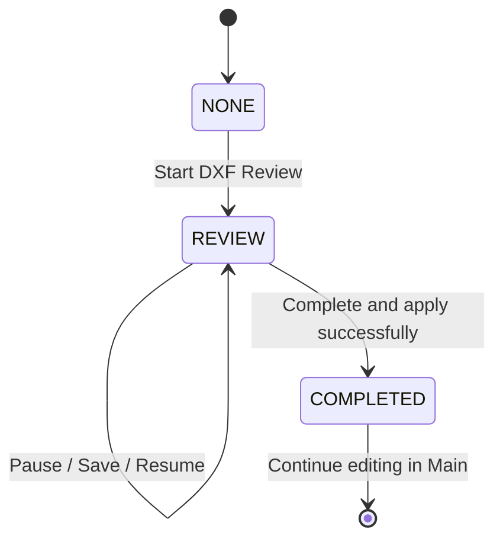
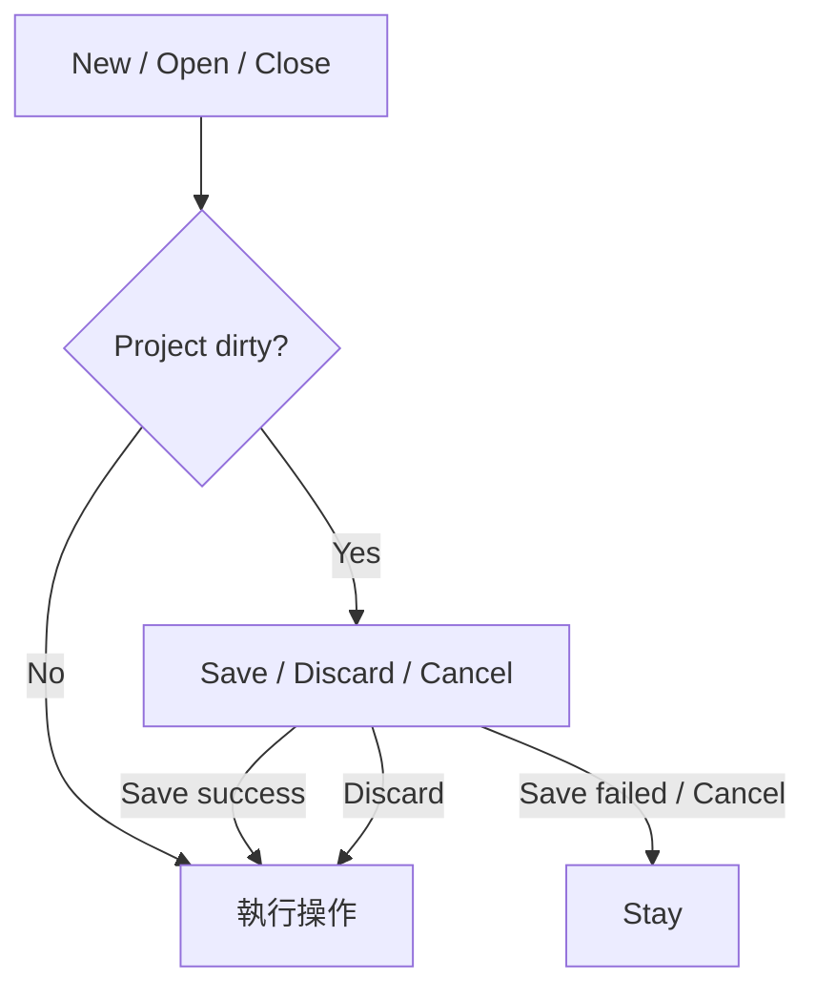
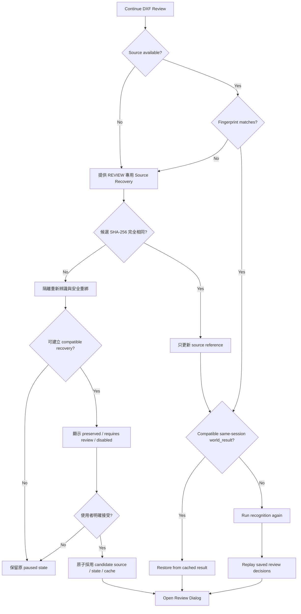
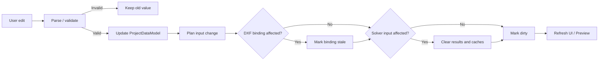
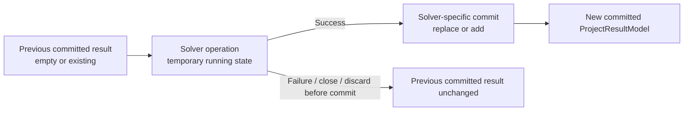
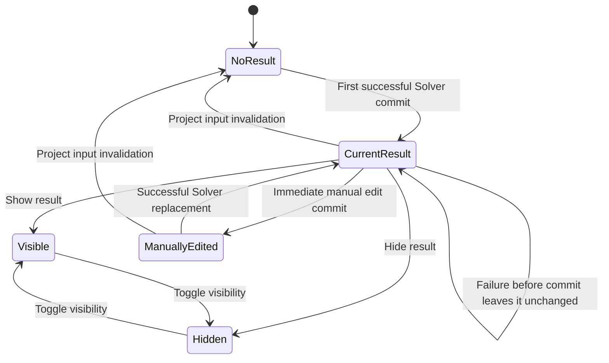
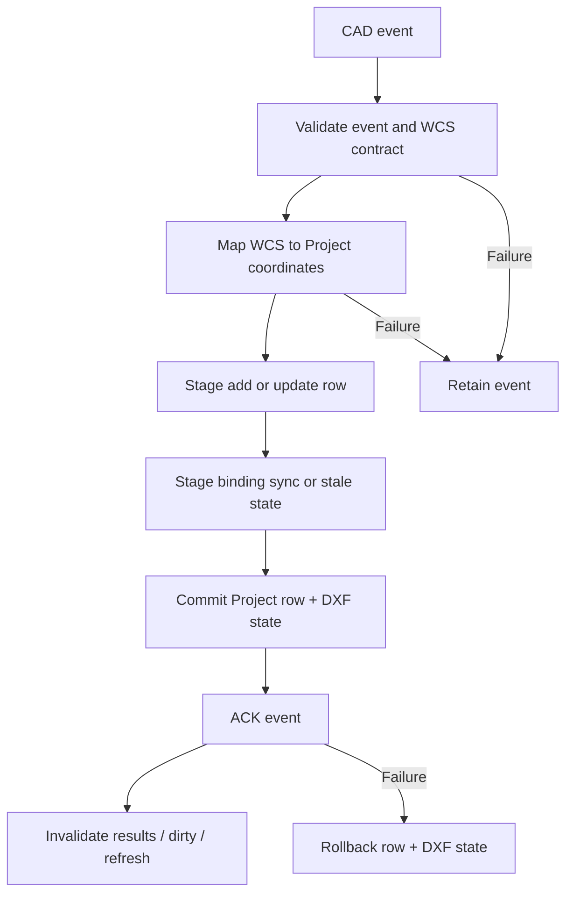
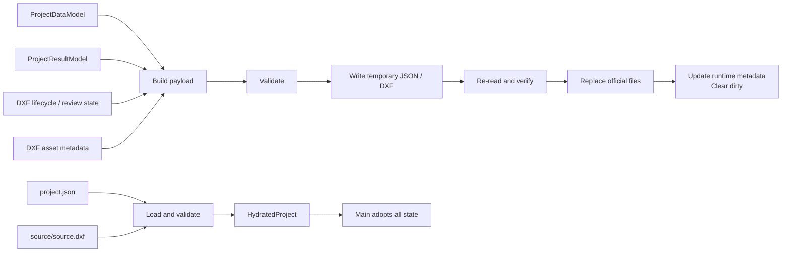

# 系統流程

## 1. Purpose

本文件說明 SupportOptimizer 在使用者發起操作後，runtime state 如何流動，以及：

- Trigger 是什麼？
- Temporary／staged state 在哪裡？
- 什麼時候 commit 成為正式狀態？
- Failure、Cancel 或 rollback 時怎麼處理？

相關文件的責任如下：

- [ARCHITECTURE.md](ARCHITECTURE.md)：Component 責任、state ownership 與 dependency direction。
- [DOMAIN.md](DOMAIN.md)：工程實體、工程限制與共同語言。
- [SOLVER.md](SOLVER.md)：候選生成、搜尋、評分與 Solver policy。
- `WORKFLOW.md`：操作發生後，runtime state 依序如何改變。

本文件以目前實作為主。尚未實作、但已由產品確認的行為會標示為 `Confirmed Desired Behavior`，不得解讀為目前 runtime 已有的功能。

## 2. Workflow State Overview

### 2.1 Authoritative state

| State | Runtime owner | 意義 |
| --- | --- | --- |
| `ProjectDataModel` | Main Application session | 正式 Project input：Walers、Struts、Braces、Inventory、Material Specs |
| `ProjectResultModel` | Main Application session | 正式 Solver results、visibility、calculated time 與材料結果 projection |
| Live DXF Review state | `DXFReviewWorkflow` | WCS result、projected result、ReviewItems、manual decisions 與 coordinate state |
| Paused DXF Review state | Main／Application session | Live session 關閉後的 serialized resume state |
| Durable DXF state | Project payload／persistence | 保存後的 workflow status、resume state 與 managed asset metadata |

Runtime-only state 包含：

- Support candidate cache。
- Single Waler Solver memory。
- Same-session DXF `world_result` cache。
- UI selection、viewport 與 editor draft。
- `project_dirty` indicator。

這些 runtime-only state 不會當作完整 Solver cache 保存至 Project。

### 2.2 Temporary state 與 committed state

Temporary／staged state 包含：

- Solver worker 尚未完成的計算。
- Global Waler worker 中尚未形成合法 solution 的候選與診斷。
- Application service 建立、等待 Main 採用的 staged Project／result。
- Editor 中尚未通過基本格式檢查的輸入。
- Persistence 尚未替換正式檔案的 temporary output。

Committed current state 是已由 Main 採用的：

- `ProjectDataModel`。
- `ProjectResultModel`。
- Serialized paused DXF Review state。
- DXF lifecycle status。
- DXF asset metadata。

Solver operation 的 Running、temporary candidate 或 worker state，不是 `ProjectResultModel` 本身的 destructive state transition。

在新結果 commit 前，既有 committed result 保持不變。

### 2.3 DXF lifecycle status

| Status | 意義 |
| --- | --- |
| `NONE` | 沒有進行中的 DXF Review，也尚未完成本專案的 DXF import lifecycle |
| `REVIEW` | Review 尚未完成；Dialog 可已關閉，但 serialized resume state 仍存在 |
| `COMPLETED` | DXF Review 已完成，辨識結果已套用至 Project |



`COMPLETED` 不表示 Project input 永遠不能修改。後續 Main／CAD 修改若破壞原 DXF binding，binding 會標示為 stale。

## 3. Application Startup

### Trigger

使用者啟動桌面程式。

### Flow

```text
main.py
→ 建立 Tk root
→ build_dependencies()
→ SupportInputApp
→ 初始化 Application state
→ 啟動 CAD event polling
→ Tk mainloop
```

啟動後目前 state 為：

- 空白 `ProjectDataModel` 與 `ProjectResultModel`。
- 已載入預設 Inventory 與必要 Material Specs。
- 無目前 Project path。
- `dxf_workflow_status = NONE`。
- Solver memory 與 Support candidate cache 為空。
- `project_dirty = false`。

初始化完成即成為目前 runtime state，但尚未建立磁碟 Project。初始化失敗時不會產生半完成 Project 檔案。

## 4. New / Open / Close Project



### 4.1 New Project

| Item | Current behavior |
| --- | --- |
| Trigger | 使用者選擇建立新專案 |
| Dirty prompt | `Save / Discard / Cancel`；Save 只在回報 `saved` 後繼續 |
| Temporary state | 新的空白 model、預設 Inventory 與空 result |
| Commit | navigation guard 允許後，Main 才採用新 `ProjectDataModel`／`ProjectResultModel` |
| Side effects | 清除 Project path、DXF state、Solver caches；workflow 設為 `NONE`；刷新 UI；清除 dirty |
| Failure／Cancel | Save As 取消、Save 失敗或 Cancel 都不執行 reset；保留目前 Project、results、DXF state 與 dirty |

### 4.2 Open Project

| Item | Current behavior |
| --- | --- |
| Trigger | 使用者選擇另一個 Project |
| Target validation | 先確認現有 project-case selector 有有效目標；無目標時不開啟 guard |
| Dirty prompt | `Save / Discard / Cancel`；Save 只在回報 `saved` 後繼續 |
| Temporary state | 經驗證的 payload、DXF asset report 與完整 `HydratedProject` |
| Commit | navigation guard 允許後才 load；Main 一次採用 Project input、results、DXF state 與 workflow status |
| Side effects | 清除 runtime Solver caches；刷新 UI；清除 dirty |
| Failure／Cancel | Save As 取消、Save 失敗、guard Cancel 或 Load failure 都不採用新 state；目前 Project 與 committed results 保留 |

Load 會恢復 result visibility 與 paused Review state，但不恢復 runtime Solver cache。

### 4.3 Close Application

| Item | Current behavior |
| --- | --- |
| Trigger | 使用者關閉主視窗 |
| Dirty prompt | `Save / Discard / Cancel` |
| Save | 只有 Save 回報 `saved` 才繼續關閉 |
| Close commit | 停止 CAD polling、保存 UI-only window state、結束 Tk root |
| Failure／Cancel | 不關閉；目前 Project 與 committed results 保留 |

New 與 Open 共用同一個 decision-only navigation guard。Guard 不執行 reset 或 load；只回傳 `proceed`／`cancelled`，destination-specific destructive action 維持在 guard 之後。

## 5. DXF Import and Review

### 5.1 Trigger and lifecycle

使用者選擇 DXF 匯入時：

- `NONE`：選取 DXF 並開始新 Review。
- `REVIEW`：繼續目前 Review。
- `COMPLETED`：不重新開啟 Review，提示後續應在 Main 修改。

選檔取消不修改 state。

### 5.2 Recognition and Review flow

```mermaid
flowchart LR
    File[DXF file] --> Read[Read entities<br/>OCS to WCS]
    Read --> Recognition[Recognition / Association / Validation]
    Recognition --> World[WCS world_result]
    World --> Workflow[DXFReviewWorkflow]
    Workflow --> Review[Manual review<br/>Confirmation / Exclusion]
    Review --> Coordinate[Coordinate projection]
    Coordinate --> Outcome[DXFImportDialogOutcome]
    Outcome --> Decision{Action}
    Decision -- Pause --> Serialized[Serialized Review state]
    Decision -- Complete --> Stage[Stage DXF to Project apply]
    Stage --> InitialZoning[Initial Zoning suggestion<br/>reviewed world geometry]
    InitialZoning --> Project[ProjectDataModel]
```



Live Dialog 開啟期間：

- `DXFReviewWorkflow` 擁有 WCS／projected result、problems、ReviewItems、manual decisions、confirmation、exclusion、coordinate state 與 import mode。
- `DXFImportDialog` 只擁有 selection、viewport、widget variables 與 temporary UI draft。
- Dialog 透過 snapshot 顯示 Workflow state，不直接修改正式 Review fields。

Recognition canonical geometry 維持 WCS。Local coordinate 是透過 `CoordinateSystem` 產生的 projection，不覆寫 WCS result。

Dialog outcome 主要為 `pause` 或 `complete`。完成 Review 不等於 Dialog 已修改 `ProjectDataModel`；Project mutation 由 Main／Application boundary 執行。

#### BIM Block Strut／Brace role-aware recognition

一般 DXF recognition 仍是預設路徑。只有位於 Strut 或 Brace role layer、具有有效 root handle 的 root `INSERT`，才會在跨來源 geometry merge 前依自己的 role 獨立進入 BIM component-like 判定；其他 role 不進入此路徑。Nested INSERT 會遞迴展開並套用 insertion、rotation、scale 與 OCS → WCS transform；child entity 即使位於 Layer 0，role 仍由最外層 root layer 決定，provenance 則保留最外層 root handle。

特殊路徑以整個 root INSERT 的方向、完整縱向範圍、橫向寬度、fragment center alignment 與 longitudinal evidence 判斷是否能代表一支完整 Strut 或 Brace，不以單一局部平行邊或最長 LINE 強行產生構件。對齊於同一軸的多段矩形可跨越內部未顯示區域重建完整工程軸，但不得超出 terminal source evidence 外插；一個 root 即使代表一個來源範圍，也不保證一定能成功辨識。

若同一 Strut root 具有完整 closed outline／connected contour，且其他 longitudinal detail 可能使一般平行邊辨識跨輪廓配對，系統會先以 root-local topology 判定工程軸。只有同一 closed traversal 或具有實際 transverse／end-cap connection 的 rails 才可互為 companion；僅因同 root、平行、等長或間距合理不成立。幾何等價的同軸 envelopes 合併為一支 Strut，不等價的完整 axes 則成為 blocking ambiguity。`source_width` 由唯一完整 component envelope 推導，不固定為 350 mm；若軸線可靠但 envelope 寬度無法唯一判定，保留工程軸但不自動辨認材料規格。

Brace 重用同一套 pure WCS fragment／topology evidence，但使用 Brace role policy；同一 root 最多產生一支完整 Brace。明確相連、共同支持同一構件寬度的 transverse rail bands 可以收斂為同一軸；兩條不等價且各自可靠的完整軸仍是 blocking ambiguity，不會因為某一條較容易連到 Waler 就被選中。Brace recognition 只由 Brace source geometry 決定；Waler context 只在 recognition 完成後參與 connection／canonical finalization，不會改變 component-like classification、recognition winner、來源支持的軸、寬度或 root provenance。

結果依既有 Review lifecycle 處理：

- `not_applicable`：同一個未合併 root group 回到一般 recognition。
- `recognized`：只建立一個 role-correct、使用完整工程軸的 Strut 或 Brace candidate，並保留 root source identity。
- `failed`／`ambiguous`：建立 blocking recognition problem 與 unresolved ReviewItem，不回退到局部 fragment recognition。

不同 root INSERT 即使共線也不會合併。Brace whole-axis recognition 完成後，才進入有限 Waler segment 的 endpoint connection 流程：每個端點先沿用既有 `connection_tolerance_mm = 250 mm` 內的 direct snap；只有 `selection_source == "auto"` 且仍未連接的端點，才沿既有可靠 Brace 軸向外搜尋 finite Waler segment 的實際交點。軸向 extension distance `<= 600 mm` 時，唯一最近交點可成為正式 endpoint 並建立 `FromWaler`／`ToWaler`；`> 600 mm` 的交點不採用，來源支持的 endpoint 維持不變。600 mm 是 Brace 專用的 automatic connection safety boundary，不會放寬 direct snap 或其他 member role。系統亦不採用 inward、Waler 無限延長線或改變 Brace 角度的解。距離差 `<= ambiguous_connection_delta_mm` 的最近合法多解，以及兩端連到同一 Waler，均為 blocking connection error。零端或單端沒有 600 mm 內合法交點時，仍分別保留既有 `BRACE_NOT_CONNECTED`／`BRACE_ONE_END_NOT_CONNECTED`。

上述 extension 只延長 formal connection geometry，不反向改寫 source-supported recognition axis、辨識方法、寬度或 provenance。成功端點會保留 Brace 與 Waler source handles 的 candidate-point provenance；自動 extension candidates 也以 source-supported recognition line 為距離原點，不會從已延伸的 formal endpoint 再次連續延伸。未成功端點維持原 source-supported endpoint。人工 Candidate Point／CAD 工程線不會自動延伸，但仍可使用既有 direct snap。Source Exclusion／Restore、recognition rebuild、confirmation invalidation 與 Pause／Resume 都重新推導 connection outcome，不保存另一份持久化 Waler connection truth。

Original DXF、source geometry preview、source exclusion／restore、manual override replay、confirmation、Pause／Resume 與 `DXFImportResult → Project rows` boundary 仍沿用既有契約；BIM child metadata 不進入 `ProjectDataModel`。一般非 BIM Brace、非 HATCH Waler 與其他 role 的辨識規則維持不變。Guided Recognition 仍是未來需求。

#### HATCH RC Waler recognition

位於使用者指定 Waler role 圖層的 `HATCH` 會以各自 root handle 進入 RC 圍令特殊路徑；pattern 名稱、角度、比例及 solid／patterned fill 不影響 RC 語意。Importer 從 HATCH boundary 取得 OCS → WCS 幾何，只有唯一封閉、可支持一支完整直線長條圍令的 exterior 才建立 candidate；L 形、多個不連續 exterior、曲線／無效 boundary 或多解會形成指向該 HATCH 的 blocking Review problem，不以一般外框辨識回退。此 RC 路徑不受一般構件 600 mm 最大寬度 recognition setting 限制。

HATCH candidate 保留完整中心軸、實際寬度及兩條縱向邊界，再沿用既有 inner-contact-face selection 產生正式 Waler 工程線。Base recognition material 為 `RC / auto_hatch`，優先於寬度材料對應；STEP4 人工材料修改、confirmation invalidation 與 replay 仍沿用既有 workflow，Project row 仍只使用既有 `material_spec` 欄位。

幾何等價的外框 LINE／POLYLINE 只保留為 immutable preview／diagnostic evidence，不再進入一般 Waler group merge。此 runtime claim 在 HATCH recognized、failed、ambiguous 或被排除時都會由原始 boundary 重建，因此排除 HATCH 不會讓同一外框換 identity 重新出現；無法證明等價的幾何不會被吞掉。Source Exclusion／Restore、Pause／Resume、fingerprint safety 與 completed import lifecycle 均繼續以 HATCH handle 作為 durable source identity，不新增 Project persistence schema。

STEP4 提供明確觸發的 CornerBrace repair，處理 BIM 遮擋後只剩局部殘線、或自動辨識已有正式角撐但軸線不正確的情況。此工具不放寬 automatic recognizer：Workflow 先以 exact target source residual、至少一支有效的 automatic recognized primary reference，以及有限 Waler inner line／Strut centreline 交點建立 staged candidates；reference 的長度、side 與 topology 只作一致性檢查，不會複製座標或移動正式交點。只有通過全部 hard eligibility 的 candidates 會出現在 Preview；零候選只顯示拒絕原因，唯一或多個候選都必須經使用者明確 Apply 才會原子更新 Review state。

已套用 repair 會以 optional payload 保存於既有 version 2 `manual_overrides`。Same-fingerprint Pause／Resume 會重新驗證 exact repair subject、target Waler／Strut 與保存的 primary／secondary references後才 replay；失敗只回報 needs-review，不猜替代 reference。內容不同的 compatible recovery 不轉移 repair geometry：exact role/source subject 保留為 `requires_review`，來源消失或 role 改變則為 `disabled`，兩者都不能成為後續 repair reference。Cancel、關閉 Preview、stale plan 或 commit failure 均不修改 live Review truth。

### 5.3 Pause

| Item | Behavior |
| --- | --- |
| Trigger | 使用者暫停或關閉尚未完成的 Review 視窗 |
| Temporary state | Live `DXFReviewWorkflow` |
| Validation | Pause 不要求 Review 已完整通過 |
| Commit | 驗證 source fingerprint，保存 serialized state 與 same-session cache，workflow 設為 `REVIEW` |
| Side effects | 標記 dirty，關閉 live Review session |
| Persistence | Paused Review 可隨 Project 保存 |

### 5.4 Resume



Resume source 可來自 managed DXF 或 saved original path。

同一執行階段若 fingerprint、cached `world_result` 與 layer classification 相符，可重用 WCS result。重新啟動後則重新 recognition，再 replay serialized decisions。

來源不存在或 fingerprint 不符時，使用者可進入 REVIEW 專用 Source Recovery。候選檔可解析且 SHA-256 與 saved `source_fingerprint` 完全相同時，維持原有快速路徑：只更新 source reference，不執行重新辨識或額外確認，維持 `REVIEW` 並接回既有 Resume path。

候選內容不同時，系統在隔離的 candidate workflow 重新辨識，以同角色、一對一、geometry tolerance 與 handle/layer evidence 安全配對 Waler／Strut／Brace，再選擇性 replay Review settings、人工修改、雙路支撐 decision 與 confirmation。舊 candidate、association 與 validation 不會直接複製；衍生資料一律從候選來源重建。

Compatible recovery 先顯示互斥的 `preserved`／`requires_review`／`disabled` 摘要，只有使用者明確接受後才原子採用 candidate source reference、serialized Review state 與 same-session `world_result` cache。拒絕、關閉、歧義、不相容、驗證失敗或 commit-time revalidation 失敗時：

- 不開啟候選 Review，也不完成 DXF import。
- Project input、committed Solver results、dirty state 與原 paused Review 不變。
- 不留下 candidate source、state 或 cache 的部分採用狀態。
- 可重試選擇其他候選，或取消後繼續停留在 paused Review。

### 5.5 Apply DXF to Project

完成 outcome 進入 Application staging 後，先以最終 reviewed Waler／Strut world geometry建立 initial Zoning suggestion，再經 `DXFImportResult.to_project_rows()`。圖層辨識、Review polling、人工確認途中與 Pause 都不執行分組。

Initial grouping 使用 continuous Waler chain topology 與 deterministic transverse geometry 建立連續群組；missing／ambiguous topology 才使用保守的空間相鄰 fallback。已確認的 DXF double-support pair 是一個 ordering unit，兩 lane 取得相同初始 Zoning。這是新 rows 的 suggestion，不是後續 authoritative state。

正式 Project rows 為 Walers、Struts 與 Braces。Columns、Beams、Corner Braces 及 DXF provenance 不直接成為獨立 Project rows；Project 所需衍生資訊由正式 member fields 承接。

`Replace` 取代原工程幾何並保留 Inventory／Material Specs，對本次 rows 配置 deterministic initial Zoning。`Append` 保留既有 rows 及其 Zoning，只替新 rows 配置不與既有名稱衝突的初始值。進入 Main 後，使用者可自由修改及保存 Zoning；系統不重新執行 DXF grouping。

Application staging 產生：

- 新的 `ProjectDataModel`。
- 空的 `ProjectResultModel`。
- Solver cache clearing instructions。
- `COMPLETED` lifecycle transition。

Commit flow：

```text
stage Project / result
→ snapshot previous state
→ adopt staged state
→ clear results and caches
→ refresh UI / Preview
→ workflow = COMPLETED
→ clear live Review session
→ dirty
```

Failure semantics：

- Staging 失敗不修改 Project。
- Adoption 例外時恢復先前 Project、results 與 caches。
- Apply 失敗不轉為 `COMPLETED`。
- Review state 維持 `REVIEW`，可供檢查或重試。

## 6. Project Editing and Invalidation



### 6.1 Current invalidation rules

| Change | Solver result / cache | DXF binding | Other |
| --- | --- | --- | --- |
| Waler／Strut／Brace engineering input | 清除 | Geometry binding field 變更時 stale | dirty、refresh Preview |
| Inventory | 清除 | 不變 | 更新材料摘要、dirty |
| 未被引用的 Material Spec definition | 保留 | 不變 | dirty |
| 被引用的 Spec rename | 同步 references 後清除 | 不因名稱本身 stale | dirty |
| Invalid field input | 保留 | 不變 | 保留舊值，不 commit |

Input invalidation 會直接清除不再可信的 results，而不是保留 stale Solver result。這與 Solver operation failure before commit 不同。

## 7. Solver Operations

本章只描述 operation flow；搜尋與評分詳見 `SOLVER.md`。

共同原則：計算尚未成功 commit 前，既有 `ProjectResultModel` 不變。

### 7.1 Support Optimization

| Item | Current behavior |
| --- | --- |
| Trigger | 使用者選擇 `Zoning` 並啟動 Support Solver |
| Input | `SupportInputBuilder` 先驗證目前 Project Zoning geometry，再建立含 geometry-based adjacency contract 的 `SupportZoneInput` |
| Temporary state | Background worker 中的 candidates、diagnostics、`GlobalSolution` |
| Commit | Success callback 以 Zoning identity 立即寫入 `ProjectResultModel`；沒有 Apply |
| Replacement | 取代同 Zoning result；其他 results 保留 |
| Side effects | 更新 calculated time、dirty、Result Tree、Preview |
| Failure | 不更新 result；舊 result 保留；原本無 result 時仍為 No Result |
| Current close | Solver running 時拒絕關閉；success／failure UI handling 完成後恢復可關閉；close request 不取消 worker |

Zoning geometry validation 只發生在求解前。若方向差、長度差或 projection tie 無效，系統不進入 Phase 2、不修改使用者 Zoning，也不覆寫既有 committed result。Main 的欄位編輯與保存不套用這些 Solver tolerances。

### 7.2 Single Waler Optimization

| Item | Current behavior |
| --- | --- |
| Trigger | 使用者從 eligible non-RC Waler 中選擇一根並啟動 Single Waler Solver |
| Input | `WalerInputBuilder` 建立全部正式 Waler inputs；Application 排除 RC 後提供選擇 |
| Precheck | 沒有 non-RC Waler 時不開 Dialog；若有人工修改 single result，先確認；檢查既有 Material Spec／purchasable lengths |
| Temporary state | Background worker／Dialog 中最多前五名 local candidates |
| Commit | Success callback 立即採用 staged Top 5；沒有 Apply |
| Replacement | 移除同 Waler 舊 single series，保留 global-selected result |
| Visibility | 新 single results 預設 hidden |
| Side effects | 更新 calculated time、dirty、Result Tree、Preview |
| Failure | 不更新 result；舊 result 保留 |
| Current close | Solver running 時拒絕關閉；success／failure UI handling 完成後恢復可關閉；close request 不取消 worker 或提前釋放 busy guard |

### 7.3 Global Waler Optimization

| Item | Current behavior |
| --- | --- |
| Trigger | 使用者啟動全部 Waler 最佳化 |
| Input | 全部正式 `WalerProblemInput` 中的 eligible non-RC inputs；RC 不進入 local 或 global search |
| Precheck | 沒有 non-RC Waler 時不開 Dialog；missing inventory 與人工修改成果覆蓋確認只涵蓋 non-RC solve scope；拒絕則不啟動 Solver |
| Temporary state | Background worker 中的 local candidates、diagnostics 與尚未提交的 global solution |
| Commit | Solver 回傳合法 solution 後，Dialog 的 UI-thread completion callback 立即呼叫既有 atomic apply 流程；沒有 Apply |
| Replacement | 取代本次涵蓋的 non-RC Waler 舊方案，並在同一 staged transaction 清除目前 Project 中所有 RC Waler historical configuration results；Support results 保留 |
| Side effects | 更新 calculated time、dirty、Result Tree、Preview |
| Solver failure | Temporary operation 結束；舊 result 保留 |
| Invalid／missing solution | 不啟動 apply；舊 result 保留 |
| Commit failure | 原 result state 保留 |
| UI failure after commit | 已 commit non-RC results 與 RC cleanup 不回滾，只回報 refresh 問題 |
| Current close | 計算中禁止關閉；成功採用後關閉只關閉結果視窗，不撤銷成果 |

## 8. Manual Result Editing

正式產品語意採 immediate commit：

```text
Current Result
→ user edit
→ Application service stages and recalculates
→ Main immediately adopts
→ ProjectResultModel updated
→ dirty
→ Result Tree / Preview refreshed
```

### 8.1 Support editing

`SupportPlanEditing` 驗證 piece input、從 current Project geometry 重建與初次求解相同的 adjacency contract，重新計算單支與相關全域結果，再回傳 staged solution。

- 無法形成合法輸入格式時不 commit。
- 可形成方案但工程檢查為 invalid 時，invalid result 仍正式保留供修正。
- `TargetJackRegion` 是 preference，不會單獨使人工方案 invalid。
- 每次採用都更新 calculated time、dirty、Result Tree 與 Preview。

### 8.2 Waler editing

`WalerPlanEditing` 依新 segments 重建 joints、驗證合法性／庫存並重算 score。

- Main 立即更新原 result 並標記 `manual_modified`。
- Invalid state 或 purchase warning 可以保存。
- 每次採用都更新 calculated time、dirty、Result Tree 與 Preview。

### 8.3 Close and no-op initialization

Support／Waler editor 的 Close 只關閉視窗，不 rollback，也沒有額外 Apply／Cancel staging。

Support editor 初始化與欄位確認會由 `SupportPlanEditing` 比較正規化後的 ordered piece layout。只有任一受影響 Support（包含 shared-layout group members）與目前 committed layout 不同時，Main 才採用 staged solution、更新 calculated time、標記 dirty 並刷新正式結果畫面。相同 layout 是 no-op，只更新 Editor 內的狀態摘要；開啟後直接關閉不修改 Project。

## 9. Result Lifecycle

### 9.1 Solver operation 不先破壞 committed result



`Running` 是 operation state，不是 `ProjectResultModel` state。

因此：

- Solver 開始時不先清除舊 result。
- Solver failure 不清除舊 result。
- Support／Single 在 running 時會拒絕關閉；Solver failure 或 completion callback 未成功 commit 時，舊 result 保留。
- Global Waler failure／invalid solution／staging failure／commit failure 時，包含 historical RC result 在內的舊 result 全部保留。
- 原本沒有 result 時，failure／discard 後才仍是 No Result。

### 9.2 Committed result lifecycle



### 9.3 Adoption and visibility

| Solver | Temporary output | Commit timing |
| --- | --- | --- |
| Support | Worker callback result | 完成後立即 |
| Single Waler | Worker callback Top 5 | 完成後立即 |
| Global Waler | Worker callback global solution | 合法 solution 完成後立即 atomic apply；同一 transaction 取代 selected non-RC results 並清除 historical RC Waler results |

Visibility 是 durable result state，控制 Preview／export 使用範圍。切換 visibility 會 dirty，但不修改 Project input，也不重新執行 Solver。

Result 不反向修改 Project geometry；人工結果編輯也不把材料排列寫回 Waler／Strut input rows。

Project input invalidation 會清除全部 committed results、calculated time 與 runtime Solver caches。除此之外，valid Global Waler adoption 會在既有 atomic replacement scope 內取代 selected non-RC results，並清除 historical RC Waler results；它不清除 Support results 或其他未涵蓋的 non-RC results。

## 10. CAD Event Workflow

### 10.1 Trigger

Main 在 CAD import enabled 且 DXF Dialog 未開啟時，定期檢查單一 TEMP JSON event。DXF Dialog 開啟期間 Main polling 暫停，CAD update event 保留給 Main。

### 10.2 Transaction



### 10.3 Staging and commit

CAD event 使用 WCS；mapper 依 Project `CoordinateSystem` 轉成 Project coordinates。

- Add 建立新 row。
- Update 在 target 原索引 replace，不新增第二筆。
- Binding 可以唯一、安全同步且 compatibility 通過時，採用 staged binding。
- Binding 無法可靠同步時，Project change 仍可成功，但標示 stale。

Project row／DXF state 先 commit，再 ACK event。ACK 失敗時，Add 移除、Update 恢復舊 row、DXF state 恢復，event 保留。

ACK 成功後才清除 results／caches、dirty、選取 row、刷新 Preview 與顯示訊息。

### 10.4 Invalid and cancel events

Invalid event 不 ACK，Project／results 不變，event 保留供修正或 `SUPCLEAR`。

Cancel event 驗證後 ACK，Project 不變。

## 11. Export

Export 是 terminal output，不修改 Project input／results，也不改變 dirty。

| Export | Input | Commit point | Failure／Cancel |
| --- | --- | --- | --- |
| Excel | Visible Waler／Support plans、材料明細與摘要 | Temporary workbook 驗證後替換 destination | 不取代既有目的檔；Project state 不變 |
| DXF Result | Visible plans、current Project geometry、Project → WCS metadata、可用 background | Temporary DXF 重讀與驗證後替換 destination | 不取代目的檔；必要時保留 diagnostic temp；Project state 不變 |
| Preview Image | 目前完整 Preview 與輸出倍率 | Image 寫出成功 | 恢復 figure／viewport；Project state 不變 |

同一 member 有多個 visible plans 時，Excel／DXF Result Export 會拒絕匯出。

DXF Result Export 建立乾淨的新 DXF，不修改原始 DXF。Binding stale 目前不直接阻止 export，但必須有足夠的 Project → WCS metadata。

## 12. Save / Load Persistence

### 12.1 Payload and flow

Project payload 包含：

- `ProjectDataModel`。
- `ProjectResultModel`；無 result 時為 `null`。
- DXF workflow status。
- Serialized DXF Review／import state。
- DXF asset metadata。
- Project information。

Paused `REVIEW` 是可保存的合法 Project state。



### 12.2 Save

Temporary JSON／DXF 驗證後才替換正式檔案。

Save 成功後更新 Project path、DXF asset metadata 與 persisted result projection，並清除 dirty。

Presentation 儲存流程以明確 outcome 區分 `saved`、`cancelled` 與 `failed`。未命名 Project 沿用 Save As；取消名稱輸入、無效名稱或拒絕覆蓋都是 `cancelled`，不會被當成儲存成功。

若既有 DXF asset 的 active source 不可用，Save As 會被拒絕，避免建立缺少 managed DXF 的新專案。

Save 失敗時不清除 dirty；既有正式 Project／managed DXF 保留或恢復。

### 12.3 Load

Load 先建立完整 `HydratedProject`，再由 Main 一次採用所有正式 state。

Load failure 不取代目前 Project 或 committed results。

## 13. DXF Relink

### 13.1 Current workflow

非 REVIEW 狀態下，使用者選擇 candidate DXF：

- Exact fingerprint match 可直接採用新 source link。
- 無法 exact match 時，開啟不可 Pause 的 Review／compatibility flow。
- Accepted relink 保留 Project input、Solver results 與人工修改，更新 DXF state 並 dirty。
- Rejected／Cancelled relink 不修改目前 state。
- Save 後才更新 managed copy。

### 13.2 REVIEW Source Recovery

`dxf_workflow_status = REVIEW` 使用專用的 paused Review recovery contract，與 completed Project Relink 分離：

- Exact Match：候選 DXF 的 SHA-256 與 paused Review fingerprint 完全相同時，選檔即授權更新 source reference，不執行 planner、summary 或第二次確認，並保留既有 Review decisions 與 compatible same-session cache。
- Compatible Source：fingerprint 不同時，在隔離 workflow 重新辨識與安全 rebind；先顯示 `preserved`／`requires_review`／`disabled` 摘要，明確接受後才採用 recovered state。
- Candidate recognition 與 recovery summary 都不是 durable truth；正式 truth 仍是採用後的 source metadata 與 version 2 serialized Review state。same-session `world_result` 只作為相符 fingerprint/layer state 下的 runtime cache。
- 採用是原子操作，涵蓋 candidate source reference、recovered state、runtime cache、asset/recovery report 與 dirty state；任一步驟失敗便完整 rollback。
- Recovery 本身不建立或取代 managed DXF；下一次 Save 才更新 managed copy。
- 拒絕、取消、不相容、驗證失敗、候選檔改變或 paused Review base state 改變都不修改目前 state；使用者可重試或維持 paused Review。

## 14. Dirty and Transaction Summary

### 14.1 Dirty behavior

| Operation | Dirty behavior |
| --- | --- |
| Project input edit／add／delete | 設為 dirty |
| Inventory／Material Spec edit | 設為 dirty |
| DXF Review pause／complete | 設為 dirty |
| Support／Single result commit | 設為 dirty |
| Global Waler successful auto-commit | 設為 dirty |
| Global Waler solver／staging／commit failure | 不變 |
| Manual result edit／invalid result retained | 設為 dirty |
| Result visibility toggle | 設為 dirty |
| Accepted Relink | 設為 dirty |
| CAD add／update | 設為 dirty |
| CAD cancel event | 不變 |
| Solver failure／discard before commit | 不變 |
| Excel／DXF／image export | 不變 |
| Successful Save | 清除 dirty |
| Successful Open／New reset | 清除 dirty |

Support editor no-op initialization 不會修改 result、calculated time、persisted projection 或 dirty state；實際修改仍依 manual edit commit 規則設為 dirty。

### 14.2 Commit／rollback summary

| Operation | Temporary state | Commit point | Failure／Cancel |
| --- | --- | --- | --- |
| Open | `HydratedProject` | Main 採用完整 state | 保留目前 Project／results |
| DXF Review | Live Workflow | Pause 保存 state；Complete 進入 apply | 未保存 outcome 時不改 Project |
| DXF Apply | Staged Project／result | Main 採用並完成 transition | 恢復 Project／results／cache；維持 REVIEW |
| Support Solver | Worker result | Success callback | 舊 result 保留 |
| Single Waler | Worker Top 5 | Success callback | 舊 result 保留 |
| Global Waler | Worker global solution／staged result mapping | Valid completion callback 立即 atomic commit | Solver／staging／commit failure 時舊 result 保留；refresh failure 不回滾已提交成果 |
| Manual edit | Staged recalculation | 每次成功 recalculation 後立即 | 格式失敗不更新；可保存 invalid result |
| CAD add／update | Staged row／DXF state | Row/state commit 後 ACK | ACK 失敗 rollback |
| Export | Temporary output | Validated file replace | 不取代 destination |
| Save | Temporary JSON／DXF | Official files replace | 正式檔案保留或恢復；dirty 保留 |
| Relink | Candidate／compatibility state | Accepted state adopted | Rejected／cancelled 不修改 state |

Manual editor 的 Close 不是 Cancel，不 rollback。

Global Waler result commit、CAD ACK 或 export file replace 後若只有 UI message／refresh 失敗，已完成的正式 commit 不會因 UI failure 自動回滾。

## 15. Current Behavior vs Confirmed Desired Behavior

| Topic | Current Behavior | Confirmed Desired Behavior | Classification |
| --- | --- | --- | --- |
| Paused Review Source Recovery | Exact Match 維持直接恢復；內容不同來源可隔離重新辨識、安全 rebind、摘要確認後原子採用 | 已完成 Exact 與 compatible recovery，後續只依實際案例校正辨識品質 | Implemented |
| Solver Dialog close | Support／Single／Global 在 running 時都拒絕關閉；success／failure UI handling 完成後恢復可關閉 | 已統一三種 Dialog 的 running-state close policy，且不提供 worker cancellation | Implemented |
| Support editor no-op | 正規化後 layout 未變時不採用、不更新時間且不 dirty；shared-layout group 以所有受影響 members 判定 | 無實際修改時不 mutation | Implemented |
| Guided DXF Member Recognition | 自動辨識無法唯一可靠判定構件時，目前沒有以人工粗略輔助線引導重新辨識的 workflow | 在 automatic recognition 與 BIM Block recognition 皆無法可靠判定後，可由使用者提供非正式輔助線，引導系統從原始 DXF source geometry 推導 Strut／Brace 正式工程線 | Future Requirement / Not Implemented |

Manual Support／Waler editing 的 immediate commit 是已確認的正式產品行為，不是 Gap。

## 16. Known Workflow Gaps

Known Gap 不等同於自動 roadmap；後續修改仍需獨立 Feature Spec 與測試。

### Completed — Paused Review content-changed source recovery

OpenSpec change `recover-paused-dxf-review-compatible-source` 已完成內容不同來源的 candidate recognition、同角色 geometry-gated member matching、選擇性 Review decision replay、互斥 recovery summary 與明確接受後的原子採用。Exact Match 仍使用原快速路徑；所有拒絕或失敗路徑維持零副作用。此能力不再列為 workflow gap。

### Completed — Solver Dialog close semantics

Support、Single Waler 與 Global Waler 現在都以各 Dialog 的本地 running state 作為唯一 close gate。running 時的 close request 不會 destroy Dialog、關閉 UI callback bridge、修改 result／operation state或取消 worker；既有 success／failure UI handling 完成或 worker 啟動失敗後，Dialog 恢復正常可關閉。

### Completed — Support editor no-op mutation

OpenSpec change `support-editor-no-op` 已將 no-op 判定放在 Application staging 的 deep copy 與工程重算之前，並由明確的 `changed` outcome 控制 Main adoption。初始化、相同值確認及 shared-layout group 全員相同時不修改 committed result、calculated time、persisted projection、dirty 或正式結果畫面；真實修改仍維持 immediate commit 與 invalid-result 保留行為。此項不再列為 workflow gap。

### Gap 4 — Guided DXF Member Recognition

**Future Requirement / Not Implemented**

當 automatic recognition 與 BIM Block recognition 都無法唯一可靠判定構件時，未來可提供人工 Guided Recognition，預計先支援 Strut／Brace：

- 使用者在 DXF Review Preview 畫一條粗略輔助線，只提供預期構件的位置、方向與大致範圍。
- 輔助線不是正式工程中心線，不得直接建立 Project component。
- 系統仍必須從原始 DXF source geometry 推導正式工程線；沒有可靠來源幾何時，不得為了符合人工標記而製造構件。
- 此 workflow 位於正常 automatic recognition 與 BIM Block recognition 仍無法可靠判定之後，不取代前兩者。
- 本需求不屬於目前的 `block-member-recognition` change；後續實作前仍需另立 Feature Spec／OpenSpec change 與測試。

## 17. Current Workflow / Technical Limitations

Technical Limitation 不自動轉成 roadmap。

### Limitation 1 — CAD post-ACK rollback boundary

ACK 前可恢復 Project row 與 DXF state。ACK 成功後 event 已移除；後續 invalidation、dirty 或 UI refresh 若失敗，不能以同一 event 安全重播完整 transaction。

### Limitation 2 — Project → WCS metadata dependency

DXF Result Export 的 Project → WCS information 目前來自 DXF import state。沒有 DXF state 的 Project 可能缺少 export 所需 metadata；目前未確認為近期產品修改。

### Limitation 3 — Single-slot CAD event transport

CAD bridge 一次只保存一個 event。Invalid event 會保留並可能阻擋後續 event，直到修正或執行 `SUPCLEAR`；這不代表必須立即重構 transport。

## 18. Major Runtime Diagrams

本文件保留九組主要 runtime 圖：

1. DXF lifecycle status。
2. New／Open／Close dirty handling。
3. DXF Import／Review。
4. Paused Review resume。
5. Project editing and invalidation。
6. Solver operation commit semantics。
7. Committed result lifecycle。
8. CAD event transaction。
9. Project persistence。

流程圖聚焦 temporary state、commit 與 rollback，不重複 Architecture dependency inventory。

## 19. Out of Scope

本文件不展開：

- Support／Waler Solver 搜尋與 score 細節。
- 工程限制的由來與工程論證。
- Tkinter widget layout。
- Package dependency 與 architecture guardrails。
- Project JSON 完整 schema reference。
- DXF recognition 個別圖元規則。
- 未確認的 UI redesign 或 future roadmap。

工程規則以 `DOMAIN.md` 為準；搜尋與評分以 `SOLVER.md` 為準；責任與 state ownership 以 `ARCHITECTURE.md` 為準。
