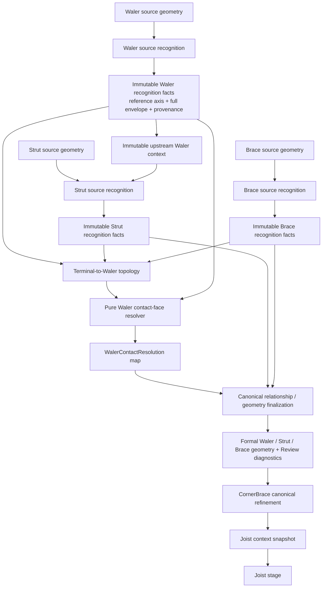

# Design

## Context

動機與行為範圍見 `proposal.md` 與 `specs/dxf-waler-contact-face-recognition/spec.md`。

目前 `dxf_import/recognition.py::_select_waler_inner_lines()` 會收集所有 Strut／Brace candidate 的 `start`、`end`，對每一條 Waler `boundary_lines` 加總最近最多四個 endpoint 到有限線段的距離；第一項相同時才比較全域 endpoint centroid。這個流程同時混合了來源辨識、構件關係與正式接觸面三種責任。

Y05 W7（root `C86`）的來源具有四條主要水平長線，約為 `y=8800`、`8781`、`8469`、`8449`。現行一般平行線路徑先留下 `8781`／`8469`，BIM contextual Strut endpoints 又已位於 provisional reference axis `y≈8625`，因此兩條線的幾何距離理論上同為 `156 mm`。實際浮點總和約為 `623.9999999999709` 與 `623.9999999999782`，導致 `min(tuple)` 選到上側 `8781`，而不是支撐側完整 envelope 的最外表面 `8449`。W12 的接觸面約為 `y=8800`；錯誤的 W7 endpoint 因而只距 W12 `19 mm`，進一步產生不必要的 connection warning。

Y1A 一般 CAD 目前之所以多數能選對，是因 source-derived endpoints 原本落在正確表面附近，兩側 score 有明顯差距；這是來源畫法造成的偶然差異，不是可維持的共用工程語意。

現有 Architecture 已定義 recognition stage ordering：

```text
Waler → Strut → Brace → CornerBrace → Column → Joist
```

箭頭表示 stage ordering 與 cumulative immutable upstream context visibility，不表示 downstream 可以修改 upstream recognition truth。`docs/ARCHITECTURE.md` 亦已將 endpoint／contact／association adjustment 定位為 post-recognition canonical relationship／finalization。本 change 沿用該 Architecture，不建立新的反向 dependency。

## Goals / Non-Goals

**Goals:**

- 將 Waler 自身來源幾何、member-to-Waler topology 與正式接觸面決策拆成單向階段。
- 讓一般 CAD、BIM Block、HATCH RC Waler 共用同一個 pure contact-face resolution。
- 從完整 Waler envelope 選擇支撐側最外實體表面，並維持 deterministic behavior。
- 讓正式 Waler、contextual Strut、Brace connection、CandidatePoint 與 diagnostics 消費同一份 resolution outcome。
- 保留既有 Review、manual replay、pause／resume、source provenance 與 Project boundary。

**Non-Goals:**

- 不更改任何 member 的 source recognition winner、BIM classifier、Brace 600 mm extension policy或 HATCH RC classification。
- 不建立 Waler section／材料專用輪廓模型；完整 envelope 只表達來源幾何可證明的最外 physical faces。
- 不使用 Continuous Wall 建立第二套 inside／outside 規則；Continuous Wall 目前是 preview-only role，也不在既有 contact finalization barrier 的可靠 upstream context 中。
- 不重新設計 CandidatePoint、Project schema、persistence、Solver 或 DXF Review UI。
- 不建立通用 dependency framework、iterative fixpoint 或 cyclic recognition。

## Architecture Alignment

本 change 沿用既有 Architecture，新增的是 `dxf_import` recognition-supporting pure geometry／relationship service 與既有 importer orchestration 的明確 finalization boundary，不改變 layer direction。



實際 importer 維持目前在 Column source recognition 完成後、Joist context 建立前的 finalization barrier。此時 Waler、Strut、Brace、CornerBrace 與 Column 都已完成自己的 source recognition；resolver 只讀取其中已完成的 Waler／Strut／Brace facts，不將結果回送任何 recognizer。Brace source geometry 單獨產生 Brace recognition facts；Waler facts 只在後續與 Brace facts 共同建立 terminal relation、contact-face／connection finalization，不參與 Brace recognition winner、axis、width 或 provenance 的決定。CornerBrace 隨後的 axis intersection refinement 屬 canonical finalization，不是重新選擇其 source recognition winner；Column／Joist 都不成為本 resolver 的輸入。

Dependency direction 為：

```text
Waler source geometry → Waler source recognition → immutable Waler facts
immutable Waler facts + Strut source geometry → Strut recognition facts
Brace source geometry → Brace recognition facts
Waler facts + Strut / Brace facts → terminal relation
terminal relation → contact-face / connection finalization
finalization → formal DXF review model
```

不存在：

```text
contact decision → Waler recognition
contact decision → Strut / Brace recognition winner
Strut / Brace recognizer → mutate Waler candidate
```

## Decisions

### 1. 將 provisional source facts 與 formal contact geometry 分開

Waler source recognition SHALL 先產生 runtime-only 的 immutable facts，概念上包含：

- normalized source identity／handles；
- source-supported provisional reference segment；
- 完整 longitudinal envelope 的兩個最外 physical faces（若可證明）；
- single-line contact segment（若來源本來只有一條正式工程線）；
- source width、recognition method 與 provenance。

實作優先在 `dxf_import` 新增小型 pure module（建議 `waler_contact_face.py`），以 frozen internal records 表達例如 `WalerEnvelopeFacts`、`MemberTerminalEvidence` 與 `WalerContactResolution`。名稱可以依既有 naming 調整，但這些 records 不成為 public API、Project row 或 persisted schema。

`_Candidate.recognized_axis` 維持 source-supported provisional reference，而 `start/end` 只在 contact resolution commit 時成為正式 Waler line。不得用同一 mutable field 在辨識過程中輪流表示「中心參考線」與「已選接觸面」，否則會再次形成兩個含義不同的 truth。

**Single source of truth：**一輪 recognition 中，以 normalized Waler source identity 為 key 的 `WalerContactResolution` map 是正式接觸面唯一決策；Waler formal candidate、contextual Strut finalization、Brace connection 及後續 CandidatePoint 只能消費該 map 的 committed result，不得自行重算 side。

**Rejected alternative：**只在現有浮點 score 加 epsilon。這只能隱藏 W7 的微差，仍保留「已投影 endpoint 距離」這個錯誤責任與 CAD／BIM 差異。

### 2. 完整 envelope 必須在 local parallel-pair collapse 前建立

目前 `_candidate_from_group()` 可以從多條等長平行線中先選出一個 pair；W7 因而在 contact selection 前已失去 `8800`／`8449` 的 envelope 語意。新流程必須在此 collapse 前建立 component hypotheses，但不得把一個 accepted GeometryGroup 直接等同於單一 Waler component。

Envelope extraction 依下列順序工作：

1. 從 normalized WCS evidence 建立一個或多個 component hypotheses。
2. 每個 hypothesis 必須具有足以共同支持一支完整 Waler 的 topology／boundary evidence，才可成為 qualified component scope。
3. 只有在單一 qualified component scope 內，才使用與 provisional direction 符合既有 `parallel_angle_tolerance_deg`、具有足夠 `minimum_projection_overlap_ratio` coverage，且經 `collinear_tolerance_mm`／`duplicate_tolerance_mm` 正規化的 distinct longitudinal rails。
4. 最後才在該 scope 的 canonical normal 上取得最小與最大 signed offset作為 outer faces。

同 layer、同一 GeometryGroup、端點相接、彼此平行、長度相近或 projection coverage 重疊，都只能作為候選線索，不能單獨完成 component qualification。可驗證的 closed／connected boundary topology、HATCH exterior identity或既有 recognition 已證明的獨立 component identity可以提供較強證據；但不得為本 change 發明「只要同 root／同 group 就是一支 Waler」的捷徑。

內部 rails 可以保留為 preview／diagnostic evidence，但不得成為 contact face candidate。HATCH RC path 已能提供 exterior longitudinal boundaries，直接轉成相同 facts；single LINE path則標示為 single-contact-line，不推測第二側。

同一 source scope／GeometryGroup 若可唯一分離成兩個以上完整 component envelopes，輸出分離 facts；若存在兩個以上不等價完整 interpretations但無法唯一分離，回報 envelope ambiguity。任何情況都不得先對 raw group evidence取全局 transverse min/max。W7與W12必須在 component qualification階段保持不同 scope，即使同 layer、方向相同、相接或鄰近。

若同一 component scope 無法證明唯一完整 envelope，resolver 回報 unresolved／ambiguous；不得以最早 pair、最寬 combined extent或最靠近 endpoint 的 pair 退化處理。

**Rejected alternative：**建立 H 型鋼 4-line 專用規則。Waler 可能是 Steel、RC 或其他輪廓；本需求只需要來源支持的 component envelope，不應把特定斷面畫法寫成工程規則。

### 3. 先建立 terminal-to-Waler topology，再判斷 side

Contact resolver 不對所有 drawing endpoints 做全域投票。每筆 `MemberTerminalEvidence` 必須先具有唯一 Waler source identity，並保留 member role、member source identity、source-supported axis、terminal label、provisional intersection 與朝 member body 的向量。

Topology 依既有 role contract 建立：

1. BIM contextual Strut 已有 `selected_waler_source_handles` 時，保留該 immutable identity，只驗證 identity 仍存在；不得由 contact stage改派。
2. 一般 Strut 使用既有 direct finite-Waler relation semantics，並以 Waler envelope／reference segment 建立 provisional relation；本 change 不新增 Strut long-range extension。
3. Brace recognition 本身仍只由 Brace source geometry決定。Brace terminal relation 重用既有 direct `connection_tolerance_mm` 與既有 outward-axis `maximum_brace_axis_extension_mm`／ambiguity policy，但先對 provisional Waler facts建立 identity，待 contact face resolved 後再完成 formal endpoint。
4. 只有唯一合法 relation 可輸出 evidence；多解沿用 blocking connection ambiguity，不得先任選 Waler 再決定 face。

因此 CAD 與 BIM 可以有不同的來源 facts／已知 identity，但進入 contact resolver 後使用完全相同的 `MemberTerminalEvidence → support side → outer face` 規則。這維持既有 upstream recognition能力，又消除 contact-side source-path branch。

**Rejected alternative：**直接把所有 member 無限軸與所有 Waler 相交。這會讓非 terminal crossing 或無關構件參與投票，破壞有限 topology 與既有 connection safety boundary。

### 4. 由 Waler 朝 member body 的向量決定支撐側

每筆有效 terminal evidence 以 provisional Waler intersection 為起點，以 member 的另一 terminal／source-supported interior 方向建立 `body_vector`。Waler reference direction 先做 geometry-derived canonical normalization，再取得 deterministic unit normal；`dot(body_vector, normal)` 的符號表示 member 位於哪一側。

- start/end 反轉時 terminal label 與另一端會一起交換，實體 `body_vector` 不變。
- normal 反轉時 outer-face signed offsets 與 side sign 同時反轉，最後幾何 face 不變。
- side evidence 的量測值定義為 `normal_component_mm = abs(dot(body_vector, unit_normal))`。characterization 已確認本 change 可重用 `endpoint_tolerance_mm` 作為 valid／degenerate boundary；這是依 synthetic、Y05 W7 與 Y1A corpus 得到的 mapping，不把兩種 tolerance 語意宣告為一般性等同。
- 同一 Waler 的全部可靠 evidence 必須指向同一 side；不做多數決。兩側都有可靠 evidence 時回報 `WALER_CONTACT_FACE_AMBIGUOUS`。
- 沒有可靠 evidence 時回報 blocking `WALER_CONTACT_FACE_UNRESOLVED`。此時 provisional reference axis只保留為 recognition／diagnostic fact，不能代替 formal contact face，DXF Import保持 blocked。

決策不使用 endpoint-to-face distance、nearest-four sum、global centroid、member count、row order、handle order 或浮點最小值。這些值不再是 tie-break。

在 production routing 前，必須比較：

- 垂直於 Waler 的 body vector（明確 valid side evidence）；
- 平行於 Waler 的 body vector（明確 degenerate）；
- 長 member 且 `normal_component_mm` 略高於 `endpoint_tolerance_mm`；
- 短 member 且 `normal_component_mm` 略低於 `endpoint_tolerance_mm`；
- Y05 W7 與 Y1A 實際 member body vectors 的 total length、normal component與方向分布。

characterization 結果為：垂直與實際 Y05／Y1A body vectors 的 normal component 明顯大於 50 mm，平行與低於 50 mm 的 synthetic boundary 保守視為 degenerate，而略高於 50 mm 的 evidence 可穩定進入 side comparison。因此本 change 重用 `endpoint_tolerance_mm`，不新增 `minimum_waler_side_evidence_normal_component_mm`。不得加入 magic epsilon、未命名 ratio或依 member長短臨時分支。

### 5. 支撐側選定後採用該側最外 physical face

Resolver 對唯一 side 直接選擇完整 envelope 在該側的 extreme face。W7 中 relevant members 位於較低側，因此四條來源 rail 的結果為：

```text
upper outer face      y = 8800
upper internal rail   y = 8781
provisional axis      y ≈ 8624.5 / 8625
lower internal rail   y = 8469
lower outer face      y = 8449  ← formal contact face
```

這也使 finalized W7 endpoint 與 W12 `y≈8800` 相距約 `351 mm`，超過既有 `connection_tolerance_mm = 250 mm`，因此 W7 relation 不應再只因錯誤 contact face 而產生 W12 的 19 mm 競爭 warning。W7 與 W12仍是兩支獨立 source identities；本 change不處理 duplicate merge。

Y1A 的 correct results 應保持等價，但原因改為 member body direction，而不是 endpoints 恰好靠近某一 face。

### 6. 在單一 staged finalization 中套用 resolution

Importer 先完成所有 resolution 的驗證，再 staging：

1. 建立 Waler envelope facts；
2. 完成 Strut／Brace source recognition；
3. 建立 terminal relations 與 side evidence；
4. pure resolver 產生完整 `WalerContactResolution` map 與 messages；
5. 若某 Waler resolved，staged candidate 使用 selected face；
6. contextual Strut 以原選定 Waler identities 與 selected faces 求正式 endpoints；
7. Brace connection 以相同 selected faces 完成 formal endpoints；
8. corner-brace refinement、CandidatePoint、association、validation 與 models 只讀取 staged formal geometry。

Resolution failure 不刪除 source candidate facts；它建立 blocking Problem／ReviewItem，讓 Preview 顯示來源與原因。但 unresolved member 不得越過 completed import boundary。這是 DXF Review staged state，不修改既有 committed Project／results。

若 applying staged resolution 本身發生例外，該輪 result 不得留下部分 Walers 已換 face、部分 Struts 尚未 finalize 的混合狀態。實作可用 candidate deep-copy／local staged structures完成，不建立大型 transaction framework。

### 7. Determinism 與 tolerance mapping

所有線段先使用既有 ordered endpoint normalization，方向 cluster、source identities、faces、terminal evidence 與 output map 都以 geometry-derived key 排序。排序只為穩定輸出；任何歧義不得靠排序決勝。

| 判斷 | 既有 setting／contract | 用途 |
| --- | --- | --- |
| longitudinal direction compatibility | `parallel_angle_tolerance_deg` | 判斷 source segment 是否支持同一 Waler direction |
| longitudinal coverage | `minimum_projection_overlap_ratio` | 避免短局部 detail 被當成完整 outer face |
| collinear rail normalization | `collinear_tolerance_mm` | 合併同一實體 rail 的碎片／數值偏差 |
| equivalent geometry | `duplicate_tolerance_mm` | normalized face／candidate 等價比較 |
| degenerate side evidence | `endpoint_tolerance_mm`（經 synthetic／Y05／Y1A characterization確認） | `normal_component_mm <= endpoint_tolerance_mm` 視為退化；此為本 change 的具名 setting mapping，不代表 connectivity 與方向可靠性在一般情況下語意相同 |
| ordinary direct connection | `connection_tolerance_mm` | 保留既有 endpoint-to-finite-Waler eligibility |
| connection ambiguity | `ambiguous_connection_delta_mm` | 保留既有多 Waler relation ambiguity |
| Brace outward extension | `maximum_brace_axis_extension_mm` | 保留既有 Brace-only 600 mm boundary |

本 change 不新增未命名的 epsilon、距離、vote count 或 score magic number。若 characterization 證明現有 tolerance 無法表達某個必要的 recognition distinction，必須先更新 Design／Spec（若涉及行為）並建立具名 internal recognition setting，再進行 production 實作。

### 8. Review lifecycle、manual override 與 persistence

- `WalerContactResolution` 是 runtime derived state，每次 recognition／exclude／restore／rebuild 重新建立。
- root handles、source layer、source geometry 與 recognition metadata仍是 provenance truth。
- manual override replay 仍依既有 exact source identity 規則發生在 fresh base recognition／finalization 之後；Presentation 不自行計算 side。
- contact face 或 relation 改變時，confirmation 沿用既有 geometry signature invalidation。
- Pause／Resume 仍由 serialized Review decisions 與 source fingerprint 保護；重新啟動後重新 recognition，再 replay。
- completed Project只接收既有 Waler／Strut／Brace row fields，不保存 envelope facts 或 resolver diagnostics。

因此無 persistence schema migration。已完成 Project 不會被背景重算；只有重新進入 DXF recognition／Review 才使用新規則。回滾到舊版本不需要資料轉換，但舊版重新辨識仍可能重現舊 contact behavior。

### 9. Error contract

至少區分：

- `WALER_ENVELOPE_UNRESOLVED`：來源候選已存在，但多面 Waler 的完整 outer envelope 無法唯一建立。
- `WALER_ENVELOPE_AMBIGUOUS`：同一 source scope／GeometryGroup 支持兩個以上不等價完整 component envelopes，且無法唯一分離 interpretations。
- `WALER_CONTACT_FACE_UNRESOLVED`：envelope 有效，但沒有可靠 related member side evidence。
- `WALER_CONTACT_FACE_AMBIGUOUS`：可靠 related members 指向相反側，或 terminal-to-Waler relation 無法唯一決定。
- 既有 contextual Strut／Brace finalization error：identity 存在但 selected face 無法與 source-supported axis形成合法正式 endpoint。

Messages 必須包含 role、Waler source handles；若由特定 member conflict 造成，亦包含相關 member identities。這些 messages 交由既有 validation／ProblemRecord／ReviewItem rebuild，不新增 UI-specific exception flow。

### 10. 測試策略

先建立 characterization，再接 pipeline：

- Y05 W7 root `C86`：保留四條 rail，members 位於下側，選 `y=8449`；不得退回 `8469`／`8781`。
- Y05 W7／W12：兩者 identities 都保留；W7 finalized endpoint 不再因 19 mm 假接近產生 W12 競爭 warning。
- Y1A W1～W4：new rule 得到與目前正確正式 faces 等價的結果。
- synthetic CAD vs BIM：等價 envelope／member topology 得到相同 face。
- HATCH RC：相同 resolver，且不受一般 600 mm component width setting 限制。
- single LINE Waler：行為不變。
- internal rail／entity order／LINE direction／candidate order permutations：final outcome等價。
- 同 group相接雙 Waler、同方向多 component、跨 component raw min/max與多個完整 envelope interpretations：保持分離或blocking ambiguity，不建立combined envelope。
- perpendicular／parallel body vectors、長 member略高於 endpoint tolerance、短 member略低於 endpoint tolerance，以及Y05 W7／Y1A實際 body-vector ranges：characterize side-evidence boundary後才決定setting mapping。
- no evidence、opposite-side evidence、ambiguous terminal relation：blocking error，不 fallback。
- BIM contextual Strut identities、Brace direct／600 mm extension、manual replay、exclusion／restore、pause／resume 與 Project conversion regression。

## Risks / Trade-offs

- **[Risk] 現行 candidate 建立過早捨棄完整 envelope rails** → 在 parallel-pair collapse 前加入 pure envelope characterization；沒有通過 W7 與 synthetic four-rail tests 前不得接 router。
- **[Risk] 同一 GeometryGroup 內含多支 Waler而被 raw min/max合成假 envelope** → 在 transverse extreme extraction前先建立並驗證 qualified component scopes；以相接雙 Waler、同方向多 component、W7／W12與多 interpretation負面測試保護。
- **[Risk] 誤把 `endpoint_tolerance_mm` 當成 side reliability threshold** → 先 characterize synthetic boundary與Y05／Y1A實際ranges；若不能穩定區分，建立具名internal setting並先更新planning artifacts。
- **[Risk] Topology refactor改變既有 Strut／Brace connection eligibility** → 重用既有 role-specific direct／extension settings，只將 provisional relation 與 final face 分階段；以現有 connection tests做 characterization。
- **[Risk] 某些孤立多面 Waler 沒有 related member，從過去任意選面變成 blocking Review** → 這是 Spec 要求的安全行為；保留 source facts與既有人工 Review／排除流程，不猜測。
- **[Risk] `boundary_lines` 既有 consumers仍假設只有 selected pair** → 以新的 internal envelope record隔離 source facts；正式 model與 preview adapter只在 resolution commit 後取得 selected line，並以 focused regression確認。
- **[Risk] W7 fix誤傷 HATCH RC 寬 Waler** → HATCH exterior faces直接進共用 contract，不套用一般 `maximum_component_width_mm`，沿用既有 RC capability。
- **[Trade-off] 不用 Continuous Wall cross-check** → 避免讓 preview-only downstream data 成為 contact truth或引入循環；若未來要將 wall topology升級為正式 context，需另立 change。

## Migration Plan

1. 以 characterization tests鎖定目前 Y1A、Y05 W7／W12、HATCH RC、BIM Strut／Brace與 single-line behavior。
2. 新增 pure envelope／topology／contact resolver及 unit tests，不接 production router。
3. 將 importer既有 `_select_waler_inner_lines()` barrier改為 staged resolver／finalizer，保留 stage order。
4. 擴充 validation／Review rebuild與 downstream consistency tests。
5. 執行完整 DXF regression、architecture tests與 OpenSpec verification。

沒有資料 migration 或 feature flag。若 deployment 後需 rollback，只需回復程式版本；original DXF與 Project payload沒有新格式。已提交 Project保持不變，尚未完成的 DXF Review在重新載入後依執行版本重新 recognition並沿用既有 fingerprint／replay contract。
